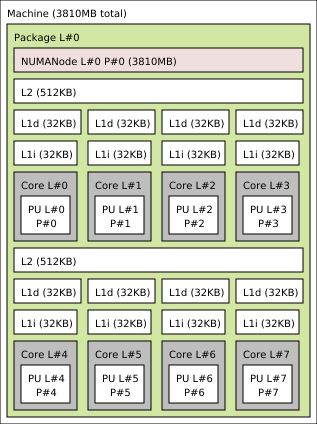

# Cross-platform 500k-row price benchmark

Benchmark sources: [Rust typed-SoA workload](price_total_500k.rs) ·
[C++ aligned-AoS workload](cpp-reference/price_total_500k_benchmark.cpp) ·
[Linux build and run script](run_price_total_500k.sh)

This benchmark compares the Rust table's typed structure-of-arrays columns with a
24-byte C++ array-of-structures row matching the corresponding GD row layout:

The same configurable sources are also measured with a cache-resident working set in
the [10k-row companion report](price-total-10k.md).

```text
Rust input:  Vec<f64> + Vec<f64> + Vec<u32> = 20 bytes/row
C++ input:   PriceRow                       = 24 bytes/row
Output:      contiguous double              =  8 bytes/row
```

Both calculate the same expression into a separate output allocation:

```text
result = price * quantity + tax
```

The C++ source provides both ordinary pointers and the same loop with a `__restrict`
aliasing contract. Setup, schema construction, and row insertion are outside the
reported timing samples. The longer `perf` mode makes initialization negligible
relative to the measured kernel, although process-level counters still include it.

Run portable baseline builds pinned to a Linux logical CPU with:

```sh
./benches/run_price_total_500k.sh 4
```

The runner deliberately unsets Rust architecture flags and gives C++ no `-march`
option. Set `PERF_EVENTS` to add three repeated `perf stat` runs per workload:

```sh
PERF_EVENTS='cycles:u,instructions:u,cache-references:u,cache-misses:u' \
  ./benches/run_price_total_500k.sh 4
```

Use host-PMU events for detailed cache-level and TLB reporting. Keep each event group
small enough to avoid multiplexing, and record the compiler versions, CPU affinity,
event names, event time-enabled percentage, and kernel perf permissions with results.

## Results

These measurements were made on 2026-07-19 and 2026-07-20 with the checked-in
benchmark sources.
All binaries use portable release settings: Rust has no `target-cpu` override, and
C++ uses GCC `-O3 -ffast-math -DNDEBUG` without `-march`. The Linux machines used
rustc 1.97.0 or 1.97.1; the Ky X1 and Core Ultra used GCC 13.3.0, while the RK3588
and Ryzen used GCC 15.2.0. A separate Ky X1 compiler comparison used Clang 18.1.3
with both libstdc++ and libc++ 18. The Core Ultra runs pin the same binaries to CPU 0
(Lion Cove P-core) or CPU 4 (Skymont E-core); the RK3588 run pins to CPU 4
(Cortex-A76). The Ryzen run pins to guest CPU 0 under Microsoft Hyper-V.

The logical CPU numbers identify these physical core types on the tested machines:

| Host | Affinity | CPU/core type |
|---|---:|---|
| Ky X1 RISC-V | CPU 0 | Ky X1 RISC-V core |
| Rockchip RK3588 | CPU 4 | Arm Cortex-A76 performance core |
| Intel Core Ultra 5 225H | CPU 0 | Lion Cove performance core (P-core) |
| Intel Core Ultra 5 225H | CPU 4 | Skymont efficiency core (E-core) |
| AMD Ryzen 9 3900X under Hyper-V | Guest CPU 0 | Zen 2 core; guest CPU 1 is its SMT sibling |

These mappings are specific to the tested systems' Linux logical-CPU numbering;
CPU 0 or CPU 4 should not be assumed to select the same core type on another system.

### CPU topology

The following diagrams were generated from each host with `lstopo --no-io
--no-factorize`. Disabling factorization is important here: every physical core and
Linux processing unit remains visible instead of collapsing identical cores. The
benchmark affinities are identified in the captions and in the table above.

**Ky X1 RISC-V — eight cores; benchmark pinned to CPU 0**



The Ky X1 has two four-core groups. Each core has private 32 KB L1 data and
instruction caches; each group shares a 512 KB L2 cache.

**Rockchip RK3588 — CPUs 0–3 are Cortex-A55 and CPUs 4–7 are Cortex-A76;
benchmark pinned to Cortex-A76 CPU 4**


The four Cortex-A55 efficiency cores have private 128 KB L2 caches. The four
Cortex-A76 performance cores are arranged as two two-core clusters with private
512 KB L2 caches. All eight cores appear below the shared 3 MB L3 cache in hwloc's
topology.

**Intel Core Ultra 5 225H — CPUs 0–3 are Lion Cove P-cores, CPUs 4–11 are
Skymont E-cores, and CPUs 12–13 are low-power E-cores; benchmarks pinned separately
to Lion Cove CPU 0 and Skymont CPU 4**


The four Lion Cove cores each have a private 3 MB L2. The eight Skymont cores are
split into two four-core clusters sharing 4 MB L2 per cluster. The final two
low-power E-cores share a separate 2 MB L2 outside the 18 MB L3 hierarchy shown for
the main compute tile.

**AMD Ryzen 9 3900X under Hyper-V — 12 guest-visible cores and 24 processing
units; benchmark pinned to guest CPU 0**


The Ryzen guest reports private 32 KiB L1D and 512 KiB L2 caches per core and one
16 MiB L3 instance. The diagram is the topology exposed by Hyper-V, not the physical
3900X chiplet topology. `taskset` fixes the Linux vCPU but cannot control how Hyper-V
schedules that vCPU on the Windows host.

Median time per 500,000-row pass, calculated as the geometric mean of the collected
run medians. Each run contains nine samples of 512 passes after 16 warm-up passes:

| Host and affinity | Rust SoA | C++ GCC AoS | C++ GCC AoS `restrict` | Fastest |
|---|---:|---:|---:|---:|
| Ky X1 RISC-V, CPU 0 | 5,211.883 us | 3,441.526 us | 4,064.198 us | C++ AoS |
| RK3588 Cortex-A76, CPU 4 | 953.265 us | 1,106.142 us | 1,113.598 us | Rust |
| Core Ultra 5 225H P-core, CPU 0 | 309.670 us | 355.518 us | 356.724 us | Rust |
| Core Ultra 5 225H E-core, CPU 4 | 282.342 us | 334.549 us | 355.661 us | Rust |
| Ryzen 9 3900X under Hyper-V, guest CPU 0 | 287.469 us | 625.365 us | 749.107 us | Rust |

Rust is 16.0% faster than unrestricted C++ on the A76, 14.8% faster on the P-core,
18.5% faster on the E-core, and has 117.5% more throughput than unrestricted C++ in
the Ryzen guest. Unrestricted GCC C++ is 51.4% faster than Rust on the Ky X1. With
GCC, `restrict` does not improve elapsed time in this fixture even where it changes
the generated store loop.

The Ryzen guest inherited a slow post-compilation/frequency state: unconditioned
medians accelerated materially with run order. Each published run therefore first
executes its own 2.048-billion-row `perf` body, immediately followed by the normal
nine-sample timing process. The three conditioned Rust medians are 292.605, 287.255,
and 282.633 us; unrestricted C++ records 633.880, 620.470, and 621.832 us. This is a
sustained guest result rather than the transient first-run state.

#### RISC-V GCC versus Clang

The Ky X1 C++ fixture was also built with Ubuntu Clang 18.1.3 using the same
`-std=c++20 -O3 -ffast-math -DNDEBUG -fno-exceptions -fno-rtti` options, CPU 0
affinity, and no architecture-specific flag. The values use the geometric mean of
three run medians, matching the main timing methodology:

| Ky X1 compiler and standard library | C++ AoS | C++ AoS `restrict` | Faster variant |
|---|---:|---:|---:|
| GCC 13.3.0 | 3,441.526 us | 4,064.198 us | unrestricted |
| Clang 18.1.3 + libstdc++ | 4,438.011 us | 4,094.342 us | `restrict` |
| Clang 18.1.3 + libc++ 18 | 4,411.112 us | 4,053.264 us | `restrict` |

Clang's `restrict` path is 8.4% faster with libstdc++ and 8.8% faster with libc++.
GCC unrestricted is nevertheless the overall C++ winner: it has approximately 28--29%
more throughput than Clang unrestricted and 17--19% more than Clang restricted. All
three restricted results are within 1.0%. A reverse-order confirmation ran Clang with
libstdc++ restricted before unrestricted and produced medians of 4,048.106 us and
4,388.490 us respectively, so the direction of the Clang result is not an ordering
artifact.

The libc++ and libstdc++ calculation functions have identical sizes and byte-for-byte
identical machine code in both variants. The libc++ measurements are 0.6% faster for
unrestricted and 1.0% faster for restricted, but that small difference cannot come
from the timed kernel and should be treated as run-to-run/system variation rather
than a standard-library performance result. `ldd` confirmed that the libc++ binary
loaded libc++, libc++abi, and LLVM libunwind rather than libstdc++.

At measurement time, the Ky X1 package database and standard include paths did not
expose the libc++ development headers. The Ubuntu `libc++-18-dev`,
`libc++abi-18-dev`, and matching runtime packages were therefore unpacked into an
isolated `/tmp` prefix and passed explicitly to Clang. This did not alter the host's
installed packages and used the same Ubuntu 18.1.3 libc++ build that a system package
installation would provide.

There are no usable `perf` counters on this Ky X1 kernel, so this compiler comparison
has timing and disassembly evidence but no cycles, cache, or TLB measurements.

The per-pass working sets explain what is physically scanned, independently of the
instruction count:

```text
Rust SoA
  price Vec<f64>      4 MB
  tax Vec<f64>        4 MB
  quantity Vec<u32>   2 MB
  result Vec<f64>     4 MB
                     -----
                      14 MB/pass

C++ AoS
  PriceRow[500k]     12 MB  (24 bytes/row, including 4 bytes padding)
  result double[]     4 MB
                     -----
                      16 MB/pass
```

Across 4,112 passes, the minimum logical traffic is therefore 57.568 GB for Rust and
65.792 GB for C++. Actual cache-line traffic can be higher because of write
allocation, evictions, prefetching, and refills. The arithmetic is identical at the
source level, but the C++ executable is allowed `-ffast-math` while Rust retains its
normal floating-point rules. The inspected Rust loops used separate multiply and add
instructions rather than FMA.

### Load/store totals are the denominator for miss rates

Every implementation logically reads `price`, `tax`, and `quantity` and writes one
`f64` result for every row. The `perf` workload performs 16 warm-up passes followed
by 4,096 measured passes, or 2.056 billion processed rows. It therefore represents
6.168 billion logical field reads and 2.056 billion logical result writes in every
case. This is the same semantic work, but it is **not** the number of machine load
and store instructions: one SIMD instruction can transfer values for several rows.

The following are process-level totals, so they include the much smaller setup and
validation work as well as the 4,112 kernel passes. Intel provides retired memory
instruction/uop events. Values are averages of three `perf stat` runs with at least
99% event time enabled.

| Core Ultra CPU | Implementation | Retired loads | Loads / processed row | Retired stores | Stores / processed row |
|---|---|---:|---:|---:|---:|
| P-core 0 | Rust SoA | 3.125 B | 1.520 | 1.055 B | 0.513 |
| P-core 0 | C++ AoS | 6.179 B | 3.006 | 2.064 B | 1.004 |
| P-core 0 | C++ AoS `restrict` | 6.179 B | 3.006 | 1.036 B | 0.504 |
| E-core 4 | Rust SoA | 3.124 B | 1.520 | 1.056 B | 0.513 |
| E-core 4 | C++ AoS | 6.178 B | 3.005 | 2.065 B | 1.004 |
| E-core 4 | C++ AoS `restrict` | 6.178 B | 3.005 | 1.037 B | 0.504 |

The Intel counts match the generated code. Rust's portable x86-64 loop uses SSE2
vectors, so it retires about half as many load operations as either C++ AoS loop.
The unrestricted C++ loop stores one row at a time. `restrict` lets GCC combine two
outputs per store, making its store count approximately equal to Rust's, but it still
has to obtain the three fields from strided AoS rows. Relative to unrestricted C++,
Rust retires 49.4% fewer loads and 48.9% fewer stores on both core types. Relative to
restricted C++, Rust still retires 49.4% fewer loads; the roughly 2% difference in
store totals is setup overhead around two kernels whose steady-state store rate is
one instruction per two rows.

Zen 2 exposes dispatched rather than retired load/store events. They should not be
compared numerically with the Intel retired events, but show the same within-core
relationship. These are three-run averages with 100% event time enabled:

| Ryzen guest CPU 0 | Dispatched loads | Loads / processed row | Dispatched stores | Stores / processed row |
|---|---:|---:|---:|---:|
| Rust SoA | 3.137 B | 1.526 | 1.056 B | 0.514 |
| C++ AoS | 6.242 B | 3.036 | 2.084 B | 1.014 |
| C++ AoS `restrict` | 6.250 B | 3.040 | 1.044 B | 0.508 |

Thus Rust dispatches approximately half as many load operations as C++, while its
store count is approximately half that of unrestricted C++ and close to restricted
C++. The result agrees with the inspected packed Rust loop and paired restricted
C++ output stores.

The Cortex-A76 PMU exposed `LD_SPEC` and `ST_SPEC`, but its architected
`LD_RETIRED`/`ST_RETIRED` events returned zero and are not implemented by this
kernel/PMU combination. These are therefore **speculatively executed memory
instructions**, not retired instructions, and must not be compared numerically with
the Intel events:

| Cortex-A76 CPU 4 | Speculative loads | Loads / processed row | Speculative stores | Stores / processed row |
|---|---:|---:|---:|---:|
| Rust SoA | 1.356 B | 0.660 | 0.559 B | 0.272 |
| C++ AoS | 4.170 B | 2.028 | 2.093 B | 1.018 |
| C++ AoS `restrict` | 4.168 B | 2.027 | 1.062 B | 0.517 |

The branches in this workload are highly predictable, so the A76 events remain
useful for comparing the three binaries on that core. Rust executes 67.5% fewer
speculative load instructions than either C++ path, and 73.3% or 47.3% fewer store
instructions than unrestricted or restricted C++, respectively. The generated Rust
AArch64 loop uses 128-bit NEON and processes eight rows per unrolled loop body.

`perf` is unavailable for the Ky X1 kernel. Static inspection of the portable
RISC-V steady-state loops shows scalar code with no vector extension: three load
instructions and one store instruction per row. Excluding setup, that is 6.168
billion loads and 2.056 billion stores for 4,112 passes in both Rust and C++; C++
wins there through unrolling and scheduling rather than fewer semantic memory
accesses.

This changes how cache percentages should be read. A high L1 miss *percentage* does
not imply more data movement when its denominator contains far fewer memory
instructions. On the A76, Rust produced 149 million L2 refills versus approximately
272 million for C++. On the E-core, Rust reduced completed data-TLB page walks from
31--35 thousand to 11.5 thousand. The direct load/store counters now show the other
half of that result: the Rust SIMD loops also issue substantially fewer memory
operations. Cache event semantics differ between PMUs, so rates and totals are only
compared within the same core type.

### Cycles and instructions

These process totals cover the same 4,112-pass `perf` workloads and are three-run
averages:

| CPU | Implementation | Cycles | Instructions | Instructions/cycle |
|---|---|---:|---:|---:|
| Cortex-A76 CPU 4 | Rust SoA | 8.483 B | 7.085 B | 0.835 |
| Cortex-A76 CPU 4 | C++ AoS | 9.715 B | 11.033 B | 1.136 |
| Cortex-A76 CPU 4 | C++ AoS `restrict` | 10.148 B | 9.843 B | 0.970 |
| Core Ultra P-core 0 | Rust SoA | 6.354 B | 10.968 B | 1.726 |
| Core Ultra P-core 0 | C++ AoS | 7.288 B | 12.912 B | 1.772 |
| Core Ultra P-core 0 | C++ AoS `restrict` | 7.284 B | 17.411 B | 2.390 |
| Core Ultra E-core 4 | Rust SoA | 4.970 B | 10.964 B | 2.206 |
| Core Ultra E-core 4 | C++ AoS | 5.987 B | 12.909 B | 2.156 |
| Core Ultra E-core 4 | C++ AoS `restrict` | 6.244 B | 17.407 B | 2.788 |
| Ryzen guest CPU 0 | Rust SoA | 5.093 B | 10.937 B | 2.147 |
| Ryzen guest CPU 0 | C++ AoS | 10.273 B | 12.875 B | 1.253 |
| Ryzen guest CPU 0 | C++ AoS `restrict` | 15.963 B | 17.501 B | 1.096 |

IPC alone does not rank these loops. Restricted C++ retires more instructions at a
higher IPC on both Intel cores but still takes more cycles than Rust. Elapsed time
and cycles are the outcome; IPC describes how a particular instruction stream
occupied the core. On the Ryzen guest, GCC's packed reconstruction of strided AoS
rows increases both instructions and cycles, so restricted C++ is slower at a lower
IPC.

### Cache and data-TLB counters

The Ryzen Zen 2 PMU reports L1D miss-allocation and demand-fill sources. Hyper-V
virtualizes these counters, so the values characterize this guest configuration and
must not be treated as bare-metal Ryzen totals. The 500k events were stable enough to
report, used 100% event time, and are three-run averages:

| Ryzen guest CPU 0 | L1D MAB load allocations | L1D MAB store allocations | Fills from L2 | Fills from local cache | Fills from local DRAM |
|---|---:|---:|---:|---:|---:|
| Rust SoA | 11.213 M | 2.538 M | 4.605 M | 5.687 M | 2.824 M |
| C++ AoS | 36.540 M | 0.943 M | 5.079 M | 9.151 M | 4.056 M |
| C++ AoS `restrict` | 18.952 M | 0.783 M | 210.594 M | 41.925 M | 97.384 M |

`local cache` means a cache in the local Zen 2 complex other than private L2. Remote
cache and remote-DRAM fill events were zero. GCC 15's restricted loop reconstructs
packed vectors from the 24-byte AoS stride; its much larger demand-fill totals
coincide with the loop's higher cycle count rather than demonstrating a general
property of `restrict`.

The corresponding translation events show the expected larger-working-set regime:

| Ryzen guest CPU 0 | L1 DTLB reloads | Completed data-side page walks |
|---|---:|---:|
| Rust SoA | 13.153 M | 11.471 M |
| C++ AoS | 14.998 M | 13.870 M |
| C++ AoS `restrict` | 16.004 M | 15.016 M |

Most L1 DTLB reloads in this 14–16 MiB repeated scan proceed to a page walk. This is
translation activity, not evidence that the data itself is fetched from DRAM; the
data-cache fill-source counters above are separate events.

The A76 events count cache accesses/refills at each level. They show both the event
totals and their denominators directly:

| Cortex-A76 CPU 4 | L1D accesses | L1D refills | Refill rate | L2D accesses | L2D refills | Refill rate |
|---|---:|---:|---:|---:|---:|---:|
| Rust SoA | 3.695 B | 175.557 M | 4.751% | 1.565 B | 149.387 M | 9.546% |
| C++ AoS | 6.191 B | 239.576 M | 3.870% | 1.806 B | 273.639 M | 15.155% |
| C++ AoS `restrict` | 5.162 B | 253.959 M | 4.920% | 1.806 B | 271.836 M | 15.056% |

The matching A76 data-TLB totals are:

| Cortex-A76 CPU 4 | L1D-TLB accesses | L1D-TLB refills | Refill rate | Completed data-TLB walks |
|---|---:|---:|---:|---:|
| Rust SoA | 3.657 B | 1.223 M | 0.0334% | 1,674 |
| C++ AoS | 6.191 B | 1.301 M | 0.0210% | 1,588 |
| C++ AoS `restrict` | 5.162 B | 1.310 M | 0.0254% | 1,616 |

Rust's A76 L1D refill percentage is higher than unrestricted C++'s, but it performs
far fewer L1D accesses and incurs 27% fewer absolute L1D refills. At L2, Rust incurs
about 45% fewer refills than either C++ path. The data-TLB walk counts are all tiny;
the Rust L1D-TLB refill percentage is not evidence of a page-walk bottleneck.

Intel's P-core and E-core expose different PMUs and event definitions. The following
ratios are conditional miss ratios computed from each core type's matching
level-specific hit/miss events, not a common cross-core metric:

| Core Ultra CPU | Implementation | L1 conditional miss | L2 conditional miss | LLC conditional miss | Completed walks / (STLB hits + walks) |
|---|---|---:|---:|---:|---:|
| P-core 0 | Rust SoA | 23.21% | 27.38% | 1.50% | 19.72% |
| P-core 0 | C++ AoS | 5.52% | 6.20% | 5.19% | 9.52% |
| P-core 0 | C++ AoS `restrict` | 3.64% | 5.37% | 6.06% | 11.73% |
| E-core 4 | Rust SoA | 57.65% | unavailable | 1.35% | 4.97% |
| E-core 4 | C++ AoS | 30.24% | unavailable | 3.74% | 12.95% |
| E-core 4 | C++ AoS `restrict` | 29.79% | unavailable | 3.95% | 13.56% |

The E-core PMU did not expose the matching L2-miss event needed for a valid ratio;
its measured L2-hit totals were 183.762 million for Rust, 182.576 million for C++,
and 207.233 million for restricted C++. They are reported as totals only.

Absolute Intel TLB and last-level values provide important context:

| CPU | Implementation | STLB hits | Completed data-TLB walks | LLC misses |
|---|---|---:|---:|---:|
| P-core 0 | Rust SoA | 153,276 | 37,655 | 571,850 |
| P-core 0 | C++ AoS | 332,539 | 34,970 | 510,141 |
| P-core 0 | C++ AoS `restrict` | 311,842 | 41,455 | 419,716 |
| E-core 4 | Rust SoA | 219,484 | 11,476 | approximately 12.1 M |
| E-core 4 | C++ AoS | 208,856 | 31,058 | approximately 38.6 M |
| E-core 4 | C++ AoS `restrict` | 224,799 | 35,276 | approximately 40.7 M |

The E-core result strongly favors Rust in both absolute LLC misses and page walks.
The P-core result is more nuanced: Rust has the lowest LLC *rate* but 12--36% more
absolute LLC misses than the two C++ binaries. Thus “Rust has lower last-level miss
rates” is accurate for these conditional ratios, but “Rust always has fewer
last-level misses” is not. The faster P-core result instead coincides with fewer
cycles, fewer retired load operations, fewer instructions than restricted C++, and a
smaller logical working set.

### Generated steady-state loops

The disassembly explains why the same Rust source behaves differently across the
three ISAs:

| Target and portable ISA | Rust loop strategy |
|---|---|
| x86-64 (`x86-64`, no `-march`) | SSE2, 128-bit vectors; four rows per loop through two independent two-row groups |
| AArch64 (`aarch64`, no `-mcpu`) | NEON, 128-bit vectors; eight rows per loop through four independent two-row groups |
| RISC-V (`rv64imafdc`, no `V`) | Scalar, one row per loop, no unrolling |

On x86-64, rustc loads packed prices and taxes, converts packed `u32` quantities to
`f64`, and uses `mulpd`/`addpd` before packed stores. The conversion uses the standard
SSE2 constant-bias sequence because portable x86-64 has no direct packed unsigned
32-bit-to-double conversion. Four rows per loop expose two independent vector chains
to the out-of-order core.

On AArch64, rustc uses paired/vector loads, `uxtl`/`uxtl2` to widen quantities,
`ucvtf` to convert them, then `fmul`/`fadd` and paired stores. The body handles eight
rows with four independent vector chains. This both reduces dynamic memory
instructions and gives the core more independent arithmetic to schedule.

The portable RISC-V binary targets `rv64imafdc`; the CPU advertises the vector
extension, but the binary cannot use it without a vector-enabled target. Rust emits
`fld`, `fld`, `lw`, `fcvt.d.wu`, `fmul.d`, `fadd.d`, and `fsd` for one row at a time.
GCC's explicitly unrolled C++ loop has more independent scalar work available and is
substantially faster on the Ky X1. This is a code-generation/unrolling result, not an
AoS bandwidth advantage.

Clang also emits scalar RV64 code and honors the 16-row unroll pragma. Both Clang
variants use `fmadd.d`, which `-ffast-math` permits. The unrestricted loop completes
each row's loads, conversion, FMA, and store before moving to the next unrolled row.
With `restrict`, Clang interleaves the work from many independent rows and delays
groups of stores, exposing more instruction-level parallelism; this corresponds to
its measured 8.4--8.8% gain. GCC already interleaves independent scalar work extensively
in its faster unrestricted loop. This compiler contrast demonstrates that `restrict`
is an aliasing promise, not a portable guarantee of a particular schedule or speedup.

For C++ on Intel and AArch64, the 24-byte AoS stride prevents the same simple packed
loads used by Rust's independent vectors. GCC honors the requested 16-way unroll and
extracts the three row fields from strided addresses. `restrict` permits packed
output stores on Intel, explaining the halved store count, but does not remove the
strided input work and does not improve the measured time.

GCC 15 on the Ryzen guest goes further in the ordinary restricted build: it
vectorizes the AoS loop by issuing scalar field loads and rebuilding two-row SSE2
vectors with `movd`, `punpck*`, and shuffle instructions before `mulpd`/`addpd`.
The vectorizers-disabled build instead retains the explicit 16-row scalar unroll.
This raises the ordinary restricted process from about 12.9 to 17.5 billion
instructions and makes it slower; it is an example of unprofitable AoS
auto-vectorization, not a failure of SIMD arithmetic itself.

### Interpretation

The key conclusions from this fixture are:

- Both implementations perform the same logical operation; Rust scans 12.5% fewer
  bytes because SoA has no four-byte inter-row padding.
- On x86-64 and AArch64, Rust's SoA layout gives LLVM straightforward packed loads,
  vector conversion, arithmetic, and stores. It wins on the A76 and both 225H core
  types, and decisively in the virtualized Ryzen run.
- The direct PMU counts are essential denominators. A larger miss percentage can
  coexist with fewer memory instructions and fewer absolute downstream refills.
- `restrict` changes generated scheduling but does not make the AoS input contiguous.
  It did not improve any measured GCC result, while it improved Clang by 8.4--8.8% on
  the Ky X1.
- Portable RISC-V currently receives scalar, non-unrolled Rust code. The unrolled C++
  loop wins decisively there even though its rows move more bytes.
- PMU event semantics are architecture- and even core-type-specific. Compare totals
  and rates only within the same PMU, and never compare percentages without the event
  counts used as their denominator. The Ryzen values additionally carry a Hyper-V
  virtualization caveat.
