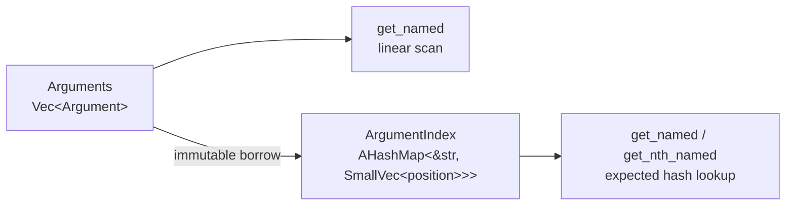

# Arguments

`Arguments` is an insertion-ordered sequence of `Argument` values. It is not a map:
duplicate names and unnamed positional entries are both valid and preserved.

Names and short string values use inline storage where possible. A linear lookup does
not allocate. `ArgumentIndex` borrows names from the source and stores the first
position inline; overflow storage is needed only for duplicate occurrences.

## Choosing a lookup path

Positional access is O(1). Linear name lookup is O(n) and is often the smaller choice
for short-lived, small argument sets. Building an index is expected O(n); indexed name
lookup is expected O(name length), with O(1) duplicate occurrence selection after the
hash lookup.

The index holds an immutable borrow of its `Arguments`. Rust therefore rejects source
mutation while the index exists rather than permitting stale C++ buffer offsets.

## Mutation

Appending is amortized O(1). Removing an entry is O(n), because later entries shift to
preserve order. `clear` retains vector capacity. Value mutation does not change names
or ordering.

## Hashing assumption

The name index uses `ahash`, as do other crate indexes. It is intended for trusted,
non-adversarial keys and is not a denial-of-service boundary.
