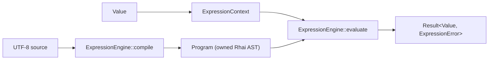

# Expressions and scripts

The expression module provides a small GD-facing API over Rhai. `ExpressionEngine`
compiles source into a reusable `Program`; `ExpressionContext` owns named variables;
evaluation returns the existing `Value` sum type. The module does not reproduce the
C++ postfix-token types or expose their layouts.

Rhai was selected after evaluating maintained embeddable evaluators. It is licensed
under MIT or Apache-2.0, supports expressions and statement control flow, compiles to
an owned AST, registers native Rust functions with typed signatures, and uses `ahash`
internally. `evalexpr` was not used because version 13.1.0 is AGPL-3.0-only. A custom
parser would duplicate substantially more code than this boundary.

## Data flow



Compilation is separate from evaluation so repeated formulas do not repeat parsing
or syntax-tree allocation. A `Program` is not tied to one context and can be reused
with different variable values.

## Grammar and precedence

`compile_expression` accepts exactly one Rhai expression. `compile` accepts a Rhai
script containing assignments, `if`/`else`, loops, blocks, and functions. Scripts use
braces and semicolons; the C++ engine's `begin`/`end` syntax, postfix input format,
keyword operator rewriting, and partial Lua translation are not compatibility goals.

The commonly used precedence groups, from tightest to loosest, are:

| Group | Forms |
|---|---|
| grouping and calls | `(expression)`, `function(arguments)` |
| unary | `!value`, `-value` |
| product | `*`, `/`, `%` |
| sum | `+`, `-` |
| comparison | `<`, `<=`, `>`, `>=`, `==`, `!=`, `in` |
| Boolean conjunction | `&&` |
| Boolean disjunction | `||` |
| assignment in scripts | `=`, `+=`, `-=`, and related forms |

Rhai is the grammar authority. Compile errors include its source position. The Rust
property suite checks arithmetic precedence against native Rust arithmetic, while
GoogleTest records the corresponding C++ formulas.

## Values and variables

The boundary intentionally supports scalar GD values:

| GD input | Expression value | GD output |
|---|---|---|
| `Null` | unit, written `()` in source | `Null` |
| signed integers | `i64` | `I64` |
| unsigned integers through `u32` | `i64` | `I64` |
| `U64` | checked `i64` conversion | `I64` |
| `F32` / `F64` | `f64` | `F64` |
| `Bool` | Boolean | `Bool` |
| `String` | Rhai string | `String` |
| `Bytes` | Rhai blob | `Bytes` |
| `Uuid` | hyphenated string | `String` |

`U64` values above `i64::MAX` return `UnsignedOutOfRange`; they are never wrapped or
rounded. Arrays, maps, function pointers, timestamps, and application custom types
can be used internally by advanced Rhai integrations, but returning one through the
GD boundary produces `UnsupportedOutput` rather than guessing a conversion.

Context lookup is linear in the number of visible variables because Rhai scopes are
stack-like and permit shadowing. Setting and reading one variable is therefore
**O(v)** in the worst case for `v` visible entries. This keeps the adapter small; if
large variable sets become a measured workload, a resolver backed by `AHashMap`
should be benchmarked before changing the public model.

## Execution and extension

```rust
use gd::{ExpressionContext, ExpressionEngine, Value};

let mut engine = ExpressionEngine::new();
engine
    .inner_mut()
    .register_fn("distance2", |x: i64, y: i64| x * x + y * y);

let program = engine.compile_expression("distance2(x, y)")?;
let mut context = ExpressionContext::new();
context.set("x", 3_i64)?.set("y", 4_i64)?;

assert_eq!(engine.evaluate(&program, &mut context)?, Value::I64(25));
# Ok::<(), gd::ExpressionError>(())
```

Native functions are registered through Rhai's typed `register_fn` API. This is the
extension point in place of C++ method arrays containing erased function pointers and
manually synchronized argument-count flags. Advanced callers can access the Rhai
engine and scope through explicit `inner[_mut]` and `scope[_mut]` methods.

The default engine permits at most 1,000,000 operations, 64 nested calls, and an
expression depth of 64. `print` and `debug` are disabled, so evaluation does not emit
library-side output. Applications may tune limits through `inner_mut`; code accepting
untrusted source should retain finite limits.

For source length `n`, compilation is **O(n)** under the parser's normal token stream
and retains **O(n)** AST storage. Evaluation is **O(t)** for `t` executed operations,
plus variable lookup and called-function costs. Loops make `t` depend on runtime data;
the operation limit bounds that work for the default engine.
