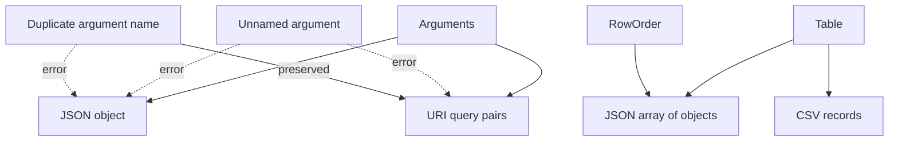

# Interchange formats

The `format` module serializes arguments and tables without exposing their storage
layouts. JSON uses `serde_json`; CSV record rules use `csv`; URI components reuse the
text module's percent encoder.

## Representability

`arguments_to_json` requires every entry to be named and every name to be unique.
Those checks prevent a JSON object from silently dropping positional values or
collapsing duplicate keys. JSON member order is not contractual.

`arguments_to_uri` returns query pairs without a leading `?`. It requires names but
preserves duplicate names and insertion order. Null is an empty value. Names and
values are percent encoded independently, so one field cannot reuse another field's
escape buffer.

Both argument formatters write directly into one output buffer. URI integer and
floating-point text uses stack-backed `itoa` and `ryu` buffers.

## Table output

`table_to_json` produces one complete array of objects. Primary column names are
keys; aliases are lookup conveniences and are not emitted. `row_order_to_json`
serializes the same shape in an existing `RowOrder` without copying or rearranging
the table.

`table_to_csv(table, headers)` optionally writes primary names as the first record.
Null cells become empty fields. The `csv` crate decides quoting for commas, quotes,
and embedded newlines. Integer and float field text uses `itoa` and `ryu` stack
buffers, avoiding one heap allocation per numeric cell.

Both table writers stream directly into one output buffer and use **O(output size)**
space. They do not build an intermediate JSON tree or a vector of fields per row.

## Value mapping

| Rust value | JSON | CSV / URI |
|---|---|---|
| null | `null` | empty |
| Boolean | Boolean | `true` / `false` |
| integer | number | decimal text |
| finite float | number | shortest round-tripping text |
| non-finite float | error | formatter text |
| string | string | text |
| bytes | lowercase hex string | lowercase hex |
| UUID | canonical string | canonical string |

The bytes and UUID choices are explicit library conventions, not attempts to infer an
external schema.
