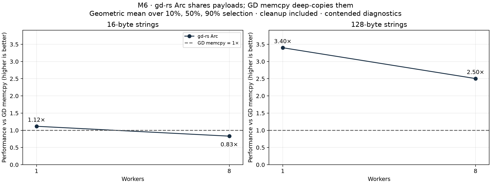
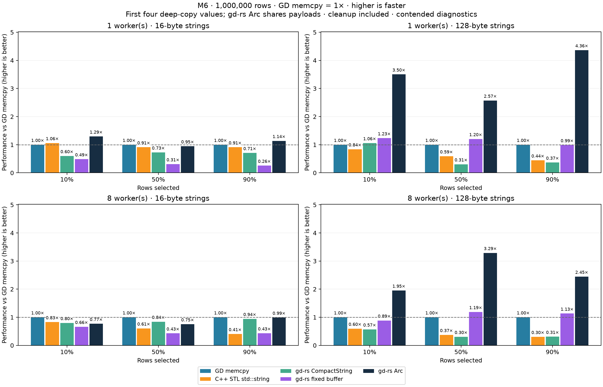

# Arc scaling and refreshed GD comparison on Apple M6

Sources: [Arc scaling harness](../../benches/filter_copy/arc_scaling.rs), [scaling runner](../../benches/filter_copy/arc_scaling.py), [gd-rs shared-record API](../../src/table/shared_record.rs), [Rust comparison driver](../../benches/filter_copy/driver.rs), [C++ comparison driver](../../benches/cpp-reference/filter_copy.cpp), [comparison runner](../../benches/filter_copy/compare.py). The C++ driver has no shared-pointer counterpart; The displayed Arc variant shares payloads while the other four variants copy them.

The selected Arc pipeline is **1.265× faster than the original at eight workers** in the core sweep. Going from one to eight workers improves the original pipeline by **1.089×** and the improved pipeline by **1.377×**, with equal weight for both string sizes and all three selection rates.

Measured from 2026-10-09T10:20:04.026054+00:00 (UTC).

**Contended diagnostics:** these runs retain current host load and OS scheduling. The primary results and separate confirmations are both retained.

## What changed and why

Sources: [Arc scaling harness](../../benches/filter_copy/arc_scaling.rs), [scaling runner](../../benches/filter_copy/arc_scaling.py), [gd-rs shared-record API](../../src/table/shared_record.rs), [Rust comparison driver](../../benches/filter_copy/driver.rs), [C++ comparison driver](../../benches/cpp-reference/filter_copy.cpp), [comparison runner](../../benches/filter_copy/compare.py). The C++ driver has no shared-pointer counterpart; The displayed Arc variant shares payloads while the other four variants copy them.

The original `par_filter` already evaluated predicates and cloned Arc handles on Rayon workers. Its output was then dropped on the calling thread. Every matched row therefore incurred a serial atomic reference-count decrement during timed cleanup. Rayon's unindexed collection also used temporary local buffers and a final concatenation.

Two explicit, safe APIs were added to `SharedRecordTable<S>`:

- `par_filter_chunked(chunk_rows, predicate)` gives each source chunk a local vector reserved to its source length, avoiding local growth. It concatenates the matched handles in source order without additional Arc clones.
- `par_drop()` consumes the result and releases its handles on Rayon workers, joining before returning. Ordinary `drop` remains sequential. Small targets below 4,096 handles stay on the caller; larger targets use a minimum cleanup grain of 4,096.

The M6 comparison uses **1 source chunk per worker** (approximately 125,000 source rows per chunk at eight workers). Both one and four chunks per worker were measured; selection used the lower geometric-mean time over all six eight-worker cases. Their measured difference is small, so this grain is a choice for this workload rather than a universal optimum. At one worker the original serial filter and cleanup are used for both Arc variants; small differences there are measurement variation.

In the separate phase diagnostics, serial cleanup accounted for **47.7%** of original eight-worker elapsed time on average. Primary-batch CPU time divided by elapsed time increased from **4.16** to **7.19** active-core equivalents. This shows substantially more concurrent CPU activity, including scheduling and any worker spinning; it does not measure useful work alone. Each record has its own reference count: there is no single global counter shared by all rows. Per-record atomic operations and pointer chasing still remain; greater CPU use does not imply linear speedup. Moving reference-count updates between caller and worker cores can also create cache-coherence traffic, but this experiment does not isolate that cost with hardware counters.

Parallel cleanup alone improves the eight-worker geometric mean by **1.209×**. Adding reserved chunks gives a further **1.047×**. The cleanup change therefore accounts for most of the measured gain. At 10% selection the combined gain is larger than at 90%; moving more handles and reference counts still costs time.

Initial screening also tried filtering row indices and then gathering Arc handles. That two-pass path did not beat the original at eight workers; the final sweep therefore focuses on fused filtering, chunk size and cleanup. The shorter pilot samples are archived separately and excluded from final means.

Both Arc targets still contain one contiguous vector of shared handles, remain readable after source destruction, and preserve input order. No record or string payload is copied. Construction, temporary buffers, concatenation and completed cleanup are all timed.

## Scaling across cores

Sources: [Arc scaling harness](../../benches/filter_copy/arc_scaling.rs), [scaling runner](../../benches/filter_copy/arc_scaling.py), [gd-rs shared-record API](../../src/table/shared_record.rs), [Rust comparison driver](../../benches/filter_copy/driver.rs), [C++ comparison driver](../../benches/cpp-reference/filter_copy.cpp), [comparison runner](../../benches/filter_copy/compare.py). The C++ driver has no shared-pointer counterpart; The displayed Arc variant shares payloads while the other four variants copy them.

| Workers | gd-rs Arc speed vs 1 worker | gd-rs Arc active CPU cores |
|---:|---:|---:|
| 1 | 1.000× | 1.00 |
| 2 | 1.174× | 1.94 |
| 4 | 1.225× | 3.60 |
| 6 | 1.239× | 5.41 |
| 8 | 1.377× | 7.19 |
| 12 | 1.209× | 10.01 |



The graph uses the fresh comparison at one and eight workers, where GD was also measured. Higher is faster, with GD memcpy at 1×. The table above retains the separate Arc-only sweep at all six worker counts.

CPU-core equivalents are process CPU seconds divided by wall seconds inside each primary batch, excluding source construction and verification. The process clock sums work across threads; it does not identify particular physical cores or core types. The M6 has two Super, four Performance and six Efficiency cores. Eight workers give the best measured aggregate time for the selected pipeline; twelve use more CPU but take longer. Without affinity or hardware counters, this test cannot separate core placement from memory-system and scheduling costs.

| Text bytes | Selected | gd-rs Arc build ms | gd-rs Arc cleanup ms |
|---:|---:|---:|---:|
| 16 | 10% | 0.652 | 0.233 |
| 16 | 50% | 1.014 | 0.786 |
| 16 | 90% | 1.280 | 1.060 |
| 128 | 10% | 0.706 | 0.213 |
| 128 | 50% | 1.038 | 0.805 |
| 128 | 90% | 1.316 | 1.080 |

Stage timings come from seven separately instrumented operations after the primary batches; they are diagnostic and are not added to the primary timing samples.

## Fresh comparison with GD and standard C++ containers

Sources: [Arc scaling harness](../../benches/filter_copy/arc_scaling.rs), [scaling runner](../../benches/filter_copy/arc_scaling.py), [gd-rs shared-record API](../../src/table/shared_record.rs), [Rust comparison driver](../../benches/filter_copy/driver.rs), [C++ comparison driver](../../benches/cpp-reference/filter_copy.cpp), [comparison runner](../../benches/filter_copy/compare.py). The C++ driver has no shared-pointer counterpart; The displayed Arc variant shares payloads while the other four variants copy them.

The tables and graphs show GD row memcpy, standard C++ `std::vector`/`std::string`, gd-rs CompactString, gd-rs fixed buffers, and the latest gd-rs Arc pipeline. All were measured together; the original Arc control is retained in the raw data and explanation. One million source rows contain three numbers and two 16- or 128-byte strings; 10%, 50% or 90% of rows are selected into one ordered target. The first four variants deep-copy values. gd-rs Arc shares records and times handle release while the source remains alive. C++ and the other Rust variants retain their existing caller-thread cleanup.

**Speed relative to GD** (`GD time / variant time`; higher is faster). Geometric means weight each case equally.

| Group | GD memcpy | C++ STL std::string | gd-rs CompactString | gd-rs fixed buffer | gd-rs Arc |
|---|---:|---:|---:|---:|---:|
| All 12 cases | 1.000× | 0.610× | 0.573× | 0.670× | 1.676× |
| 1 worker, 16 B | 1.000× | 0.958× | 0.676× | 0.338× | 1.117× |
| 1 worker, 128 B | 1.000× | 0.604× | 0.491× | 1.137× | 3.400× |
| 8 workers, 16 B | 1.000× | 0.588× | 0.860× | 0.497× | 0.830× |
| 8 workers, 128 B | 1.000× | 0.408× | 0.377× | 1.060× | 2.504× |



| Text bytes | Workers | Selected | GD memcpy ms | C++ STL std::string ms | gd-rs CompactString ms | gd-rs fixed buffer ms | gd-rs Arc ms |
|---:|---:|---:|---:|---:|---:|---:|---:|
| 16 | 1 | 10% | 1.237 | 1.165 | 2.064 | 2.548 | 0.956 |
| 16 | 1 | 50% | 2.107 | 2.315 | 2.896 | 6.825 | 2.226 |
| 16 | 1 | 90% | 2.868 | 3.152 | 4.056 | 11.177 | 2.524 |
| 16 | 8 | 10% | 0.718 | 0.867 | 0.898 | 1.083 | 0.935 |
| 16 | 8 | 50% | 1.373 | 2.268 | 1.630 | 3.211 | 1.823 |
| 16 | 8 | 90% | 2.338 | 5.769 | 2.476 | 5.412 | 2.364 |
| 128 | 1 | 10% | 7.315 | 8.717 | 6.906 | 5.928 | 2.088 |
| 128 | 1 | 50% | 8.675 | 14.681 | 28.425 | 7.203 | 3.373 |
| 128 | 1 | 90% | 11.062 | 24.933 | 30.128 | 11.194 | 2.535 |
| 128 | 8 | 10% | 2.594 | 4.348 | 4.558 | 2.930 | 1.329 |
| 128 | 8 | 50% | 5.992 | 16.056 | 19.651 | 5.041 | 1.821 |
| 128 | 8 | 90% | 7.904 | 25.980 | 25.602 | 6.979 | 3.232 |

In this fresh comparison the improved eight-worker Arc path is **1.158× faster** than the original Arc path. The large-string 90%-selection case regressed in this primary cohort, despite improving in the paired core sweep; its process-round timings show substantial variability. It receives an additional confirmation below. These timings are independent of the earlier three-host and fixed-array cohorts; older measurements are not pooled into the new means.

## Confirmation measurements

Sources: [Arc scaling harness](../../benches/filter_copy/arc_scaling.rs), [scaling runner](../../benches/filter_copy/arc_scaling.py), [gd-rs shared-record API](../../src/table/shared_record.rs), [Rust comparison driver](../../benches/filter_copy/driver.rs), [C++ comparison driver](../../benches/cpp-reference/filter_copy.cpp), [comparison runner](../../benches/filter_copy/compare.py). The C++ driver has no shared-pointer counterpart; The displayed Arc variant shares payloads while the other four variants copy them.

The case with the largest relative round-median range across any variant in each text-size/worker group was repeated with all six variants. The surprising 128-byte, eight-worker, 90%-selection regression was also repeated separately. Primary numbers remain unchanged.

| Text bytes | Workers | Selected | Primary gd-rs Arc / GD speed | Repeat gd-rs Arc / GD speed |
|---:|---:|---:|---:|---:|
| 16 | 1 | 50% | 0.947× | 0.939× |
| 16 | 8 | 90% | 0.989× | 0.810× |
| 128 | 1 | 90% | 4.364× | 4.340× |
| 128 | 8 | 50% | 3.290× | 3.287× |
| 128 | 8 | 90% | 2.446× | 3.351× |

The high-selection regression **did not reproduce** in the repeat: improved/original speed was **2.046×**, versus **0.833×** in the primary run. Separate-process timings vary more than the core sweep, where all pipelines share the same source allocation within each case. Host scheduling, allocation layout and cache state are possible contributors; this experiment does not isolate them. The improvement is therefore an aggregate result for this workload, not a guarantee for every selection rate.

The 128-byte, one-worker, 90%-selection repeat gives a **1.997×** difference between the Arc variants even though they execute the same serial code. That control demonstrates substantial process-to-process variability, not a serial optimization. The paired core sweep is therefore the stronger evidence for the implementation change; the separately launched six-variant ratios should be read as noisy diagnostics rather than precise hardware limits.


## Reproduction and validation

Sources: [Arc scaling harness](../../benches/filter_copy/arc_scaling.rs), [scaling runner](../../benches/filter_copy/arc_scaling.py), [gd-rs shared-record API](../../src/table/shared_record.rs), [Rust comparison driver](../../benches/filter_copy/driver.rs), [C++ comparison driver](../../benches/cpp-reference/filter_copy.cpp), [comparison runner](../../benches/filter_copy/compare.py). The C++ driver has no shared-pointer counterpart; The displayed Arc variant shares payloads while the other four variants copy them.

- Host `M6.local`; `Apple M6`; 32 GiB; 128-byte cache lines; niceness zero; no affinity.
- Compiler: `rustc 1.99.0 (b940084d7 2026-09-28)`; comparison C++: `Apple clang version 21.0.0 (clang-2100.3.34.2)`.
- Core sweep: 4 rotated rounds, 7 batches, calibrated to at least 50 ms; all four pipelines use the public APIs.
- Full comparison: 6 rotated process rounds, 7 batches, at least 50 ms; native release builds; Rust thin LTO, C++ IPO, without sanitizers.
- Core sweep: 144 million-row source-drop strategy checks; 320 boundary strategy checks. Full comparison: 72 million-row and 480 boundary checks; independent Python value oracle.
- Every timed process verifies the complete ordered result outside its timing. Reference counts return to one after Arc target cleanup. Source and executable fingerprints are retained and remained unchanged.
- Separate AddressSanitizer tests passed for the Arc pipelines and process-clock FFI; no sanitizer timings enter these results. Leak detection was disabled because Apple ASan does not support it.
- Library tests cover ordering, duplicate handles, copy-on-write, final-owner destruction, empty input and predicate panics. Full repository CI and Rust 1.86 checks passed.

[Core raw data](measurements/arc-scaling-m6.json), [fresh comparison](measurements/filter-copy-arc-m6.json), [confirmations](measurements/filter-copy-arc-m6-confirmations.json), [high-selection regression repeat](measurements/filter-copy-arc-m6-regression.json), [pipeline selection](measurements/arc-scaling-m6-selection.json). The initial five-pipeline screening and matching source snapshots are retained in the [pilot archive](measurements/archive/arc-scaling-pilot/README.md).

```sh
python3 benches/filter_copy/arc_scaling.py --strategies current fused-par-drop chunks-par-drop chunks4-par-drop \
  --workers 1 2 4 6 8 12 --rounds 4 --samples 7 --sample-ms 50 --verify-full --allow-contended
python3 benches/filter_copy/compare.py --arc-parallel arc_chunks --rounds 6 --allow-contended
# Exact oracle/output paths and confirmation case arguments are in each raw file's invocation metadata.
```
