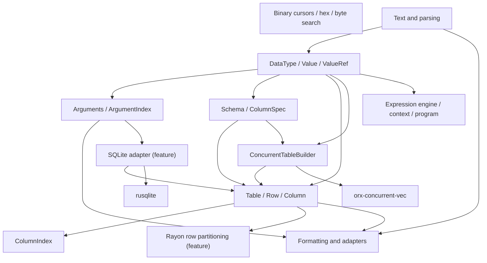
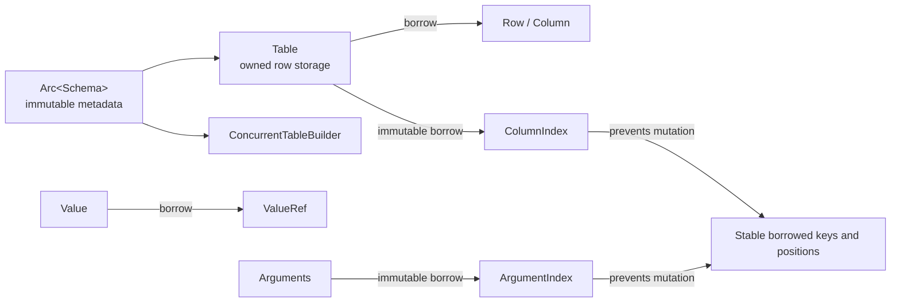
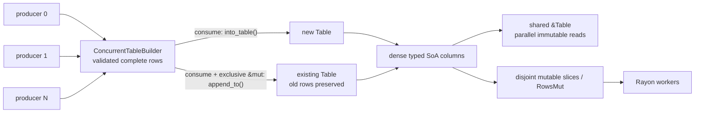

# Architecture

`gd-rs` is a semantic port of the portable core of `gd`. It preserves useful
observable behavior while replacing C++ layout coupling, manual variants, and raw
ownership flags with Rust types.

The `sqlite` feature is a narrow adapter from GD values and arguments to `rusqlite`
and from query rows to typed tables. Generic database interfaces, ODBC and other
drivers are excluded. Pure SQL construction is also excluded from this crate; it can
be considered as a separate package if golden-output tests establish a concrete need.

## Dependency direction

Dependencies point from concrete facilities toward the small value core. Only the
feature-gated SQLite adapter depends on a database API; no module depends on a global
logger or service locator.

Expression parsing and execution are delegated to Rhai behind a GD-value boundary.
This replaces the C++ tokenizer, postfix compiler, erased function-pointer registry,
and bytecode interpreter with one maintained component. The boundary deliberately
returns only `Value`; Rhai-only arrays, maps, function pointers, and custom objects
produce a typed error.

CLI parsing, filesystem and rotation policy, console rendering, logging sinks, and
COM-like request routing are application integration concerns. Rust applications
should use `clap`, `std::fs`/`std::path`, and purpose-built logging or routing crates
directly. Re-exporting those crates here would add coupling without a GD-specific
abstraction.

## Ownership model

Borrowed views carry lifetimes. An index borrows its source immutably, so the source
cannot be structurally mutated while offsets or borrowed keys are in use. This removes
the stale-pointer and stale-offset states possible in the C++ companion index types.

`Schema` is immutable and normally held through `Arc`, so independent tables and
concurrent builders can share column metadata without sharing row storage. Standard
atomic reference counting replaces the source implementation's manual schema
lifetime protocol.

## Concurrency model

Concurrency is divided into explicit phases rather than making every `Table` operation
internally synchronized:

During construction, producers share `&ConcurrentTableBuilder`. Row values and any
open-schema extras are checked and assembled before one complete pending row is
published through `orx-concurrent-vec`; separate typed columns are never allowed to
advance independently. Single-row insertion returns its schedule-dependent final
position. Batch insertion reserves a consecutive range and validates the complete
batch before publishing any of its rows. While producers are active, `row_count` is
the completely published contiguous prefix; it is exact after all producers return.

The transition to `Table` is deliberately exclusive. `into_table` consumes the
builder and creates a new table. `append_to` also consumes the builder and requires
`&mut Table`, checks structural schema equality, preserves existing row positions, and
returns the appended range. A schema mismatch leaves the destination unchanged. Both
paths move pending values into dense typed column vectors, so the finished table pays
no concurrent-element overhead.

An established table then follows normal Rust borrowing. Multiple threads may share
immutable access. Mutation requires an exclusive borrow unless the table is first
partitioned into disjoint typed column slices or row ranges; those disjoint borrows can
be processed by scoped threads or the optional Rayon integration. There is no API for
concurrent structural growth, sorting, indexing, and cell mutation on the same live
`Table`—such operations would need to coordinate every column, extras storage, row
count, and any outstanding borrowed index or ordering view.

## Error and diagnostic policy

Expected failures use typed `Result` errors. The library has no global logger and does
not emit output as a side effect of normal API failures. If a later module has a
concrete need for spans or diagnostics, it can expose optional `tracing` integration;
the application remains responsible for selecting and configuring a subscriber.

## Hash policy

Hash-backed schemas and indexes use `ahash`. This assumes keys are trusted or otherwise
non-adversarial. Ordered sequences remain vectors, because `Arguments` must preserve
duplicate names, unnamed entries, and insertion order.
