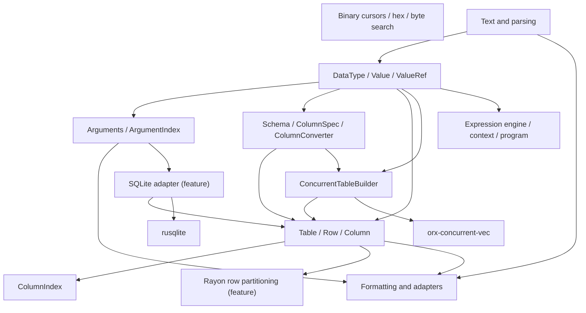
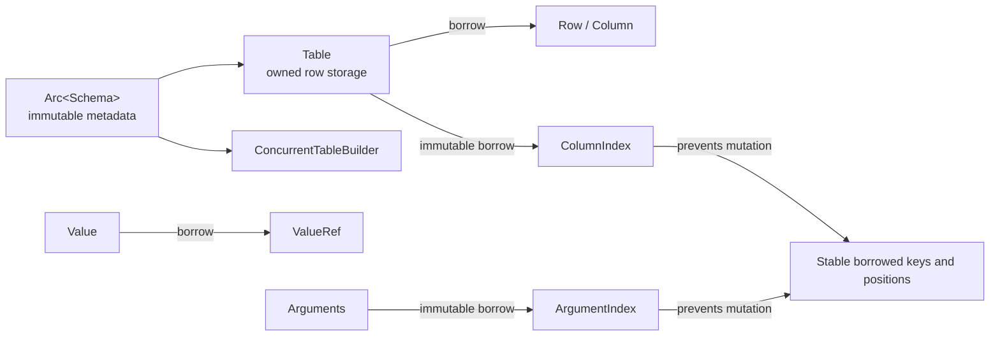
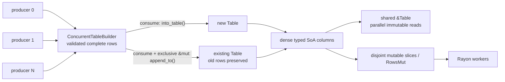

# Architecture

`gd-rs` is a semantic port of the portable core of `gd`. It preserves useful
observable behavior while replacing C++ layout coupling, manual variants, and raw
ownership flags with Rust types.

The `sqlite` feature is a narrow adapter from GD values and arguments to `rusqlite`
and from query rows to typed tables. Generic database interfaces, ODBC and other
drivers are excluded. Pure SQL construction is also excluded from this crate; it can
be considered as a separate package if golden-output tests establish a concrete need.

## Dependency direction

```mermaid
flowchart TD
    Value["DataType / Value / ValueRef"] --> Arguments["Arguments / ArgumentIndex"]
    Value --> Schema["Schema / ColumnSpec / ColumnConverter"]
    Schema --> Table["Table / Row / Column"]
    Value --> Table
    Schema --> Builder["ConcurrentTableBuilder"]
    Value --> Builder
    Builder --> Table
    Builder --> Orx["orx-concurrent-vec"]
    Table --> ColumnIndex["ColumnIndex"]
    Table --> Rayon["Rayon row partitioning (feature)"]
    Binary["Binary cursors / hex / byte search"]
    Text["Text and parsing"] --> Value
    Value --> Expression["Expression engine / context / program"]
    Arguments --> Formatting["Formatting and adapters"]
    Table --> Formatting
    Text --> Formatting
    Arguments --> SQLite["SQLite adapter (feature)"]
    SQLite --> Table
    SQLite --> Rusqlite["rusqlite"]
```

Dependencies point from concrete facilities toward the small value core. Only the
feature-gated SQLite adapter depends on a database API; no module depends on a global
logger or service locator.

Expression parsing and execution are delegated to Rhai behind a GD-value boundary.
This replaces the C++ tokenizer, postfix compiler, erased function-pointer registry,
and bytecode interpreter with one maintained component. The boundary deliberately
returns only `Value`; Rhai-only arrays, maps, function pointers, and custom objects
produce a typed error.

CLI parsing, filesystem and rotation policy, console rendering, logging sinks, and
COM-like request routing are application integration concerns. Rust applications
should use `clap`, `std::fs`/`std::path`, and purpose-built logging or routing crates
directly. Re-exporting those crates here would add coupling without a GD-specific
abstraction.

## Ownership model

```mermaid
flowchart LR
    Schema["Arc&lt;Schema&gt;<br/>immutable metadata"] --> Table["Table<br/>owned row storage"]
    Schema --> Builder["ConcurrentTableBuilder"]
    Value["Value"] -->|"borrow"| ValueRef["ValueRef"]
    Arguments["Arguments"] -->|"immutable borrow"| ArgumentIndex["ArgumentIndex"]
    Table -->|"borrow"| View["Row / Column"]
    Table -->|"immutable borrow"| ColumnIndex["ColumnIndex"]
    ArgumentIndex -->|"prevents mutation"| Stable["Stable borrowed keys and positions"]
    ColumnIndex -->|"prevents mutation"| Stable
```

Borrowed views carry lifetimes. An index borrows its source immutably, so the source
cannot be structurally mutated while offsets or borrowed keys are in use. This removes
the stale-pointer and stale-offset states possible in the C++ companion index types.

`Schema` is immutable and normally held through `Arc`, so independent tables and
concurrent builders can share column metadata and named input converters without
sharing row storage. Converters are explicit per-column policies for mismatched,
non-null input; their output still passes the schema's ordinary type and nullability
checks. Standard atomic reference counting replaces the source implementation's manual
schema lifetime protocol.

Each `Table` also owns an insertion-ordered property collection. Properties describe
the complete table rather than individual rows, are cloned by row-selection copies,
and do not affect the shared schema or typed column layout.

## Concurrency model

Concurrency is divided into explicit phases rather than making every `Table` operation
internally synchronized:

```mermaid
flowchart LR
    P0["producer 0"] --> Builder["ConcurrentTableBuilder<br/>validated complete rows"]
    P1["producer 1"] --> Builder
    PN["producer N"] --> Builder

    Builder -->|"consume: into_table()"| New["new Table"]
    Builder -->|"consume + exclusive &mut: append_to()"| Existing["existing Table<br/>old rows preserved"]

    New --> SoA["dense typed SoA columns"]
    Existing --> SoA
    SoA --> Shared["shared &Table<br/>parallel immutable reads"]
    SoA --> Split["disjoint mutable slices / RowsMut"]
    Split --> Rayon["Rayon workers"]
```

During construction, producers share `&ConcurrentTableBuilder`. Row values are first
processed by any schema-declared converters; converted values and any open-schema
extras are checked and assembled before one complete pending row is
published through `orx-concurrent-vec`; separate typed columns are never allowed to
advance independently. Single-row insertion returns its schedule-dependent final
position. Batch insertion reserves a consecutive range and validates the complete
batch before publishing any of its rows. While producers are active, `row_count` is
the completely published contiguous prefix; it is exact after all producers return.

The transition to `Table` is deliberately exclusive. `into_table` consumes the
builder and creates a new table. `append_to` also consumes the builder and requires
`&mut Table`, checks structural schema equality, preserves existing row positions, and
returns the appended range. A schema mismatch leaves the destination unchanged. Both
paths move pending values into dense typed column vectors, so the finished table pays
no concurrent-element overhead.

An established table then follows normal Rust borrowing. Multiple threads may share
immutable access. Mutation requires an exclusive borrow unless the table is first
partitioned into disjoint typed column slices or row ranges; those disjoint borrows can
be processed by scoped threads or the optional Rayon integration. There is no API for
concurrent structural growth, sorting, indexing, and cell mutation on the same live
`Table`—such operations would need to coordinate every column, extras storage, row
count, and any outstanding borrowed index or ordering view.

### Thread-safety classification

These are separate properties, rather than three levels of one guarantee:

- **Thread-compatible**: distinct objects can be used on distinct threads without
  synchronization. One object used from several threads needs caller-provided
  synchronization, and distinct objects share no hidden mutable state.
- **Reentrant**: a function can be entered again, by recursion or a callback, before
  an earlier call returns without corrupting its state. This also depends on any
  application callbacks and locks it uses; thread safety alone does not establish it.
- **Safe sharing**: one object can be accessed by several threads at once without
  caller-provided synchronization, at least for reads.

| Property | gd-rs | GD (C++) |
|---|---|---|
| Thread-compatible | Core data types are `Send`; expression objects are not. Borrowing and `Send`/`Sync` constrain cross-thread use | Application must check shared backing objects, non-atomic reference counts, and global state such as the `r64` UUID generator |
| Reentrant | Borrowing prevents conflicting access to an ordinary `Table`; callback reentrancy and deadlock freedom are not compiler guarantees | No general guarantee; callers must preserve views and avoid conflicting access or callback mutation |
| Safe sharing | Shared reads of `Table`; shared appends through `ConcurrentTableBuilder`; disjoint mutable partitions | No general internally synchronized table API; verified frozen reads require an application-enforced protocol |

#### gd-rs

The crate contains no `unsafe` code or manual `Send`/`Sync` implementations. The
compiler derives these traits from field types; this is distinct from establishing
logical correctness or callback reentrancy. With the current dependency features:

| Types | `Send` | `Sync` | Consequence |
|---|---|---|---|
| `Table`, `Schema`, `ConcurrentTableBuilder`, `Value`, `Arguments` | Yes | Yes | May be moved to and shared between threads |
| `SqliteDatabase` | Yes | No | May be moved to another thread; shared access needs synchronization such as a `Mutex` because `rusqlite::Connection` uses `RefCell` |
| `ExpressionEngine`, `ExpressionContext`, `Program` | No | No | Existing objects cannot be moved or shared across threads; create one per worker. Rhai is built without its `sync` feature, so it uses `Rc` and `RefCell` |

Shared backing data, namely `Arc<Schema>` and named converters (`Send + Sync`
closures), uses atomic reference counts. Tables that share a schema therefore remain
independent row storage for threading purposes. Converters may capture synchronized
application state, so sharing a schema does not promise independent callback behavior.

Conflicting re-entry into an ordinary table is prevented by borrowing. Mutation requires `&mut`,
converters receive only a `ValueRef`, row-mutation callbacks cannot reach the table
they are mutating, and borrowed index and ordering views prevent structural mutation
while they are alive. Shared immutable operations can re-enter; callbacks can also
re-enter other objects or acquire locks. The compiler does not prevent recursive
business logic or deadlocks. A panic in a row-wise mutation callback leaves earlier rows
modified; this is memory-safe but not transactional. `ConcurrentTableBuilder` avoids
partial rows by validating each complete row before publishing it.

Safe sharing is limited to the phases above: immutable `&Table` access, concurrent
appends to `ConcurrentTableBuilder`, and disjoint mutable partitions. Concurrent
structural mutation of one live `Table` requires an application-level `Mutex` or
`RwLock`.

#### GD (C++)

GD does not provide a general thread-safety contract for these containers. Separate
table objects can still share backing storage, and unrelated utilities can use shared
mutable state. In particular:

- Member tables share `detail::columns` schema objects whose reference count is a
  plain `int` ([`gd_table_column.h`](../../external/gd/source/gd_table_column.h)).
  Schema-sharing construction paths, including the `tag_columns` overload, increment the source's count
  ([`gd_table_table.cpp`](../../external/gd/source/gd_table_table.cpp)), so two
  threads doing so from one frozen source race.
- String and binary `reference` storage also uses a non-atomic `int` reference count
  ([`gd_table.h`](../../external/gd/source/gd_table.h)).
- `r64::new_uuid` draws from a static `std::mt19937_64` without a lock
  ([`gd_uuid.h`](../../external/gd/source/gd_uuid.h)). In contrast,
  `uuid_generate_g` uses a thread-local engine
  ([`gd_types.cpp`](../../external/gd/source/gd_types.cpp)).

GD's ordinary table operations do not internally synchronize access. Growth such as
`row_add` can invalidate live views or iterators; subsequently using invalidated views
can be undefined behavior. Unsynchronized conflicting accesses, including reference
count updates, can themselves be data races. A `const` operation can change shared
reference counts, so `const` alone is not evidence of safe sharing. Genuinely read-only
operations on safely published, frozen storage can run concurrently if the application
also preserves lifetimes and prevents reference-count changes. The order workflow's frozen-input,
single-writer-output protocol is the only concurrent pattern that has been checked; see
[What the application must enforce for concurrent GD use](order-workflow.md#what-the-application-must-enforce-for-concurrent-gd-use).

## Error and diagnostic policy

Expected failures use typed `Result` errors. The library has no global logger and does
not emit output as a side effect of normal API failures. If a later module has a
concrete need for spans or diagnostics, it can expose optional `tracing` integration;
the application remains responsible for selecting and configuring a subscriber.

## Hash policy

Hash-backed schemas and indexes use `ahash`. This assumes keys are trusted or otherwise
non-adversarial. Ordered sequences remain vectors, because `Arguments` must preserve
duplicate names, unnamed entries, and insertion order.
