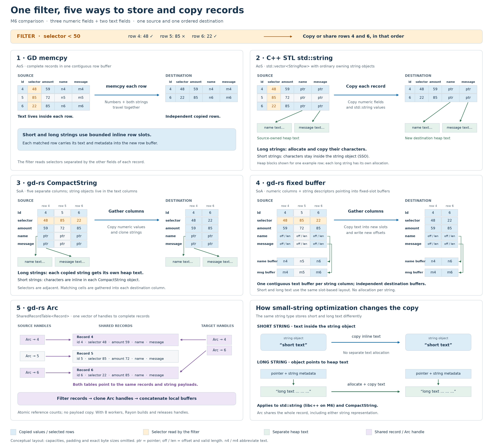

# Whole-record filtering into one target

<!-- arc-scaling-m6:start -->

## M6 comparison

Sources: [Arc scaling harness](../../../benches/filter_copy/arc_scaling.rs), [scaling runner](../../../benches/filter_copy/arc_scaling.py), [gd-rs shared-record API](../../../src/table/shared_record.rs), [Rust comparison driver](../../../benches/filter_copy/driver.rs), [C++ comparison driver](../../../benches/cpp-reference/filter_copy.cpp), [comparison runner](../../../benches/filter_copy/compare.py). The C++ driver has no shared-pointer counterpart. gd-rs Arc shares payloads while the other four variants copy them.

This comparison measures five representations of one million records containing three integers and two strings. Both strings contain either 16 or 128 bytes; a numeric filter selects 10%, 50% or 90% of the rows into one ordered target, using one or eight workers. gd-rs Arc uses chunked filtering, preallocated worker-local handle buffers, ordered concatenation and joined parallel cleanup. At one worker it uses serial filtering and cleanup. These are diagnostics under the host’s current background load; source allocation is excluded and completed target cleanup is included.

[Full-size PNG](images/m6-comparison-memory-layout.png) · [Editable SVG](images/m6-comparison-memory-layout.svg) · [Illustration source](../../../benches/filter_copy/comparison_layout.py)

**Speed relative to GD** (higher is faster; equal weight per case). The first four variants deep-copy payloads; gd-rs Arc shares them.

| Group | GD memcpy | C++ STL std::string | gd-rs CompactString | gd-rs fixed buffer | gd-rs Arc |
|---|---:|---:|---:|---:|---:|
| All 12 cases | 1.000× | 0.610× | 0.573× | 0.670× | 1.676× |
| 1 worker, 16 B | 1.000× | 0.958× | 0.676× | 0.338× | 1.117× |
| 1 worker, 128 B | 1.000× | 0.604× | 0.491× | 1.137× | 3.400× |
| 8 workers, 16 B | 1.000× | 0.588× | 0.860× | 0.497× | 0.830× |
| 8 workers, 128 B | 1.000× | 0.408× | 0.377× | 1.060× | 2.504× |

See [Arc scaling on M6](arc-scaling-m6-results.md) for absolute timings, 1/2/4/6/8/12-worker results, phase measurements, confirmation runs and implementation details. The [fixed-array SoA experiment](filter-copy-arrays-m6-results.md) separately compares GD row memcpy with deep copies of five columns containing constant size text fields and metadata.

<!-- arc-scaling-m6:end -->
