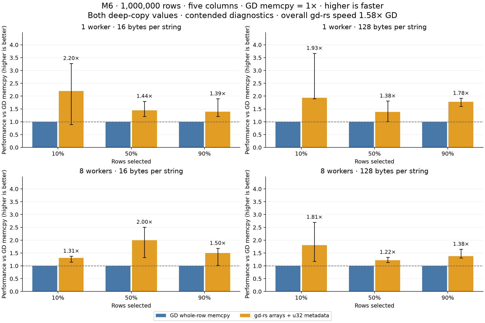

# GD row memcpy versus fixed-array SoA with text metadata on the M6

Sources: [Rust fixed-array SoA](../../benches/filter_copy/fixed_arrays.rs), [unchanged GD memcpy driver](../../benches/cpp-reference/filter_copy.cpp), [paired runner and oracle](../../benches/filter_copy/arrays.py).

This paired experiment compares independent deep copies in AoS and SoA layouts. The [current Arc comparison](filter-copy-results.md) and [earlier three-host measurements](filter-copy-three-host-results.md) are separate cohorts.

One million source rows contain three `u64` columns and two text columns, each exactly 16 or 128 ASCII bytes. Filtering `selector < percentage` selects 10%, 50%, or 90% of the rows. Every match deep-copies all five fields into one independently owned, ordered destination with the same schema.

GD uses the existing `table_column_buffer` implementation and copies each complete inline row with `std::memcpy`. The Rust experiment uses three `Vec<u64>` columns and two `Vec<TextCell<N>>` columns, with `N = 16` or `128`. Each `#[repr(C)]` text cell contains a `u32` metadata word followed by `[u8; N]`: the upper 8 bits hold a tag and the lower 24 bits hold the valid length. It is a **benchmark-local typed SoA prototype**, not the existing dynamic `gd::Table`: that API does not currently accept these fixed-array cells. There are no CompactString objects, shared handles, or per-cell allocations in the Rust target. Both source and destination retain five columns; the metadata is part of each text cell, not an extra column.

Lengths are validated once when constructing a cell. The timed copy loop copies both complete text cells, including their metadata, without revalidating them. The fixture uses full-length text and independently varying name/message tags derived from the row id. Every copied tag and length is checked outside timing; variable valid lengths and source mutation/deletion are covered by separate tests. GD retains its existing 32-bit per-cell length word; the packed Rust tag format is additional metadata, not an assertion that GD uses the same tag semantics.

Both implementations filter static source row ranges first, retain matched indices, compute destination ranges, allocate one target, then deep-copy disjoint row ranges. Rust uses an exact eight-thread Rayon pool; GD retains its persistent C++ worker pool. One worker executes on the caller. All workers join before the target is returned. No worker output tables or extra concatenation of payloads are used.

Rust writes values into `Vec::spare_capacity_mut()` using safely split slices, then sets column lengths after every slot has been initialized. This avoids a zero-fill pass absent from GD. Rust text cells occupy 20/132 bytes including the 4-byte metadata, giving 64/288 bytes across all five columns per row. GD additionally stores terminators, spare capacity and alignment: its row stride remains 72/296 bytes. Both therefore copy eight bytes of text metadata per row; their remaining storage costs differ. The [untimed M6 layout probe](measurements/filter-copy-arrays-m6-inline-layout.json) records the exact source snippet, compiler command and row strides.

The [earlier metadata-free cohort and matching source snapshots](measurements/archive/filter-copy-arrays-without-metadata/README.md) are preserved separately. Its timings are excluded from the current means; both GD and Rust were rerun for this comparison.

## Fresh paired results

Sources: [Rust fixed-array SoA](../../benches/filter_copy/fixed_arrays.rs), [unchanged GD memcpy driver](../../benches/cpp-reference/filter_copy.cpp), [paired runner and oracle](../../benches/filter_copy/arrays.py).

**Contended diagnostics:** these runs use the authorized current background load, without CPU affinity. The geometric mean weights all 12 cases equally. Ratios are GD time divided by Rust time: above 1 means Rust is faster.

Overall Rust/GD speed ratio: **1.585×**. Rust is faster in **12 of 12 primary cases**.

| Workers | Bytes per string | Rust speed relative to GD, geometric mean |
|---:|---:|---:|
| 1 | 16 | 1.639× |
| 1 | 128 | 1.682× |
| 8 | 16 | 1.577× |
| 8 | 128 | 1.450× |

| Bytes/string | Workers | Selected | GD ms | gd-rs arrays + metadata ms | gd-rs/GD speed |
|---:|---:|---:|---:|---:|---:|
| 16 | 1 | 10% | 2.034 | 0.924 | 2.200× |
| 16 | 1 | 50% | 3.648 | 2.530 | 1.442× |
| 16 | 1 | 90% | 4.808 | 3.464 | 1.388× |
| 128 | 1 | 10% | 7.300 | 3.780 | 1.931× |
| 128 | 1 | 50% | 11.479 | 8.300 | 1.383× |
| 128 | 1 | 90% | 16.901 | 9.490 | 1.781× |
| 16 | 8 | 10% | 1.385 | 1.057 | 1.310× |
| 16 | 8 | 50% | 3.556 | 1.777 | 2.000× |
| 16 | 8 | 90% | 3.770 | 2.517 | 1.498× |
| 128 | 8 | 10% | 4.691 | 2.597 | 1.806× |
| 128 | 8 | 50% | 6.879 | 5.622 | 1.224× |
| 128 | 8 | 90% | 9.750 | 7.069 | 1.379× |



These are complete filter-and-copy timings, so they include the SoA advantage of scanning a contiguous numeric selector column. They do not isolate copy-only throughput or establish that either layout wins for every operation. The experiment also compares runtime-sized GD memcpy with Rust copies whose array sizes are known at compile time; those are material implementation differences.

## Repeats and variability

Sources: [Rust fixed-array SoA](../../benches/filter_copy/fixed_arrays.rs), [unchanged GD memcpy driver](../../benches/cpp-reference/filter_copy.cpp), [paired runner and oracle](../../benches/filter_copy/arrays.py).

Selected cases were repeated separately under the same settings. The primary numbers above remain intact.

| Bytes/string | Workers | Selected | Primary Rust/GD | Repeat Rust/GD |
|---:|---:|---:|---:|---:|
| 16 | 1 | 10% | 2.200× | 1.430× |
| 16 | 8 | 50% | 2.000× | 1.148× |
| 128 | 1 | 10% | 1.931× | 1.948× |
| 128 | 8 | 10% | 1.806× | 1.823× |
| 128 | 8 | 50% | 1.224× | 1.255× |

Rust is faster in 5 of 5 confirmation cases. The advantage varies between runs, especially with eight workers; these diagnostics support the direction of the result more strongly than an exact speedup factor.

Cases were selected by the largest relative round-median range in each of the four groups, supplemented by the fastest and closest-to-parity primary results when different.

The figure shows GD time divided by Rust time, using the primary medians: GD memcpy is 1× and higher is faster. Whiskers span GD minimum / Rust maximum to GD maximum / Rust minimum using process-round medians; these are conservative observed bounds, not confidence intervals. Boundary load observations and all batch samples are retained in the raw data.

## Measurement and reproduction

Sources: [Rust fixed-array SoA](../../benches/filter_copy/fixed_arrays.rs), [unchanged GD memcpy driver](../../benches/cpp-reference/filter_copy.cpp), [paired runner and oracle](../../benches/filter_copy/arrays.py).

- Host: `M6.local`, `Apple M6`; `macOS-27.0.1-arm64-arm-64bit`.
- CPU topology: hw.physicalcpu: 12; hw.logicalcpu: 12; hw.nperflevels: 3; hw.perflevel0.name: Super; hw.perflevel0.physicalcpu: 2; hw.perflevel1.name: Performance; hw.perflevel1.physicalcpu: 4; hw.perflevel2.name: Efficiency; hw.perflevel2.physicalcpu: 6.
- RAM: 32 GiB; process niceness 0.
- Rust: `rustc 1.99.0 (b940084d7 2026-09-28)`. C++: `Apple clang version 21.0.0 (clang-2100.3.34.2)`.
- Rust flags: `release -O3; codegen-units=1; lto=thin; target-cpu=native; no-default-features; rayon; locked`. C++ flags: `Release -O3 -DNDEBUG -march=native; IPO ON; sanitizers OFF`.
- GD revision: `cb11cff90d05260a88d59a30c9da421cd4e19c34`; gd-rs base revision: `293e6b3f7b5d1dadad71e1b8b6934f2514504922` plus the fingerprinted experiment files.
- Measurement UTC: `2026-10-09T07:18:06.118752+00:00`; 4 alternating-order process rounds, 7 batches per process, calibrated to at least 50 ms per batch.
- Primary correctness: 24 million-row, ordered full-cell digest/source-drop checks and 160 empty/boundary/ownership checks; independent Python oracle.
- Source, executable and GD fingerprints remained unchanged during the run.
- The renderer verifies each measured file against either the current checkout or the recorded base commit. For byte-for-byte source reproduction, use the recorded base for changed files and overlay the experiment files whose hashes match the current checkout.
- Source construction, worker startup and verification are excluded. Target allocation, filtering, temporary indices, synchronization, copying and target destruction are included.
- Separate Rust AddressSanitizer tests and the Rust 1.86 example check passed; timed binaries use no instrumentation.

[Primary raw data](measurements/filter-copy-arrays-m6.json), [confirmation raw data](measurements/filter-copy-arrays-m6-confirmations.json).

```sh
PYTHONDONTWRITEBYTECODE=1 python3 benches/filter_copy/arrays.py --prepare-oracle
PYTHONDONTWRITEBYTECODE=1 python3 benches/filter_copy/arrays.py --allow-contended

# Repeat the selected cases without replacing the primary JSON:
PYTHONDONTWRITEBYTECODE=1 python3 benches/filter_copy/arrays.py --skip-build --allow-contended \
  --case 16 1 10 --case 16 8 50 --case 128 1 10 --case 128 8 10 --case 128 8 50 \
  --output target/filter-copy-arrays/confirmations.json

# Render the retained primary and confirmation files:
python3 benches/filter_copy/arrays_summarize.py \
  --input docs/high-level/measurements/filter-copy-arrays-m6.json \
  --confirmations docs/high-level/measurements/filter-copy-arrays-m6-confirmations.json \
  --layout-probe docs/high-level/measurements/filter-copy-arrays-m6-inline-layout.json
```
