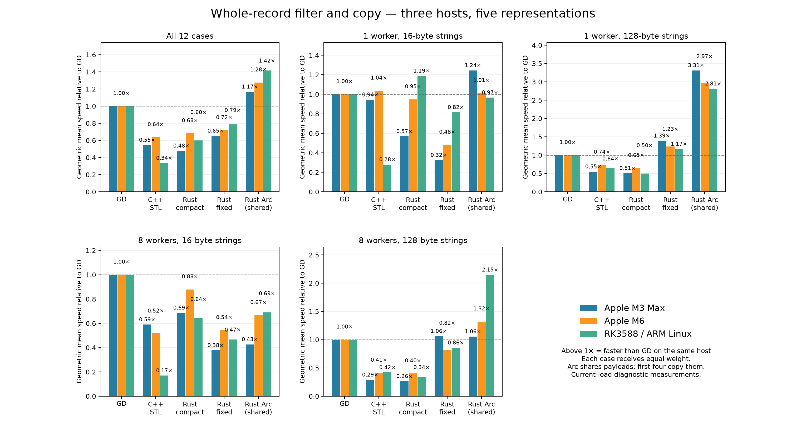
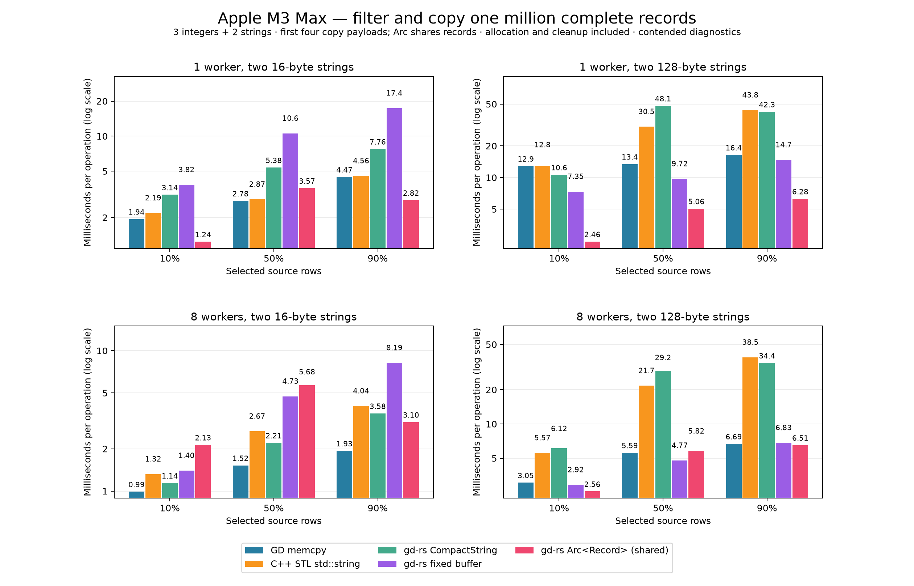
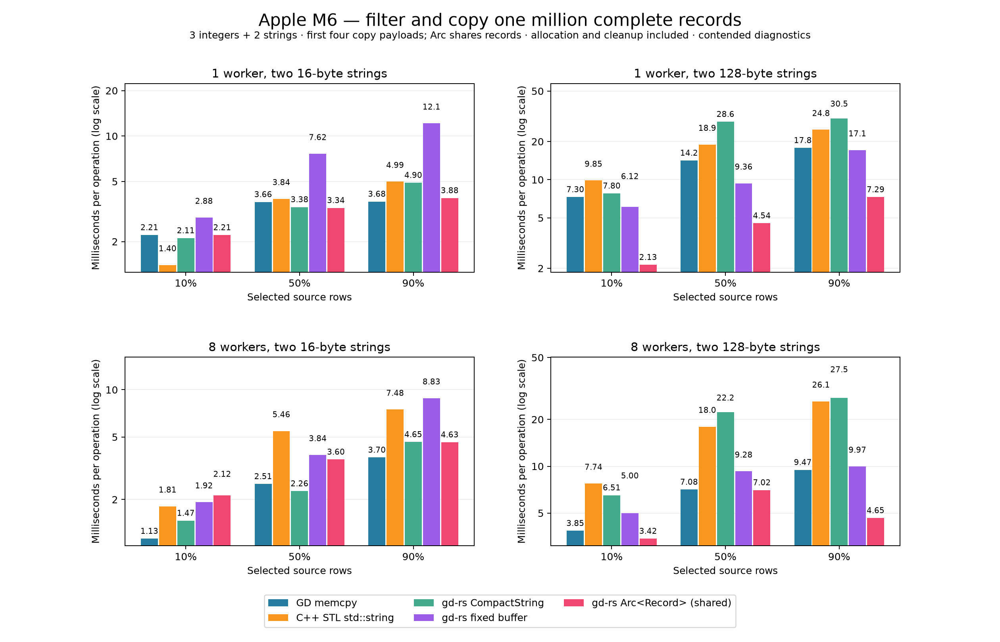
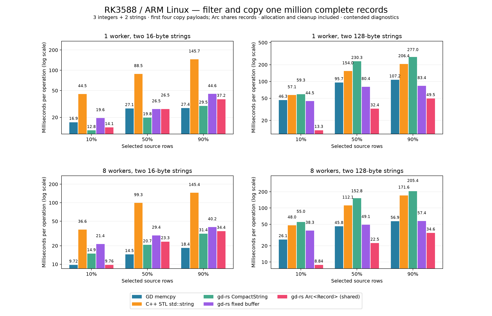

# Earlier whole-record comparison on three hosts

Historical measurements from 2026-10-08. See the [current comparison](filter-copy-results.md) for the latest M6 Arc implementation.

**Among the four independent-copy variants, GD’s whole-row memcpy path has the best overall geometric mean on all three hosts; gd-rs fixed buffers rank second overall on all three.** With the shared Arc variant included, primary first-place counts across 36 host/case combinations are: GD memcpy 11, C++ STL std::string 1, gd-rs CompactString 3, gd-rs fixed buffer 1, gd-rs Arc<Record> (shared) 20.

Measured on 2026-10-08. Each source has **1,000,000 records**, with **three `u64` fields and two string fields**. Both strings are exactly 16 or 128 ASCII bytes. A numeric predicate selects exactly 10%, 50%, or 90% of the source. Every implementation returns one ordered target containing all five fields. Runs use one or eight workers.

GD copies each matched complete inline row with `std::memcpy`. The STL case uses standard `std::vector` and ordinary `std::string` copy operations. gd-rs is Yoshman’s SoA implementation, tested with native `CompactString` storage and its fixed-buffer string support. These first four variants create independent record and string storage.

**The fifth variant uses the new `SharedRecordTable<S>` API, backed by `Vec<Arc<S>>`.** Its one column holds handles to structs containing the same five fields; the strings use `CompactString`. Filtering clones only Arc handles and shares record payloads. The target survives source destruction, and `get_mut` uses copy-on-write when `S: Clone`, but payload cloning on mutation is outside this test. This changes ownership and storage layout, so its speed is not a measure of deep-copy performance. The original dynamic `Table` remains unchanged.

Sources: [Rust driver](../../benches/filter_copy/driver.rs), [C++ driver](../../benches/cpp-reference/filter_copy.cpp), [runner/oracle](../../benches/filter_copy/compare.py), [shared-record API](../../src/table/shared_record.rs); the Arc case has no C++ `shared_ptr` counterpart in this test; [method and commands](../../benches/filter_copy/README.md).

Timed sources are preserved in [commit `6c9158f`](https://github.com/kjn-void/gd-rs/tree/6c9158f4d87b2be8e1f5f6361567448c76a4947d). The published source fingerprints match that commit. Build that snapshot to reproduce the measured sources byte for byte.

**These are diagnostics under each machine’s current background load.** All runs explicitly enabled contended-diagnostic mode; observed load is recorded per host below. Target allocation, filtering, row indices, synchronization, copying, and destruction are timed. Source generation, pool startup, and full verification are outside timing. Arc cleanup decrements handles while the source remains alive, so it does not free record or string payloads. Native optimized builds use LTO without sanitizers. Five rotated process rounds contain seven calibrated batches each; each reported time is the median of the five round medians.

## Relative performance

Sources: [Rust driver](../../benches/filter_copy/driver.rs), [C++ driver](../../benches/cpp-reference/filter_copy.cpp), [runner/oracle](../../benches/filter_copy/compare.py), [shared-record API](../../src/table/shared_record.rs); the Arc case has no C++ `shared_ptr` counterpart in this test. Each ratio is `GD time / variant time` on the same host; **above 1× means faster than GD**. The all-case geometric mean weights all 12 combinations equally. Compiler, standard-library, core topology, and load differences prevent attributing cross-host changes solely to the CPU.

| Host | GD memcpy | C++ STL std::string | gd-rs CompactString | gd-rs fixed buffer | gd-rs Arc (shared) |
|---|---:|---:|---:|---:|---:|
| Apple M3 Max | 1.000× | 0.546× | 0.479× | 0.653× | 1.168× |
| Apple M6 | 1.000× | 0.637× | 0.682× | 0.718× | 1.276× |
| RK3588 / ARM Linux | 1.000× | 0.336× | 0.601× | 0.786× | 1.417× |



### Four worker/string groups

Sources: [Rust driver](../../benches/filter_copy/driver.rs), [C++ driver](../../benches/cpp-reference/filter_copy.cpp), [runner/oracle](../../benches/filter_copy/compare.py), [shared-record API](../../src/table/shared_record.rs); the Arc case has no C++ `shared_ptr` counterpart in this test. Each group gives equal weight to the three selection percentages.

| Host | Group | GD memcpy | C++ STL | Rust compact | Rust fixed | Rust Arc (shared) |
|---|---|---:|---:|---:|---:|---:|
| Apple M3 Max | 1 worker, 16-byte strings | 1.000× | 0.945× | 0.569× | 0.325× | 1.245× |
| Apple M3 Max | 1 worker, 128-byte strings | 1.000× | 0.549× | 0.508× | 1.393× | 3.313× |
| Apple M3 Max | 8 workers, 16-byte strings | 1.000× | 0.590× | 0.687× | 0.378× | 0.427× |
| Apple M3 Max | 8 workers, 128-byte strings | 1.000× | 0.291× | 0.265× | 1.062× | 1.056× |
| Apple M6 | 1 worker, 16-byte strings | 1.000× | 1.036× | 0.947× | 0.481× | 1.013× |
| Apple M6 | 1 worker, 128-byte strings | 1.000× | 0.736× | 0.647× | 1.234× | 2.967× |
| Apple M6 | 8 workers, 16-byte strings | 1.000× | 0.521× | 0.879× | 0.543× | 0.667× |
| Apple M6 | 8 workers, 128-byte strings | 1.000× | 0.414× | 0.402× | 0.823× | 1.321× |
| RK3588 / ARM Linux | 1 worker, 16-byte strings | 1.000× | 0.280× | 1.189× | 0.815× | 0.966× |
| RK3588 / ARM Linux | 1 worker, 128-byte strings | 1.000× | 0.640× | 0.501× | 1.168× | 2.813× |
| RK3588 / ARM Linux | 8 workers, 16-byte strings | 1.000× | 0.170× | 0.644× | 0.468× | 0.691× |
| RK3588 / ARM Linux | 8 workers, 128-byte strings | 1.000× | 0.419× | 0.340× | 0.858× | 2.148× |

### Scaling from one to eight workers

Sources: [Rust driver](../../benches/filter_copy/driver.rs), [C++ driver](../../benches/cpp-reference/filter_copy.cpp), [runner/oracle](../../benches/filter_copy/compare.py), [shared-record API](../../src/table/shared_record.rs); the Arc case has no C++ `shared_ptr` counterpart in this test. Geometric mean of `1-worker time / 8-worker time` over both string sizes and all three percentages. Cleanup is included.

| Host | GD memcpy | C++ STL | Rust compact | Rust fixed | Rust Arc (shared) |
|---|---:|---:|---:|---:|---:|
| Apple M3 Max | 2.429× | 1.396× | 1.926× | 2.288× | 0.803× |
| Apple M6 | 1.652× | 0.879× | 1.254× | 1.433× | 0.894× |
| RK3588 / ARM Linux | 1.800× | 1.134× | 1.092× | 1.168× | 1.330× |

## Apple M3 Max: absolute times

Sources: [Rust driver](../../benches/filter_copy/driver.rs), [C++ driver](../../benches/cpp-reference/filter_copy.cpp), [runner/oracle](../../benches/filter_copy/compare.py), [shared-record API](../../src/table/shared_record.rs); the Arc case has no C++ `shared_ptr` counterpart in this test; [raw samples and host metadata](measurements/filter-copy-m3max.json).



| String bytes each | Workers | Selected rows | GD memcpy ms | C++ STL ms | Rust compact ms | Rust fixed ms | Rust Arc (shared) ms |
|---:|---:|---:|---:|---:|---:|---:|---:|
| 16 | 1 | 10% (100,000) | 1.939 | 2.188 | 3.138 | 3.821 | 1.240 |
| 16 | 1 | 50% (500,000) | 2.781 | 2.866 | 5.376 | 10.566 | 3.573 |
| 16 | 1 | 90% (900,000) | 4.467 | 4.558 | 7.760 | 17.396 | 2.818 |
| 16 | 8 | 10% (100,000) | 0.990 | 1.320 | 1.142 | 1.397 | 2.134 |
| 16 | 8 | 50% (500,000) | 1.521 | 2.666 | 2.207 | 4.730 | 5.677 |
| 16 | 8 | 90% (900,000) | 1.935 | 4.039 | 3.575 | 8.191 | 3.098 |
| 128 | 1 | 10% (100,000) | 12.856 | 12.823 | 10.636 | 7.350 | 2.458 |
| 128 | 1 | 50% (500,000) | 13.437 | 30.461 | 48.134 | 9.715 | 5.060 |
| 128 | 1 | 90% (900,000) | 16.441 | 43.826 | 42.259 | 14.722 | 6.279 |
| 128 | 8 | 10% (100,000) | 3.049 | 5.566 | 6.122 | 2.919 | 2.556 |
| 128 | 8 | 50% (500,000) | 5.590 | 21.664 | 29.240 | 4.770 | 5.821 |
| 128 | 8 | 90% (900,000) | 6.695 | 38.497 | 34.400 | 6.834 | 6.514 |

- Host: `lithium.local`; 16 logical CPUs.
- Rust: `rustc 1.98.1 (48a229cea 2026-09-01)`; C++: `Apple clang version 21.0.0 (clang-2100.3.34.2)`.
- Process niceness: 0; OS scheduling without affinity.
- Boundary observations of unrelated process CPU use: 23.8–137.3% (100% is one core; processes below 5% are excluded).
- 60 million-row source-destruction checks, 400 edge checks, and 300 timed processes. Every ordered digest passed.
- Source, GD, and executable fingerprints remained unchanged during the run.

```text
hw.physicalcpu: 16
hw.logicalcpu: 16
hw.nperflevels: 2
hw.perflevel0.name: Performance
hw.perflevel0.physicalcpu: 12
hw.perflevel1.name: Efficiency
hw.perflevel1.physicalcpu: 4
```

## Apple M6: absolute times

Sources: [Rust driver](../../benches/filter_copy/driver.rs), [C++ driver](../../benches/cpp-reference/filter_copy.cpp), [runner/oracle](../../benches/filter_copy/compare.py), [shared-record API](../../src/table/shared_record.rs); the Arc case has no C++ `shared_ptr` counterpart in this test; [raw samples and host metadata](measurements/filter-copy-m6.json).



| String bytes each | Workers | Selected rows | GD memcpy ms | C++ STL ms | Rust compact ms | Rust fixed ms | Rust Arc (shared) ms |
|---:|---:|---:|---:|---:|---:|---:|---:|
| 16 | 1 | 10% (100,000) | 2.210 | 1.398 | 2.109 | 2.883 | 2.209 |
| 16 | 1 | 50% (500,000) | 3.659 | 3.837 | 3.385 | 7.624 | 3.342 |
| 16 | 1 | 90% (900,000) | 3.681 | 4.988 | 4.904 | 12.134 | 3.884 |
| 16 | 8 | 10% (100,000) | 1.126 | 1.809 | 1.466 | 1.923 | 2.119 |
| 16 | 8 | 50% (500,000) | 2.511 | 5.462 | 2.259 | 3.843 | 3.597 |
| 16 | 8 | 90% (900,000) | 3.702 | 7.477 | 4.648 | 8.833 | 4.630 |
| 128 | 1 | 10% (100,000) | 7.301 | 9.855 | 7.795 | 6.124 | 2.132 |
| 128 | 1 | 50% (500,000) | 14.164 | 18.921 | 28.632 | 9.363 | 4.537 |
| 128 | 1 | 90% (900,000) | 17.805 | 24.764 | 30.464 | 17.108 | 7.289 |
| 128 | 8 | 10% (100,000) | 3.845 | 7.741 | 6.512 | 5.004 | 3.424 |
| 128 | 8 | 50% (500,000) | 7.084 | 17.975 | 22.218 | 9.279 | 7.024 |
| 128 | 8 | 90% (900,000) | 9.473 | 26.139 | 27.504 | 9.970 | 4.650 |

- Host: `M6.local`; 12 logical CPUs.
- Rust: `rustc 1.99.0 (b940084d7 2026-09-28)`; C++: `Apple clang version 21.0.0 (clang-2100.3.34.2)`.
- Process niceness: 0; OS scheduling without affinity.
- Boundary observations of unrelated process CPU use: 93.4–130.0% (100% is one core; processes below 5% are excluded).
- 60 million-row source-destruction checks, 400 edge checks, and 300 timed processes. Every ordered digest passed.
- Source, GD, and executable fingerprints remained unchanged during the run.

```text
hw.physicalcpu: 12
hw.logicalcpu: 12
hw.nperflevels: 3
hw.perflevel0.name: Super
hw.perflevel0.physicalcpu: 2
hw.perflevel1.name: Performance
hw.perflevel1.physicalcpu: 4
hw.perflevel2.name: Efficiency
hw.perflevel2.physicalcpu: 6
```

## RK3588 / ARM Linux: absolute times

Sources: [Rust driver](../../benches/filter_copy/driver.rs), [C++ driver](../../benches/cpp-reference/filter_copy.cpp), [runner/oracle](../../benches/filter_copy/compare.py), [shared-record API](../../src/table/shared_record.rs); the Arc case has no C++ `shared_ptr` counterpart in this test; [raw samples and host metadata](measurements/filter-copy-rk3588.json).



| String bytes each | Workers | Selected rows | GD memcpy ms | C++ STL ms | Rust compact ms | Rust fixed ms | Rust Arc (shared) ms |
|---:|---:|---:|---:|---:|---:|---:|---:|
| 16 | 1 | 10% (100,000) | 16.931 | 44.508 | 12.799 | 19.607 | 14.150 |
| 16 | 1 | 50% (500,000) | 27.108 | 88.498 | 19.803 | 26.500 | 26.479 |
| 16 | 1 | 90% (900,000) | 27.373 | 145.662 | 29.507 | 44.627 | 37.172 |
| 16 | 8 | 10% (100,000) | 9.719 | 36.646 | 14.877 | 21.374 | 9.757 |
| 16 | 8 | 50% (500,000) | 14.455 | 99.262 | 20.722 | 29.374 | 23.333 |
| 16 | 8 | 90% (900,000) | 18.387 | 145.364 | 31.398 | 40.199 | 34.434 |
| 128 | 1 | 10% (100,000) | 46.338 | 57.086 | 59.322 | 44.504 | 13.307 |
| 128 | 1 | 50% (500,000) | 95.697 | 153.958 | 230.260 | 80.364 | 32.413 |
| 128 | 1 | 90% (900,000) | 107.179 | 206.386 | 276.976 | 83.424 | 49.486 |
| 128 | 8 | 10% (100,000) | 26.084 | 48.003 | 55.040 | 38.252 | 8.836 |
| 128 | 8 | 50% (500,000) | 45.817 | 112.086 | 152.782 | 49.063 | 22.459 |
| 128 | 8 | 90% (900,000) | 56.947 | 171.631 | 205.362 | 57.421 | 34.586 |

- Host: `rock`; 8 logical CPUs.
- Rust: `rustc 1.99.0 (b940084d7 2026-09-28)`; C++: `c++ (Ubuntu 15.2.0-16ubuntu1) 15.2.0`.
- Process niceness: 0; OS scheduling without affinity.
- Boundary observations of unrelated process CPU use: 0.0–48.5% (100% is one core; processes below 5% are excluded).
- 60 million-row source-destruction checks, 400 edge checks, and 300 timed processes. Every ordered digest passed.
- Source, GD, and executable fingerprints remained unchanged during the run.

Board: Xunlong Orange Pi 5 Plus; four Cortex-A76 cores and four Cortex-A55 cores.

## Confirmation runs

Sources: [Rust driver](../../benches/filter_copy/driver.rs), [C++ driver](../../benches/cpp-reference/filter_copy.cpp), [runner/oracle](../../benches/filter_copy/compare.py), [shared-record API](../../src/table/shared_record.rs); the Arc case has no C++ `shared_ptr` counterpart in this test; [confirmation selector and runner](../../benches/filter_copy/recheck.py). Up to three noisy or close cases per host were repeated in five rotated process rounds. An additional case can be selected explicitly to check surprising Arc scaling; each JSON records the selection. **The original measurements remain the basis of every graph and geometric mean.**

| Host | Strings | Workers | Selection | Primary winner | Confirmation winner | Largest variant change |
|---|---:|---:|---:|---|---|---:|
| Apple M3 Max | 16 | 8 | 90% | GD memcpy | GD memcpy | 7.1% |
| Apple M3 Max | 128 | 8 | 90% | gd-rs Arc<Record> (shared) | gd-rs Arc<Record> (shared) | 4.3% |
| Apple M3 Max | 128 | 1 | 10% | gd-rs Arc<Record> (shared) | gd-rs Arc<Record> (shared) | 51.5% |
| Apple M3 Max | 16 | 8 | 10% | GD memcpy | GD memcpy | 8.2% |
| Apple M6 | 16 | 1 | 10% | C++ STL std::string | GD memcpy | 28.1% |
| Apple M6 | 16 | 8 | 10% | GD memcpy | GD memcpy | 23.7% |
| Apple M6 | 128 | 8 | 50% | gd-rs Arc<Record> (shared) | gd-rs Arc<Record> (shared) | 45.2% |
| RK3588 / ARM Linux | 128 | 8 | 10% | gd-rs Arc<Record> (shared) | gd-rs Arc<Record> (shared) | 16.7% |
| RK3588 / ARM Linux | 16 | 8 | 90% | GD memcpy | GD memcpy | 23.1% |
| RK3588 / ARM Linux | 16 | 8 | 50% | GD memcpy | GD memcpy | 2.9% |
| RK3588 / ARM Linux | 16 | 8 | 10% | GD memcpy | GD memcpy | 11.3% |

[Apple M3 Max confirmation samples](measurements/filter-copy-m3max-confirmations.json): all 100 repeated process digests passed.
[Apple M6 confirmation samples](measurements/filter-copy-m6-confirmations.json): all 75 repeated process digests passed.
[RK3588 / ARM Linux confirmation samples](measurements/filter-copy-rk3588-confirmations.json): all 100 repeated process digests passed.


## Sharing pipelines: M3 Max, eight workers

Sources: [Rust strategy implementations](../../benches/filter_copy/shared_strategies.rs), [Rust fixtures and timing](../../benches/filter_copy/driver.rs), [generation and measurement runner](../../benches/filter_copy/strategies.py). The [C++ driver](../../benches/cpp-reference/filter_copy.cpp) has no matching Arc/Rc pipeline cases.

This separate M3 Max experiment tests the same million records and all three selection rates, with five rotated rounds and seven batches per process. All pipelines share record payloads. Temporary buffers, concatenation and caller-thread cleanup are timed; source generation and pool startup are excluded. It has 30 full source-drop checks, 200 edge checks and 150 timed processes. All ordered digests passed; [raw samples and fingerprints](measurements/filter-copy-sharing-strategies-m3max.json) are retained. These diagnostic samples do not replace the primary three-host tables.

The two-pass Arc path filters positions and then gathers handles. Fused Arc uses the public SharedRecordTable API to filter and clone together. Explicit fold/reduce merges local vectors through a reduction tree; chunk/concat produces one local vector per source chunk before concatenating. The Rc prototype uses standard `Vec<Rc<Record>>`: the caller first borrows record payloads as `&Record`, Rayon filters those references into positions, and the caller constructs the destination by cloning Rc handles. Rc handles never enter a worker or worker result. It is an experimental container, not another gd-rs public table type.

**Speed relative to fused Arc** (`fused time / strategy time`; above 1× is faster). Each case receives equal weight.

| Group | Arc two passes | Arc fused | Arc fold/reduce | Arc chunk/concat | Rc caller construction |
|---|---:|---:|---:|---:|---:|
| All six cases | 0.841× | 1.000× | 0.953× | 1.406× | 0.988× |
| 16-byte strings | 0.735× | 1.000× | 0.968× | 1.229× | 0.916× |
| 128-byte strings | 0.962× | 1.000× | 0.939× | 1.609× | 1.067× |

| Strings | Selected | Arc two passes ms | Arc fused ms | Arc fold/reduce ms | Arc chunk/concat ms | Rc caller ms |
|---:|---:|---:|---:|---:|---:|---:|
| 16 | 10% | 4.484 | 1.968 | 1.863 | 1.899 | 1.600 |
| 16 | 50% | 4.605 | 5.186 | 4.405 | 3.230 | 5.417 |
| 16 | 90% | 3.637 | 2.917 | 3.998 | 2.614 | 4.471 |
| 128 | 10% | 4.316 | 2.059 | 1.907 | 1.868 | 2.099 |
| 128 | 50% | 4.634 | 5.163 | 5.760 | 3.236 | 5.761 |
| 128 | 90% | 3.636 | 6.089 | 7.128 | 2.570 | 4.408 |

Rc suffices for caller-owned handles with parallel read-only payload access when the record is Sync. Direct Rayon traversal of `Vec<Rc<S>>`, or transferring worker-local Rc vectors, is rejected because Rc is neither Send nor Sync. Arc supports the fused parallel handle-copy pipeline and permits tables to cross threads when the record is Send + Sync. Avoiding atomic counts with Rc trades them for reference/index buffers and serial destination construction; the complete workflow determines the result.


## Interpretation and limits

Sources: [Rust driver](../../benches/filter_copy/driver.rs), [C++ driver](../../benches/cpp-reference/filter_copy.cpp), [runner/oracle](../../benches/filter_copy/compare.py), [shared-record API](../../src/table/shared_record.rs); the Arc case has no C++ `shared_ptr` counterpart in this test.

The independent-copy cases directly exercise GD’s whole-row memcpy advantage: the destination owns the complete record, including both strings. The Arc case instead materializes a vector of shared record handles. All return one ordered target with readable complete records. The benchmark does not measure transforming text, string search predicates, fetching one record into an external struct, NULLs, variable-length distributions, reference-backed GD strings, or database I/O.

The eight-worker strategies have different granularity. C++ dispatches eight filter ranges, computes prefix offsets, then dispatches eight disjoint target ranges. The STL destination’s empty string objects are constructed before parallel assignment. Rust’s dynamic Table filters row ranges with Rayon and then calls native column-parallel gather: five columns create five copy tasks, with most string work in two tasks. SharedRecordTable fuses row filtering and Arc cloning in Rayon local buffers, then concatenates those buffers into one target in source order. This concatenation is timed and moves handles without incrementing their reference counts again. One-worker Arc filtering reserves the source count as an upper bound and appends matched handles. Destruction is performed by the calling thread for all variants. These are material implementation costs, with no shared per-row mutex.

Arc avoids copying string bytes and allocating target string payloads, but still dereferences separately allocated source records and performs atomic reference-count increments and decrements. Source construction includes one Arc allocation per record and is excluded from the timings. Copy-on-write edits and final payload destruction are also excluded. A C++ `std::vector<std::shared_ptr<Record>>` could use the same sharing approach; it was not included, so these measurements cannot attribute the benefit of sharing to Rust alone.

The [untimed representation probe](../../benches/cpp-reference/filter_copy_string_layout.cpp) confirms that the 16-byte payload lives inside each macOS `std::string` object (libc++); Linux’s libstdc++ stores both 16-byte and 128-byte payloads outside the object. Both macOS toolchains use libc++ 220106, while Linux reports libstdc++ 20260321. This changes allocation and cleanup costs. `CompactString` has its own inline representation. Fixed-buffer results include each library’s actual gather implementation and descriptor work, not only a raw byte-copy loop.

Verification checks every output value and order against an independent Python oracle. Separate processes destroy the source and recheck both target string columns. Empty, one-row and uneven-range fixtures plus 0% and 100% selection also pass. Local C++ AddressSanitizer checks separately exercise [168 ownership and boundary cases](measurements/filter-copy-asan.json), using the [safety runner](../../benches/filter_copy/check_safety.py); no sanitizer numbers enter the performance tables. Apple ASan memory checks ran with LeakSanitizer disabled because that platform does not support it. The full repository CI script, including Clippy, documentation, both feature configurations and Rust 1.86, passed.

These measurements establish behavior for this schema, predicate, ownership requirement and scheduling. They do not establish that AoS or SoA is universally faster. High round-to-round variation should be interpreted with the retained samples and confirmation measurements.

Untimed probe output: [Apple M3 Max](measurements/filter-copy-m3max-string-layout.txt), [Apple M6](measurements/filter-copy-m6-string-layout.txt), [RK3588 / ARM Linux](measurements/filter-copy-rk3588-string-layout.txt).


The separate [M6 fixed-array SoA experiment](filter-copy-arrays-m6-results.md)
compares the unchanged [GD memcpy path](../../benches/cpp-reference/filter_copy.cpp)
with a [typed Rust five-column table](../../benches/filter_copy/fixed_arrays.rs),
deep-copying two fixed-array text columns (each cell includes a 32-bit tag/valid-length
word) and three numeric columns. It measures both
variants afresh with the same two-phase row-range scheduling. That prototype is
not the existing dynamic gd-rs Table, and its paired cohort is excluded from all
five-variant figures and geometric means above.
