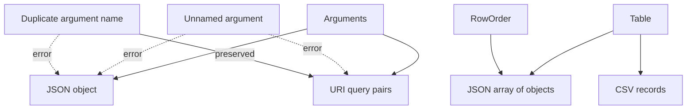

# Interchange formats

The `format` module serializes arguments and tables without exposing their storage
layouts, and `format_import` reads the table formats back into a `Table`. JSON uses `serde_json`; CSV record rules use `csv`; URI components reuse the
text module's percent encoder.

## Representability

`arguments_to_json` requires every entry to be named and every name to be unique.
Those checks prevent a JSON object from silently dropping positional values or
collapsing duplicate keys. JSON member order is not contractual.

`arguments_to_uri` returns query pairs without a leading `?`. It requires names but
preserves duplicate names and insertion order. Null is an empty value. Names and
values are percent encoded independently, so one field cannot reuse another field's
escape buffer.

Both argument formatters write directly into one output buffer. URI integer and
floating-point text uses stack-backed `itoa` and `ryu` buffers.

## Table output

`table_to_json` produces one complete array of objects. Primary column names are
keys; aliases are lookup conveniences and are not emitted. `row_order_to_json`
serializes the same shape in an existing `RowOrder` without copying or rearranging
the table.

`table_to_csv(table, headers)` optionally writes primary names as the first record.
Null cells become empty fields. The `csv` crate decides quoting for commas, quotes,
and embedded newlines. Integer and float field text uses `itoa` and `ryu` stack
buffers, avoiding one heap allocation per numeric cell.

Both table writers stream directly into one output buffer and use **O(output size)**
space. They do not build an intermediate JSON tree or a vector of fields per row.

## Table input

`table_from_json(schema, json)` and `table_from_csv(schema, csv, headers)` rebuild a
table from those representations. The formats carry no types, so the caller supplies
the schema; the reader decodes each field as its column type and then appends the row
through the same validation, conversion, and extras rules as `push_row`.

The JSON reader walks the input with a `serde` visitor instead of building a
`serde_json::Value` tree. Each field is taken as a borrowed raw JSON slice and parsed
from its text, so `u64::MAX` and every finite `f32`/`f64` round-trip exactly and
repeated keys are detected rather than silently collapsed. The CSV reader uses the
`csv` crate's record parser. Both readers keep only the current row outside the
table, so extra space is **O(row width)** beyond the table itself.

Round trips are exact for the fixed schema except where CSV is ambiguous: an empty
field is both null and the empty string or byte sequence, and it reads as the empty
value only in a required column of those types. CSV also strips a UTF-8 BOM at the
start of the input, so a first field that literally begins with U+FEFF loses those
bytes, and a table with no columns has no CSV representation; `table_to_csv` returns
`FormatError::ZeroColumnTable` instead of emitting a record the reader would misread.
Row-local extras are accepted on input (a JSON object key or CSV header column that
matches no schema column under `UnknownFields::Store`), but neither writer emits them;
only schema columns are serialized. Tombstones and table properties are not part of
either format.

## Value mapping

| Rust value | JSON | CSV / URI |
|---|---|---|
| null | `null` | empty |
| Boolean | Boolean | `true` / `false` |
| integer | number | decimal text |
| finite float | number | shortest round-tripping text |
| non-finite float | error | formatter text |
| string | string | text |
| bytes | lowercase hex string | lowercase hex |
| UUID | canonical string | canonical string |

The bytes and UUID choices are explicit library conventions, not attempts to infer an
external schema.
