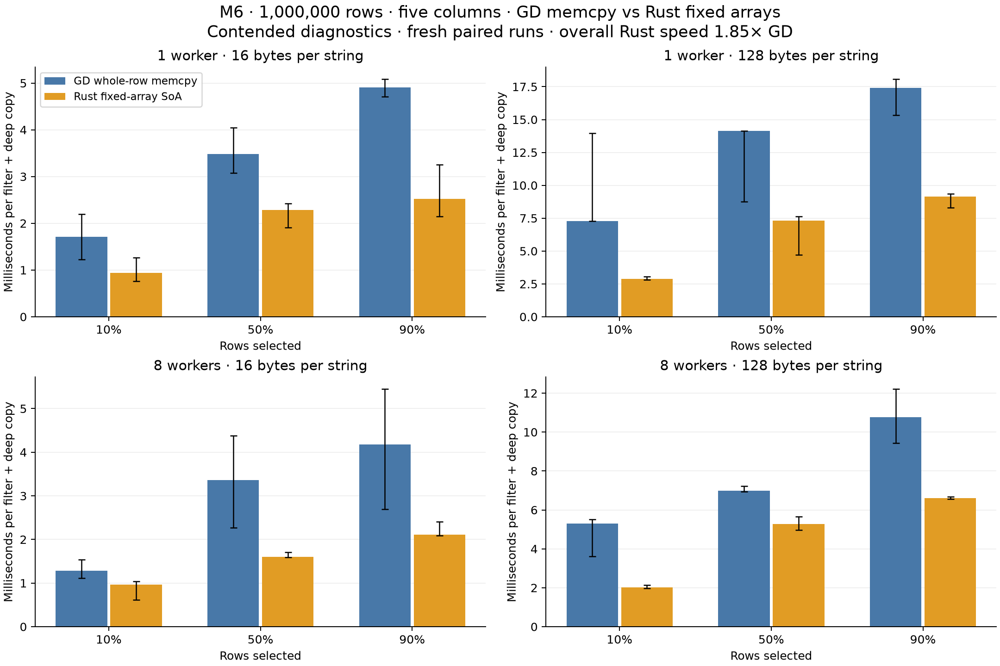

# GD row memcpy versus fixed-array SoA on the M6

Sources: [Rust fixed-array SoA](source/benches/filter_copy/fixed_arrays.rs), [unchanged GD memcpy driver](source/benches/cpp-reference/filter_copy.cpp), [paired runner and oracle](source/benches/filter_copy/arrays.py).

This is a separate, freshly paired experiment. The existing five-variant, three-host results are unchanged.

One million source rows contain three `u64` columns and two text columns, each exactly 16 or 128 ASCII bytes. Filtering `selector < percentage` selects 10%, 50%, or 90% of the rows. Every match deep-copies all five fields into one independently owned, ordered destination with the same schema.

GD uses the existing `table_column_buffer` implementation and copies each complete inline row with `std::memcpy`. The Rust experiment uses three `Vec<u64>` columns and two `Vec<[u8; N]>` columns, with `N = 16` or `128`. It is a **benchmark-local typed SoA prototype**, not the existing dynamic `gd::Table`: that API does not currently accept fixed byte-array cells. There are no CompactString objects, length descriptors, shared handles, or per-cell allocations in the Rust target.

Both implementations filter static source row ranges first, retain matched indices, compute destination ranges, allocate one target, then deep-copy disjoint row ranges. Rust uses an exact eight-thread Rayon pool; GD retains its persistent C++ worker pool. One worker executes on the caller. All workers join before the target is returned. No worker output tables or extra concatenation of payloads are used.

Rust writes values into `Vec::spare_capacity_mut()` using safely split slices, then sets column lengths after every slot has been initialized. This avoids a zero-fill pass absent from GD. Strings are raw fixed arrays with their length known from the schema. GD additionally stores string lengths, terminators and alignment: its row stride is 72/296 bytes, versus 56/280 payload bytes across the Rust columns. The byte layouts therefore have equivalent values but different metadata costs. The [untimed M6 layout probe](filter-copy-arrays-m6-inline-layout.json) records the exact source snippet, compiler command and row strides.

## Fresh paired results

Sources: [Rust fixed-array SoA](source/benches/filter_copy/fixed_arrays.rs), [unchanged GD memcpy driver](source/benches/cpp-reference/filter_copy.cpp), [paired runner and oracle](source/benches/filter_copy/arrays.py).

**Contended diagnostics:** these runs use the authorized current background load, without CPU affinity. The geometric mean weights all 12 cases equally. Ratios are GD time divided by Rust time: above 1 means Rust is faster.

Overall Rust/GD speed ratio: **1.847×**. Rust is faster in **12 of 12 primary cases**.

| Workers | Bytes per string | Rust speed relative to GD, geometric mean |
|---:|---:|---:|
| 1 | 16 | 1.752× |
| 1 | 128 | 2.102× |
| 8 | 16 | 1.773× |
| 8 | 128 | 1.784× |

| Bytes/string | Workers | Selected | GD ms | Rust arrays ms | Rust/GD speed |
|---:|---:|---:|---:|---:|---:|
| 16 | 1 | 10% | 1.712 | 0.942 | 1.816× |
| 16 | 1 | 50% | 3.483 | 2.283 | 1.525× |
| 16 | 1 | 90% | 4.906 | 2.526 | 1.943× |
| 128 | 1 | 10% | 7.296 | 2.890 | 2.525× |
| 128 | 1 | 50% | 14.131 | 7.314 | 1.932× |
| 128 | 1 | 90% | 17.398 | 9.132 | 1.905× |
| 16 | 8 | 10% | 1.284 | 0.960 | 1.338× |
| 16 | 8 | 50% | 3.364 | 1.601 | 2.102× |
| 16 | 8 | 90% | 4.176 | 2.108 | 1.981× |
| 128 | 8 | 10% | 5.301 | 2.012 | 2.635× |
| 128 | 8 | 50% | 6.995 | 5.286 | 1.323× |
| 128 | 8 | 90% | 10.757 | 6.609 | 1.628× |



These are complete filter-and-copy timings, so they include the SoA advantage of scanning a contiguous numeric selector column. They do not isolate copy-only throughput or establish that either layout wins for every operation. The experiment also compares runtime-sized GD memcpy with Rust copies whose array sizes are known at compile time; those are material implementation differences.

## Repeats and variability

Sources: [Rust fixed-array SoA](source/benches/filter_copy/fixed_arrays.rs), [unchanged GD memcpy driver](source/benches/cpp-reference/filter_copy.cpp), [paired runner and oracle](source/benches/filter_copy/arrays.py).

Selected cases were repeated separately under the same settings. The primary numbers above remain intact.

| Bytes/string | Workers | Selected | Primary Rust/GD | Repeat Rust/GD |
|---:|---:|---:|---:|---:|
| 16 | 1 | 10% | 1.816× | 1.825× |
| 16 | 8 | 90% | 1.981× | 1.232× |
| 128 | 1 | 10% | 2.525× | 2.608× |
| 128 | 8 | 10% | 2.635× | 1.943× |
| 128 | 8 | 50% | 1.323× | 1.579× |

Rust is faster in 5 of 5 confirmation cases. The advantage varies between runs, especially with eight workers; these diagnostics support the direction of the result more strongly than an exact speedup factor.

Cases were selected by the largest relative round-median range in each of the four groups, supplemented by the fastest and closest-to-parity primary results when different.

The figure shows the median of round medians; whiskers show the minimum and maximum round median, not confidence intervals. Boundary load observations and all batch samples are retained in the raw data.

## Measurement and reproduction

Sources: [Rust fixed-array SoA](source/benches/filter_copy/fixed_arrays.rs), [unchanged GD memcpy driver](source/benches/cpp-reference/filter_copy.cpp), [paired runner and oracle](source/benches/filter_copy/arrays.py).

- Host: `M6.local`, `Apple M6`; `macOS-27.0.1-arm64-arm-64bit`.
- CPU topology: hw.physicalcpu: 12; hw.logicalcpu: 12; hw.nperflevels: 3; hw.perflevel0.name: Super; hw.perflevel0.physicalcpu: 2; hw.perflevel1.name: Performance; hw.perflevel1.physicalcpu: 4; hw.perflevel2.name: Efficiency; hw.perflevel2.physicalcpu: 6.
- RAM: 32 GiB; process niceness 0.
- Rust: `rustc 1.99.0 (b940084d7 2026-09-28)`. C++: `Apple clang version 21.0.0 (clang-2100.3.34.2)`.
- Rust flags: `release -O3; codegen-units=1; lto=thin; target-cpu=native; no-default-features; rayon; locked`. C++ flags: `Release -O3 -DNDEBUG -march=native; IPO ON; sanitizers OFF`.
- GD revision: `cb11cff90d05260a88d59a30c9da421cd4e19c34`; gd-rs base revision: `293e6b3f7b5d1dadad71e1b8b6934f2514504922` plus the fingerprinted experiment files.
- Measurement UTC: `2026-10-09T04:56:09.579417+00:00`; 4 alternating-order process rounds, 7 batches per process, calibrated to at least 50 ms per batch.
- Primary correctness: 24 million-row, ordered full-cell digest/source-drop checks and 160 empty/boundary/ownership checks; independent Python oracle.
- Source, executable and GD fingerprints remained unchanged during the run.
- Source construction, worker startup and verification are excluded. Target allocation, filtering, temporary indices, synchronization, copying and target destruction are included.
- Separate Rust AddressSanitizer tests and the Rust 1.86 example check passed; timed binaries use no instrumentation.

[Primary raw data](filter-copy-arrays-m6.json), [confirmation raw data](filter-copy-arrays-m6-confirmations.json).

```sh
PYTHONDONTWRITEBYTECODE=1 python3 benches/filter_copy/arrays.py --prepare-oracle
PYTHONDONTWRITEBYTECODE=1 python3 benches/filter_copy/arrays.py --allow-contended

# Repeat the selected cases without replacing the primary JSON:
PYTHONDONTWRITEBYTECODE=1 python3 benches/filter_copy/arrays.py --skip-build --allow-contended \
  --case 16 1 10 --case 16 8 90 --case 128 1 10 --case 128 8 10 --case 128 8 50 \
  --output target/filter-copy-arrays/confirmations.json

# Render the retained primary and confirmation files:
python3 benches/filter_copy/arrays_summarize.py \
  --input docs/high-level/measurements/filter-copy-arrays-m6.json \
  --confirmations docs/high-level/measurements/filter-copy-arrays-m6-confirmations.json \
  --layout-probe docs/high-level/measurements/filter-copy-arrays-m6-inline-layout.json
```
