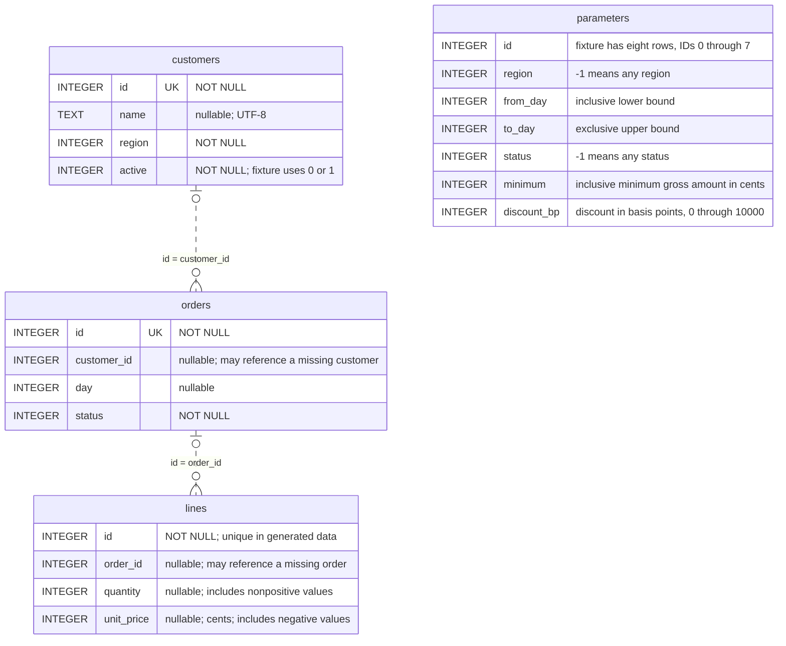
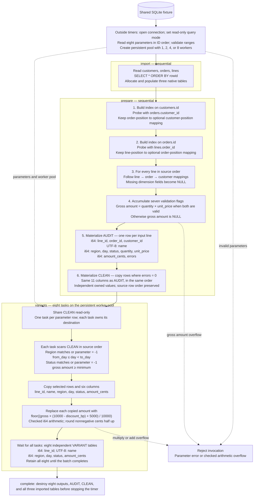
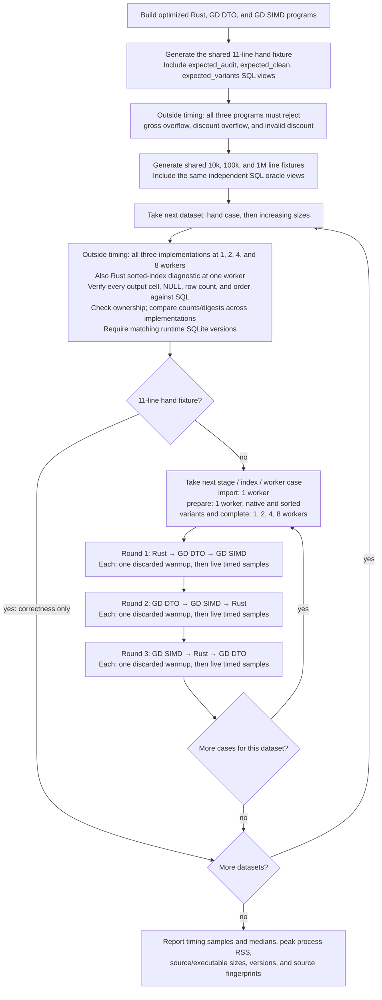

# Three-table order workflow: Rust and C++ GD

This benchmark turns the GD author's examples—mixing three tables, taking subsets,
creating parameterized variants, and validating database data—into one reproducible
application. It compares the implementations in this repository against the
**unmodified** C++ GD submodule at `external/gd`, pinned to
`cb11cff90d05260a88d59a30c9da421cd4e19c34`. The C++ applications and
[CMake build recipe](../../benches/cpp-reference/cmake/GdCore.cmake) are maintained
in `gd-rs`; build output and generated forwarding headers stay under `target`.

The implementation sources are the [Rust application](../../benches/order_workflow/workload.rs)
and [C++ application](../../benches/cpp-reference/order_workflow/workload.hpp).
The [full measurement tables](order-workflow-results.md) include sample ranges,
peak memory, source sizes, executable sizes, and environment details.

## Coverage of the GD author's examples

**All three implementations exercise the requested joins, subsets, parameterized
variants, database-data validation, and marking or excluding invalid rows.** The
following maps the author's wording to the concrete operations being measured:

| Author's example | What all three applications do | Timed stage |
|---|---|---|
| “mixa data mellan tabellerna, kanske joina ihop tre stycken” | Perform two left joins across order lines, orders, and customers, then combine fields from all three in one 11-column audit table. | `prepare` |
| “plocka ut tårtbitar” | Select subsets of rows and project six columns into separate, independently owned result tables. | `variants` |
| “skapa upp varianter baserat på olika inparametrar” | Produce eight result tables using different region, date-range, status, minimum-amount, and discount parameters. | `variants` |
| “data som är inläst från databas och valideras” | Import three tables from SQLite, then check missing order/customer references, absent or empty customer names, inactive customers, null or nonpositive quantities, null or negative prices, and missing order dates. | `import` + `prepare` |
| “värden som inte är korrekta skall ... markeras” | Retain every order line in the audit table and accumulate error flags identifying the failed checks. | `prepare` |
| “värden som inte är korrekta skall plockas bort” | Copy only rows with no validation errors into a separate clean table; invalid rows are excluded from that result and remain available in the audit table. | `prepare` |

Here, **a variant is a parameterized result table** (*resultatvariant*). The
`variants` time covers the entire batch of eight tables, including filtering,
copying selected columns, calculating discounted amounts, and destroying outputs.
The same eight outputs are produced at every worker count. Import, joining,
validation, and clean-table construction precede this stage and run sequentially;
`complete` measures the whole pipeline.

**The benchmark checks the results of these operations cell by cell.** The
[Rust verifier](../../benches/order_workflow/driver.rs) and
[C++ verifier](../../benches/cpp-reference/order_workflow/driver.cpp) compare the
audit table, clean table, and all eight variants against an
[independent SQL oracle](../../benches/order_workflow/fixture.py), including nulls,
row counts, and row order. This checks both which invalid rows are flagged/excluded
and which values each parameterized subset contains.

## Table schemas and benchmark flow

The diagrams follow the [SQLite fixture schema](../../benches/order_workflow/fixture.py),
[Rust application](../../benches/order_workflow/workload.rs),
[C++ application](../../benches/cpp-reference/order_workflow/workload.hpp), and
[timing runner](../../benches/order_workflow/compare.py).

### SQLite input schema

The three business tables are `customers`, `orders`, and `lines`. The auxiliary
`parameters` table supplies the eight variants and is read outside timing. `UK`
means an actual unique index; the relationship lines show possible lookup matches,
not enforced foreign-key constraints. Missing and null references are deliberate
fixture inputs. Each order/line can match zero or one customer/order respectively.



Every `parameters` column is nullable in the SQLite DDL, although the generated
parameter rows contain no nulls. The drivers require eight parameter rows and
validate their numeric ranges. The default timed fixtures contain 10,000, 100,000,
or 1,000,000 lines. For N lines, the other inputs contain N/5 orders and N/20
customers.
The separate eleven-line correctness fixture has its own hand-authored contents.
All three business tables are imported in SQLite `rowid` order, preserving their
shuffled source order. The native table schemas use nullable `i64` columns and a
nullable UTF-8 string column for `name`.

### Application data flow and output schemas

This is the logical flow of one **`complete` iteration**. The standalone stages
execute only their own part; the timing table below specifies what they reuse.
Each invocation opens its database connection, reads/validates the parameters,
and creates its worker pool before starting any timer.



The audit column order is exactly the order shown. `CLEAN` shares that schema;
each of the eight variants has the six-column projected schema shown. Native
schemas retain nullable capability even when a result contains no nulls. Audit
`errors` is always populated; `amount_cents` is gross in audit/clean and discounted
in variants. Validation flags mark rows; arithmetic overflow instead aborts the
invocation. The seven flag meanings and conditional checks are specified in
[What the application actually does](#what-the-application-actually-does).

The join arrows above describe the **actual execution order**: order-to-customer
mapping first, then line-to-order mapping. They do not represent two fully
materialized intermediate joined tables. Rust normally builds hash indexes;
C++ builds sorted indexes and checks candidate equality for missing keys. The
Rust `sorted` diagnostic substitutes a sorted index for the same operations.
Only the eight variant tasks run concurrently, with immutable input and separate
output ownership as described in
[the GD concurrency requirements](#what-the-application-must-enforce-for-concurrent-gd-use).

### Exact timing boundaries

Sources: [Rust driver](../../benches/order_workflow/driver.rs) and
[C++ driver](../../benches/cpp-reference/order_workflow/driver.cpp).

| Measured stage | Prepared once outside the timed loop | Work inside each timed iteration, including destruction |
|---|---|---|
| `import` | Open database connection, parameters, worker pool | Import and destroy all three native input tables |
| `prepare` | Common setup plus imported input tables | Build both indexes and mappings; validate and construct audit/clean; destroy indexes, mappings, audit, and clean |
| `variants` | Common setup plus imported inputs and prepared audit/clean | Scan the reusable clean table eight times, filter/project/copy, apply discounts, wait for all tasks, then destroy all eight outputs |
| `complete` | Open database connection, parameters, worker pool | Import, prepare, produce all eight variants, and destroy every input/intermediate/output table |

The input-row-count query is also outside timing. Each process executes one
warmup iteration of its selected stage, discards that duration, and then records
five samples by default. Input tables stay alive across `prepare` samples;
input and prepared tables stay alive across `variants` samples. A new worker pool
is created for each process and reused for all its iterations.

### Verification and measurement orchestration

The SQL views are a correctness oracle used outside timing; the measured joins
and filtering execute in the Rust/C++ table applications. The
[runner](../../benches/order_workflow/compare.py) runs one implementation process
at a time, rotating Rust, GD DTO, and GD SIMD across three process rounds.
Sanitizer diagnostics run separately from optimized measurements.



## Performance summary

The [current measurements](order-workflow-results.md) compare gd-rs (SoA), GD's
DTO table (AoS), and GD's packed table (AoSoA) on the same fixtures.
All three produce identical audit, clean, and eight variant tables.
Timing includes allocation, copying, index construction in
`prepare`, and destruction within the stage boundaries above.

Sources: [Rust application](../../benches/order_workflow/workload.rs),
[C++ application](../../benches/cpp-reference/order_workflow/workload.hpp),
[GD AoSoA adapter](../../benches/cpp-reference/order_workflow/simd_table.hpp), and
[raw measurements](measurements/order-workflow-m3max.json).

On the measured M3 Max, one million order lines give these median times across
three process rounds with five samples each. Speedup multipliers divide GD elapsed
time by gd-rs elapsed time, using the unrounded medians.

| Stage | Workers | gd-rs (SoA) ms | GD (AoS) ms | GD (AoSoA) ms | gd-rs speedup vs AoS | gd-rs speedup vs AoSoA |
|---|---:|---:|---:|---:|---:|---:|
| Import | 1 | 126.3 | 212.1 | 196.5 | 1.68× | 1.56× |
| Prepare, native index | 1 | 177.7 | 321.7 | 278.3 | 1.81× | 1.57× |
| Eight variants | 1 | 46.3 | 185.1 | 176.4 | 3.99× | 3.81× |
| Eight variants | 8 | 13.8 | 77.2 | 67.4 | 5.58× | 4.88× |
| Complete | 1 | 354.3 | 721.9 | 655.3 | 2.04× | 1.85× |
| Complete | 8 | 326.5 | 619.1 | 540.0 | 1.90× | 1.65× |

For this full workflow, GD AoS takes 2.04× the elapsed time of gd-rs, and GD AoSoA takes
1.85× at one worker; the ratios at eight workers are 1.90× and 1.65×.
GD AoSoA takes 9–13% less elapsed time than GD AoS for `complete`.
Rust's one-worker sorted-index diagnostic takes 195.8 ms for `prepare`, versus
177.7 ms with its native hash index. These are observations for this fixture and
software stack, not general library rankings.

Only the variant batch runs concurrently. Moving from one to eight workers makes
that Rust stage 3.35× faster, while the complete pipeline is 1.09× faster because
import and preparation remain sequential. Stage medians come from separate
invocations and should not be added to predict a complete-run median.

Whole-process peak RSS for `complete` is 591.9/601.6 MiB for gd-rs at one/eight
workers, 521.6/536.2 MiB for GD AoS, and 518.2/536.8 MiB for GD AoSoA. The stripped
standalone executables occupy 2,384,304, 1,325,104, and 1,324,960 bytes respectively;
these include the benchmark driver and dependencies, not just table code.
The full tables also cover 10,000 and 100,000 lines and every worker count.

## Rust column access and import

Sources: [Rust application](../../benches/order_workflow/workload.rs),
[typed column views](../../src/table/views.rs),
[SQLite adapter](../../src/sqlite.rs), and
[table append validation](../../src/table.rs).

`query_table_with_schema` streams each query through one reusable `Vec<Value>`.
It validates a complete row before moving the values into typed columns, retaining
that staging allocation for the next row. At one million lines, the three imports
contain 1.25 million rows in total; there is no fresh staging-vector allocation
for each row. Owned text and binary payloads move into their destination columns.

The application binds numeric columns once using
`Column::as_nullable_slice::<i64>`. Join-result materialization, validation,
clean-row selection, and variant predicates then read typed `Option<i64>` values
by physical row position.
It copies selected columns into owned results and updates each result's amount
column through `ColumnMut::as_nullable_mut_slice::<i64>`, retaining checked
multiply/add arithmetic. `select_rows` continues to skip tombstoned rows.

Type and nullability checks happen when borrowing the columns. Nullable schemas
remain nullable, including clean and variant tables with fully populated values.
Storage remains `Vec<Option<i64>>`; the change does not introduce packed validity
bitmaps or explicit SIMD intrinsics. Strings still use owned compact-string
storage. No new dependency or global allocator is required.

## GD SIMD variant

Sources: [shared C++ application](../../benches/cpp-reference/order_workflow/workload.hpp),
[SIMD adapter](../../benches/cpp-reference/order_workflow/simd_table.hpp),
[shared C++ driver](../../benches/cpp-reference/order_workflow/driver.cpp),
[Rust application](../../benches/order_workflow/workload.rs),
[CMake target](../../benches/cpp-reference/CMakeLists.txt), and
[three-implementation runner](../../benches/order_workflow/compare.py).

`gd_order_workflow_simd` uses **`gd::table::simd::table_8_8`** for all three
imported tables, audit, clean, and eight result tables. It compiles the pinned
upstream **`gd_table_simd.cpp`** unchanged. Its generated header has only the
existing removal of the literal `...` syntax placeholder in `pack_set_values`.
It retains GD's eight-lane, 64-byte column packs, aligned allocation, numeric
cell storage, and owned reference-string storage. The same sorted GD index,
validation rules, discounts, persistent pool, SQLite input, and timing driver
serve both C++ variants. GD SIMD filtering reads region/day/status/amount packs
directly and scans only populated lanes, preserving source order.

The pinned SIMD API cannot directly substitute for DTO in this nullable,
string-owning workflow. The table below distinguishes missing entry points,
existing functions requiring workarounds, and application performance policy.
Sources: [upstream SIMD declarations and templates](../../external/gd/source/gd_table_simd.h),
[upstream SIMD definitions](../../external/gd/source/gd_table_simd.cpp), and
[the maintained application adapter](../../benches/cpp-reference/order_workflow/simd_table.hpp).

| GD SIMD function or operation | Status in the pinned source | What the application supplies |
|---|---|---|
| `column_add(vector<tuple<string_view, unsigned, string_view>>, tag_type_name)` | Declared in the header, not defined in the `.cpp`; linking this overload fails. The initializer-list overload exists. | Loop over the schema and call the implemented single-column overload. |
| `common_construct(table_base&&)` used by the native move constructor | Declared, not defined; there is no usable native move-construction implementation for this path. | Move an owning pointer to the GD table; never copy or move its native storage. |
| `harvest(columnIndices, rowIndices, destination)` | DTO's projected gather overload is absent. SIMD has a row-only `harvest`. | Gather selected cells with packed getters and copy borrowed values through GD setters into the destination's own string store. |
| Parameterized multi-column row filtering | Pack predicates exist, but there is no helper for this workflow's combined region/date/status/minimum filter and result projection. | Scan populated column-pack lanes, apply the parameter predicate, retain selected positions, and call the application gather. |
| `prepare()` — column descriptors | Does not initialize column reference flags or positions. | Set descriptor positions and `eColumnStateReference` through GD's public schema API so `cell_set` owns `rstring` values. |
| `prepare()` / `size_row_meta()` / `row_get_null()` — nullable metadata | Allocates one bitmap per reserved pack but addresses one bitmap per logical row. | Add a normal packed GD `uint64` column containing each row's null bits; expose the original logical nullable schema to the driver. |
| `cell_get_variant_view(row, column)` | Uses `column.position()` from the pack base without the lane offset. | Use the working `cell_get_value64` and `cell_get_reference` getters, then construct the borrowed variant view. |
| `pack_harvest_span` / `get_row_pack_count` — partial packs | The span helper's assertion requires the entire table's row count to be a multiple of eight. | Use `rowpack_get` and a span limited to populated lanes, including the final partial pack. |
| `clear()` — schema lifetime | Frees the data buffer but omits releasing its columns object. | Release each privately owned schema after destroying its native table. |
| `row_add` / `row_reserve_add` — import growth policy | Functions exist; automatic append growth adds only the next required pack. This is a performance policy gap, not a missing symbol. | Reserve packs geometrically for unknown-length imports to avoid repeated whole-buffer copies. |

The packed null bitmap costs eight bytes per reserved row. It is excluded from
the business schema and SQL output, and included in memory/timing measurements.
The join orchestration, missing-key equality check, business validation, and
checked discount arithmetic remain application code in both C++ variants; those
are shared workflow responsibilities, not newly missing SIMD function definitions.

Every adapter operation, null bitmap, copy, and destruction is included in the
appropriate timed stage. These adaptations remain in maintained benchmark code.
This measures a working application built on GD SIMD's
available packed APIs, including its required adaptation, rather than an
unadapted drop-in API comparison. It does not isolate SIMD instruction throughput:
the layout enables packed reads, while the compiler decides vectorization and
the workload also includes strings, indexing, allocation, copying, and SQLite.

### Storage layout versus SIMD instructions

**This workflow's packed filter is scalar in the measured M3 Max build.** The
class name identifies GD's SIMD-oriented table; it does not establish that the
filter executes hardware SIMD comparisons. The layout is **AoSoA** (an array of
eight-row blocks, each containing column arrays), rather than one full-length SoA
array per column. Each cell slot is eight bytes; the reference-string slots hold
indexes into GD's owned string store.

```text
DTO, packed rows:  [id0 name0 region0 ...] [id1 name1 region1 ...] ...
GD SIMD, AoSoA:    pack0: [id0..id7] [nameRef0..nameRef7] [region0..region7] ...
                  pack1: [id8..id15] [nameRef8..nameRef15] [region8..region15] ...
Rust, SoA:        [id0..idN] [name0..nameN] [region0..regionN] ...
```

The inspected upstream `.cpp` and `.h` use ordinary C++ operations and loops,
with alignment/restrict hints. They contain no explicit NEON/SSE/AVX intrinsics
or portable SIMD vector types. Header functions such as `pack_find_value`,
`pack_find_value_if`, and `pack_broadcast_value` are candidates for compiler
auto-vectorization; they do not guarantee it for every type, predicate, or compiler.

Disassembling the exact optimized executable built by the runner shows that
`Variant` was inlined into the worker function. Its filter at
`0x100005af0`–`0x100005c28` loads one 64-bit value at a time and uses scalar
`cmp`/`ccmp` and conditional branches, then appends one selected row position.
For example, its date and status checks include:

```asm
100005b5c: ldr  x8, [x27]
100005b60: cmp  x8, x25
100005b64: ccmp x8, x22, #0x0, ge
100005b68: b.ge 0x100005b38
100005b6c: cmn  x21, #0x1
100005b70: b.eq 0x100005b80
100005b74: ldr  x8, [x27, #0x40]
100005b78: cmp  x8, x21
100005b7c: b.ne 0x100005b38
```

To reproduce the inspection after building with the
[runner's optimization flags](../../benches/order_workflow/compare.py):

```sh
xcrun llvm-objdump --disassemble --demangle --no-show-raw-insn \
  target/order-workflow/cpp/gd_order_workflow_simd
```

The executable does contain SIMD instructions elsewhere, including retained
library/dependency code; that does not make this row predicate vectorized.
The reported improvement therefore combines layout, packed access, allocation,
and adapter differences. It cannot be attributed to hardware SIMD filtering.
Other pack functions or compiler/architecture builds may vectorize; they require
their own generated-code evidence.

## What the application actually does

The [fixture generator and independent SQL oracle](../../benches/order_workflow/fixture.py)
create one SQLite file used by all three programs. At the largest size it contains
50,000 customers, 200,000 orders, and 1,000,000 order lines. Smaller fixtures keep
those proportions. Insertion order is shuffled with a fixed seed; even-numbered
keys and deliberately missing odd-numbered keys exercise genuine failed lookups,
including misses between existing keys. Repeated foreign keys give many lines per
order and orders per customer; dimension IDs are unique.

| Stage | Required observable result |
|---|---|
| Import | Three native tables containing all source values, including UTF-8 names and nulls |
| Prepare | Left join lines → orders → customers; materialize an 11-column audit table with error flags; materialize a separate clean table |
| Variants | Produce eight independently owned, six-column tables using region, half-open day ranges, status, inclusive minimum amounts, and discounts |
| Complete | Import, prepare, produce all eight outputs, and destroy intermediate/output tables |

The audit columns are `line_id`, `order_id`, `customer_id`, `name`, `region`, `day`,
`status`, `quantity`, `unit_price`, `amount_cents`, and `errors`. Joins retain every
line, including unmatched rows. Their missing dimension fields are null. The
original order ID remains visible even when the order cannot be found.

Validation accumulates a bitmask: missing order (1), missing customer for an
existing order (2), absent/empty name for an existing customer (4), inactive
customer (8), null/nonpositive quantity (16), null/negative price (32), and missing
day for an existing order (64). Parent absence does not manufacture additional
child-field errors. Clean rows have zero flags and are physically copied into a
new table; they are not just hidden behind deletion markers.

Amounts use signed 64-bit integer cents. A gross amount exists only when quantity
and price are valid. Variant amounts use `(gross * (10000 - discount_bp) + 5000) /
10000`, rounding nonnegative amounts to the nearest cent, with ties rounded up.
All three applications check multiplication/rounding overflow and reject invalid
parameter ranges. Overflow aborts the benchmark invocation rather than silently
wrapping or generating a partially valid output; a production importer would need
an explicit recovery/error-reporting policy. Generated ordinary inputs stay well
inside the arithmetic limits.

Each variant selects six columns: line ID, name, region, day, status, and amount.
All output strings are owned by their result tables. Variant zero selects every
clean row; other variants select different fractions. The same fixed batch of eight
variants is executed at 1, 2, 4, and 8 workers. Work is not multiplied by worker count.

## Correctness and the meaning of validation

Both [Rust verification](../../benches/order_workflow/driver.rs) and
[C++ verification](../../benches/cpp-reference/order_workflow/driver.cpp) compare
**every output cell**, null, row count, and row position against independently
written SQL. This is done before timing every dataset, at every worker count.
Canonical digests then confirm that all eight outputs also match across languages,
worker counts, and the Rust sorted-index diagnostic. A checksum alone is not the
oracle.

An eleven-line fixture has hand-calculated error masks and discounted totals. It
covers missing keys, nulls, combined errors, zero amounts, rounding, empty outputs,
an inclusive minimum amount, the inclusive lower day boundary, and the exclusive
upper day boundary. Verifiers destroy imported tables before inspecting prepared
results, mutate one variant while checking the source and siblings, and destroy
the prepared tables before inspecting remaining outputs. This exercises ownership
rather than just identical arithmetic.

The [public Rust API tests](../../tests/table_selection.rs) additionally cover
many-to-many duplicate expansion, empty joins, nulls, deleted rows, metadata,
UTF-8, duplicate/reordered selections, bounds/type failures, and independence after
mutation. A property test compares indexed joins with a simple nested-loop oracle
on randomized nullable keys. Many-to-many fanout is tested for correctness but is
not part of the performance dataset, which has unique dimension keys.

The runner also checks that all three applications reject gross overflow, discounted
intermediate overflow, and an out-of-range discount. These are extension boundary
checks, separate from the timed ordinary data.

## How the implementations differ

Rust uses `gd::Table` with typed column vectors. The reusable
[selection module](../../src/table/selection.rs) provides `select_rows`, `filter_rows`,
`project`, combined `select`, and `left_join_rows`. Predicate filtering skips deleted
rows; explicit row/column selection preserves deletion flags and metadata.
Projection/gathering copies selected columns directly instead of rebuilding every
row through dynamic values. The native join index is a hash index. Rayon supplies
the persistent worker pool.

C++ DTO uses **`gd::table::table_column_buffer` (also named `gd::table::dto::table`)**,
its SQLite cursor, sorted integer indexes, and native `harvest` for copying selected
rows/columns. This is GD table storage throughout; it is not a substitute vector-of-
structs implementation. Variable-length names use `rstring`. The
`eTableFlagDuplicateStrings` option disables repeated deduplication searches and
allows independent copied strings. Nullable fields use GD's null bitmap. The
[small persistent C++ pool](../../benches/cpp-reference/order_workflow/pool.hpp)
assigns one variant per task and is counted separately as harness code.

The C++ index needs an application-side equality check after `find`: the pinned
[index implementation](../../external/gd/source/gd_table_index.cpp) returns success
for any non-end `lower_bound` candidate, even when the requested key is absent.
Removing the check would associate invalid orders/customers with the next larger
key. That workaround is visible in `Join`, counted in application size, and
included in timing. GD's existing `join_s` scans for the first matching row; the
benchmark instead uses its sorted index to avoid quadratic joining at scale.

Harvest destinations use the reservation policy required by each implementation.
GD AoS prepares clean and variant tables without pre-reserving the selected row
count, because its native `harvest` adds that count to the destination's existing
reservation. This avoids allocating and copying a second oversized buffer.
GD AoSoA reserves the selected count up front for the adapter's cell-by-cell gather.
The shared application's `MakeHarvestTarget` applies these policies; all allocation,
copying, and destruction remain inside the relevant timed stages.

This is **not** a benchmark of GD's separate `gd::table::table` member-table class
or its shared-schema lifecycle. The chosen DTO class directly supports projected
harvesting and disabling string deduplication. Conclusions about other GD table
classes would require another implementation; the [SIMD variant](#gd-simd-variant)
separately measures GD's packed SIMD table. Likewise, short names that fit
Rust's compact strings do not represent all long-string/blob workloads.

## Implementation tradeoffs

All three implementations successfully express the requested workflow and produce
identical results. GD's runtime schemas, nullable cells, cursor adapter, and
`harvest` are useful building blocks. Its packed rows use less space per nullable
integer than Rust's `Option<i64>` columns. The C++ application uses GD's published
APIs. Concurrent readers with separately owned outputs produced correct results in
all three implementations under the application protocol described below.

Rust provides predicate filtering, combined projection/gathering, and indexed
join selection, with documented contracts and tests. The size comparison reports
the selection module separately from the application. The application can express
selection and reuse an index without manual lifetime management. Nullable column
storage and materialized intermediates have memory costs. The tested pipeline
uses eager materialization for joins and outputs; it has no query optimizer,
streaming join execution, packed validity bitmaps, or lazy results. SQLite import
streams rows into the owned input tables.

GD required care around index semantics, explicit null handling, reference-string
storage options, and independent ownership across workers. All three applications still
use positional column numbers. A reordered schema can therefore introduce a
business-logic bug even if the program compiles. All three implement validation rules
in application code; neither library knows what an inactive customer or invalid
price means.

## What the application must enforce for concurrent GD use

The GD table used here is **not an internally synchronized, thread-safe shared
container**. The measured result is that the application can organize concurrent
reads of a fully prepared table and writes to separate tables. It does not show
that GD makes concurrent access safe automatically. The locks, task ownership,
publication, and completion barriers come from the
[application's worker pool](../../benches/cpp-reference/order_workflow/pool.hpp).

The application must maintain all of these conditions:

1. **Finish construction before publishing inputs.** Import, schema construction,
   joins, validation, and clean-table construction finish on the caller thread.
   The pool publishes the input and parameter pointers under its mutex; workers
   acquire that mutex before using them. Passing a raw pointer alone would not
   establish the required ordering.
2. **Freeze the entire input for the whole batch.** No thread may edit cells,
   null flags, schemas, names, row counts, storage, or referenced values, or append,
   remove, reserve, compact, move, or destroy that table while workers read it.
   A `const Table&` in one function does not stop another alias from doing so.
3. **Give each output exactly one writer.** Each task constructs its own table,
   schema, and string storage, using `harvest` to copy values from the source.
   An atomic task counter assigns each preallocated result slot to one worker.
   The result vector is not resized, and workers never append to a shared GD table.
   Different row numbers alone are insufficient permission to mutate one table:
   operations can touch shared allocation, counts, null metadata, and string storage.
4. **Keep every borrowed view's owner alive and unchanged.** Cell `variant_view`s
   and string views borrow source storage. They are consumed while that storage is
   alive; the selected values are copied into each destination. The application
   retains the clean table, parameters, and result slots until every worker has
   finished, including when a worker reports an exception.
5. **Synchronize completion before inspecting or reusing results.** Workers report
   completion through the pool mutex/condition variable. `Run` waits for all tasks
   before returning results or rethrowing an exception. Only one caller may use a
   pool instance at a time; overlapping `Run` calls or destruction during a call
   violate this harness's contract.
6. **Keep database work outside the worker batch.** The GD SQLite connection and
   cursor are used by the caller thread. SQLite's own threading mode does not make
   GD tables, cursors, borrowed cells, or application lifetimes thread-safe.

These requirements follow from the actual operations. GD's
[`harvest`](../../external/gd/source/gd_table_column-buffer.cpp) reads the source
and calls unsynchronized `row_add` on the destination; its table buffers, row
counts, and column vectors are ordinary mutable state. The
[string/binary reference counter](../../external/gd/source/gd_table.h) is a plain
`int` incremented/decremented without atomics, but each table owns its own entries
and table copies copy them, so the workflow's tables do not share these counters.
The separate member-table class has a
[plain integer schema reference counter](../../external/gd/source/gd_table_column.h)
that is shared between tables.
Consequently, distinct wrapper objects are not by themselves evidence that their
shared backing storage or reference-count operations can be used concurrently.
That class's `set_locked()` sets a sentinel that disables reference counting; it
is **not a mutex**, does not synchronize schema access, and leaves deletion timing
to the caller. Its shared-schema lifecycle is not exercised by this benchmark.

For a shared mutable GD table, the application would need external synchronization
covering every conflicting read/write, shared backing object, and borrowed view's
use, or a design that transfers exclusive ownership. Locking only the call that
returns a view and then using the view after unlocking is insufficient if another
thread can invalidate it. `eTableFlagDuplicateStrings` is a storage policy, not a
thread-safety switch. This benchmark uses independent destinations and the
specific read/copy paths above; it does not establish that every `const` GD method
is safe to call concurrently.

ThreadSanitizer reported no race for this protocol on the tested run. That is
limited evidence about the **application's protocol**, not a thread-safety
certification for GD. In safe Rust, the shared borrows used by Rayon and the owning
result types enforce several of these restrictions at compile time; changing to
shared mutation still requires an explicit synchronization design.
These concurrency conditions do not resolve the GD undefined behavior reported below.

## Safety and extension risks

Sources: [sanitizer runner](../../benches/order_workflow/check_safety.py),
[focused C++ probes](../../benches/cpp-reference/order_workflow/probes.cpp),
[application code](../../benches/cpp-reference/order_workflow/workload.hpp),
[GD DTO diagnostics](measurements/order-workflow-safety.json),
[GD SIMD diagnostics](measurements/order-workflow-simd-safety.json).

The following findings were reproduced against the unchanged pinned GD source:

| Check | Observed result | Interpretation |
|---|---|---|
| GD DTO 10,000-line pipeline, ASan + UBSan, fail-fast | Aborted at an unaligned `uint16_t` store in `gd_table.cpp:63` | The pipeline is not free of detected undefined behavior |
| GD DTO, UBSan recovery enabled | Full SQL verification completed; four alignment UB sites were reported; no ASan address error was reported | Correct observed results do not remove the UB |
| GD SIMD 10,000-line pipeline, ASan + UBSan, fail-fast | Aborted at an unaligned `uint16_t` store in `gd_database_record.cpp:46` | The packed-table adapter does not remove the shared SQLite record UB |
| GD SIMD, UBSan recovery enabled | Full SQL verification completed; the database-record alignment site was reported; no ASan address error was reported | Correct observed results do not remove the UB |
| GD DTO and GD SIMD eight-worker pipelines, ThreadSanitizer | Completed full verification with no reported data race | Supports this particular immutable-input/owned-output pattern, not arbitrary GD concurrency |
| Raw GD index probe | Searching for 20 in keys 10 and 30 reported a hit on row 1 | Confirms the missing-key workaround is necessary |
| Column name supplied as a valid two-byte `string_view` without a trailing NUL | ASan aborted on a heap-buffer-overflow read in `names::add` | Adding names from slices/substrings can introduce a memory-safety bug unless the extra readable byte requirement is addressed |

The four observed alignment sites are table-name storage
([`gd_table.cpp:63`](../../external/gd/source/gd_table.cpp)), table-column name access
([`gd_table_column-buffer.h:300`](../../external/gd/source/gd_table_column-buffer.h)),
the shared name accessor ([`gd_table.h:774`](../../external/gd/source/gd_table.h)), and
database-record name storage
([`gd_database_record.cpp:46`](../../external/gd/source/gd_database_record.cpp)).
The separate column-name probe reaches a `memcpy` that copies the view's length
**plus one byte** from its source; a `string_view` does not promise that byte exists.
The ordinary application uses NUL-terminated literal column names, so that specific
buffer over-read is an extension probe rather than a measured-workload failure.

Sanitizers were run in separate debug builds, never for published timing numbers.
The GD core and C++ application were instrumented; the separate SQLite C target
was not instrumented, so these checks do not cover the entire native dependency stack.
Leak detection is unsupported by this macOS ASan runtime and was disabled; no claim
about leak freedom follows. TSan ran at eight workers on 10,000 lines, not every
size/schedule. No exploitability assessment was performed. Because UB exists on
the actual C++ pipeline, its release measurements describe observed behavior on
this machine, not a guarantee of portable behavior under all optimizations.

All three release applications rejected the two overflow cases and an invalid
discount. Rust stopped with a checked-operation panic; C++ returned a caught
exception. This is fail-fast behavior, not graceful per-row recovery. The complete
Rust repository checks passed, including formatting, Clippy, all-features and
minimal-features tests, documentation, and the Rust 1.86 MSRV check.


The Rust application and selection module contain no `unsafe` blocks. Borrowed table/index APIs prevent
mutation while references are in use, and parallel outputs are independently owned.
That is a useful protection against lifetime mistakes and data races in safe Rust,
not a security certification for the full dependency stack: SQLite is native code,
and dependencies may contain unsafe implementations. The test results do not prove
absence of vulnerabilities in either program.

Returned row positions are snapshots in **all three** implementations. Rust's join
result is an owned vector of positions; it does not keep either table borrowed.
Removing or compacting rows and then reusing positions can still cause a logical
error. Selection also preserves row extras/properties: projection is not a data-
redaction boundary.

| Extension | Rust | C++ GD in this application |
|---|---|---|
| Another region/date/discount variant | Add a parameter row; existing pipeline and SQL oracle cover it | Same |
| Another predicate or output column | Compose selection/projection; bounds and runtime cell types are checked | Extend predicate loop and `harvest` column list; preserve null/type assumptions |
| Duplicate dimension keys | Library join expands all matches, but this application's order-to-customer mapping assumes unique dimension IDs and must change | Sorted lookup returns one row; adapter and application must change to handle fanout |
| Larger monetary values | Checked arithmetic fails explicitly; decide whether overflow should become a row flag | Application helpers provide equivalent checks; GD does not add them automatically |
| More workers | Rayon owns scheduling; shared borrows and owned outputs enforce aliasing restrictions | Application must enforce publication, immutable input, single-writer outputs, borrowed-data lifetimes, and completion barriers; GD supplies none of these protections |
| Sharing mutable state | Requires an explicit safe synchronization design | Unsynchronized conflicting access is a data race; an external locking/ownership protocol must cover table operations, shared backing state, and outstanding views |

For extending this particular pipeline, I would favor the Rust version: ownership,
borrowed indexes, checked table access, and reusable selection contracts remove
several ways to introduce memory/lifetime bugs. C++ remains compact and capable,
but correctness depends more on preserving adapter checks and GD-specific
preconditions. That judgment is based on the implemented operations and observed
failures, not a controlled study of developer productivity.

Neither language prevents a wrong predicate, rounding rule, or column mapping.
The independent SQL oracle and boundary fixtures are what make those extensions
reviewable. Shorter source code alone does not establish ease of maintenance.

## Measurement boundaries and reproducibility

Run from the repository root:

```sh
git submodule update --init external/gd
./benches/run_order_workflow.sh
python3 benches/order_workflow/summarize.py target/order-workflow/results.json
python3 benches/order_workflow/check_safety.py
python3 benches/order_workflow/check_safety.py --implementation cpp_simd
./scripts/ci.sh
```

See [runner documentation](../../benches/order_workflow/README.md) for individual
checks and smaller runs. The [recorded raw measurements](measurements/order-workflow-m3max.json)
retain all samples, commands, versions, flags, source fingerprints, verification
counts/digests, failure checks, memory readings, and linked libraries.

Performance uses optimized assertions-off builds without sanitizers. All three target
the native CPU and use LTO. Each case has three separate process rounds with
rotated implementation order, one warmup per process, and five recorded samples
per process.
Timing invocations check background CPU usage before and during warmup and samples.
An invocation with an observed unrelated process above 60% of one
CPU is excluded and repeated; the raw data retain excluded samples, observations,
and the controller source. Accepted timings alone enter the published tables.
Tables, output allocations, index construction in `prepare`, and destruction are
timed. Fixture creation, correctness checks, database connection opening, parameter
loading, and thread-pool creation are excluded. Repeated `variants` runs reuse the
prepared clean table and do not rebuild joins or indexes. All eight outputs are
retained until the batch completes.

Import reads the same file through warm OS/database caches; it is not a cold-disk
I/O test. The complete workflow is database rows through materialized outputs,
not process launch latency. Peak RSS is a whole-process high-water mark including
setup and retained inputs; it is not the incremental allocation of a single stage.
No CPU affinity was set. Heterogeneous cores, scheduling, caching, allocation, and
the uneven sizes of the eight tasks affect scaling. Additional workers cannot
accelerate the serial import/prepare phases in this implementation.

All three measured programs use **SQLite 3.53.2**: Rust through bundled `rusqlite`
**0.40.2 / libsqlite3-sys 0.38.2**, C++ through the hash-pinned amalgamation in
the maintained CMake recipe. The runner records the runtime versions and rejects
a mismatch before timing. Fixture creation uses Python SQLite **3.53.4**, outside
timing, to produce the single input file consumed by all three programs.

Matching the engine version removes one confounder, but SQLite compile-time
options and adapters are not identical: rusqlite enables additional extensions
and API armor, while CMake uses the amalgamation defaults. Import and complete
timings compare these actual software stacks. Prepare and variants isolate the
in-memory workload from SQLite. Compiler versions also differ. This does not
isolate a pure language effect or establish either library's optimal possible
implementation.

The workload validates the specified joins, error policies, selections, ownership,
parallel result equivalence, and their observed costs at these sizes. It does not
establish universal speed, general SQL/query-engine performance, ease of use for
all applications, concurrent mutation safety, or security against arbitrary
malicious databases.
