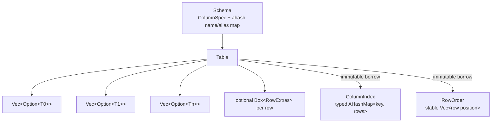
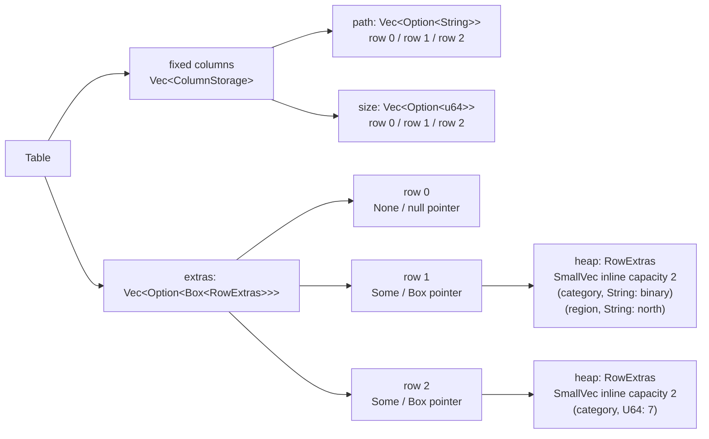

# Tables

`Table` combines an immutable `Schema` with one typed vector per column. `Row` and
`Column` are borrowing views; cells are returned as `ValueRef`.

This is different from the C++ `table_column_buffer`, whose fixed payload buffer is
row-major despite “columnar” wording in its documentation.

## Schema and rows

Primary names and aliases are unique across different columns. Schema lookup uses
`ahash` and is expected O(name length). A row must have exactly the schema width.
Values must match the declared `DataType`; conversion is not implicit.

`push_row([Value; N])` consumes a fixed-width array without a staging allocation.
`push_row_vec(Vec<Value>)` handles runtime-width rows and consumes the existing vector.
Both validate the entire row before changing any column.

Nullable columns accept `Value::Null`; non-nullable columns reject it. Unlike C++
`row_add()`, an omitted value never becomes a non-null cell with uninitialized bytes.

## Open schemas

`UnknownFields::Reject` is the default. Applying
`with_unknown_fields(UnknownFields::Store)` keeps the fixed schema immutable but lets
individual rows own additional named `Value`s. `push_row_with_extras` declares fixed
and dynamic values atomically, while `set_named` updates either storage class through
one name-based API. Fixed names and aliases always take precedence.

The sidecar is a vector parallel to the fixed columns. Each element is either a null
pointer or points to one row's extras object:

The diagram also shows that the same extra name can have a different `Value` type in
another row. It has no shared column storage or schema-level type contract.

Extras are stored lazily. Every row has one nullable pointer slot, rows without extras
allocate nothing, and the first two extras remain inline in the allocated row object.
They are deliberately excluded from column scans, indexes, ordering, and fixed-schema
formatting because they do not form homogeneous columns.

## Null storage

The current representation is `Vec<Option<T>>` per column. It is easy to inspect and
keeps null state adjacent to each value. Its main cost is padding: for example,
`Option<i64>` occupies 16 bytes on the current target. A separate validity bitmap could
reduce retained memory for wide numeric tables, but would add another allocation and
more indexing logic. The public API does not expose the storage representation.

## Views and indexes

A column scan walks one contiguous typed vector. Row iteration assembles a borrowing
view across columns. `ColumnIndex` borrows the table, uses a typed `AHashMap`, preserves
duplicate row positions, and tracks null rows separately. Boolean, integer, string,
byte, and UUID columns are indexable. Floating-point indexes are rejected until NaN
and signed-zero equality have an explicit policy.

## Ordered rows

`row_order` and `row_order_named` return `RowOrder`, a stable permutation of original
row positions. The table is neither copied nor mutated. `SortDirection` controls
non-null values, while `NullOrder` independently places nulls first or last. Equal
keys retain insertion order.

Integer, Boolean, string, byte, and UUID columns use their ordinary total order.
Floating-point columns use `total_cmp`, which gives deterministic positions to NaNs
and distinguishes negative and positive zero. A `RowOrder` immutably borrows its
source, preventing row positions from becoming stale during iteration.

This replaces destructive selection and bubble sorts with standard stable sorting of
row indexes. Constructing an order takes **O(r log r)** time and **O(r)** space; it
does not move payloads from unrelated columns. The C++ algorithms take **O(r²)**
comparisons and may move complete rows after comparisons.

## Complexity

| Operation | Expected time | Extra space |
|---|---:|---:|
| positional cell read/write | O(1) | none |
| schema name/alias lookup | O(name length) | none per lookup |
| unknown row-field lookup | O(name length + extras in row) | none per lookup |
| append complete row | O(columns) | payload ownership only |
| append row with extras | O(columns + extras) | owned extra names and values |
| pop last row | O(columns) | none |
| column scan | O(rows) | none |
| build column index | O(rows) | O(rows) |
| indexed equality lookup | O(key length) | none per lookup |
| build stable row order | O(rows log rows) | O(rows) |
| iterate ordered rows | O(rows) | none after construction |
