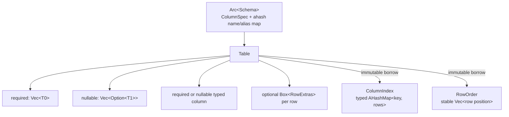
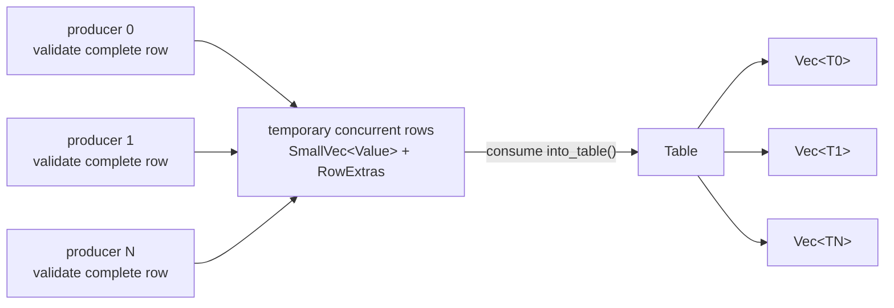
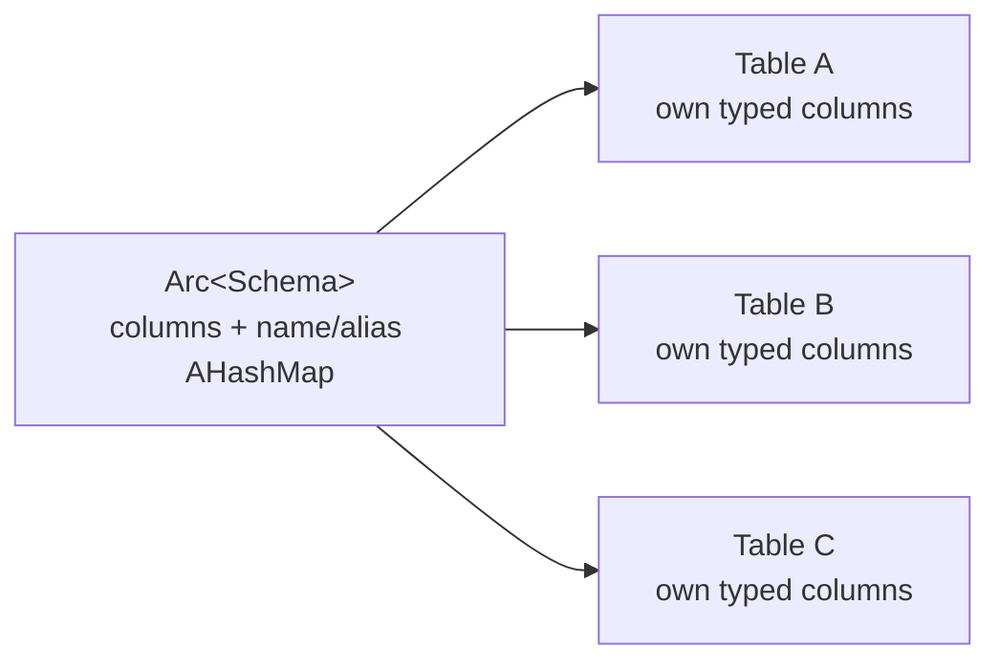
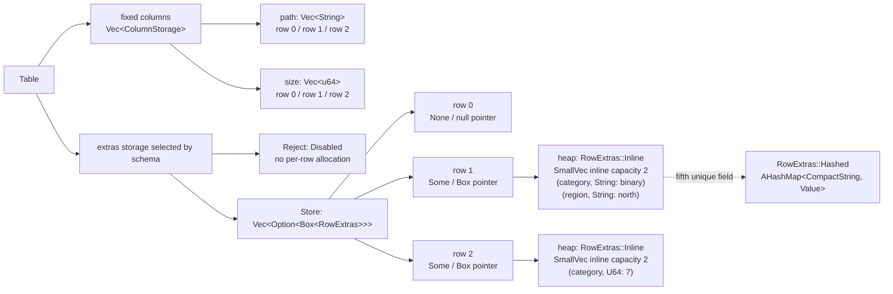
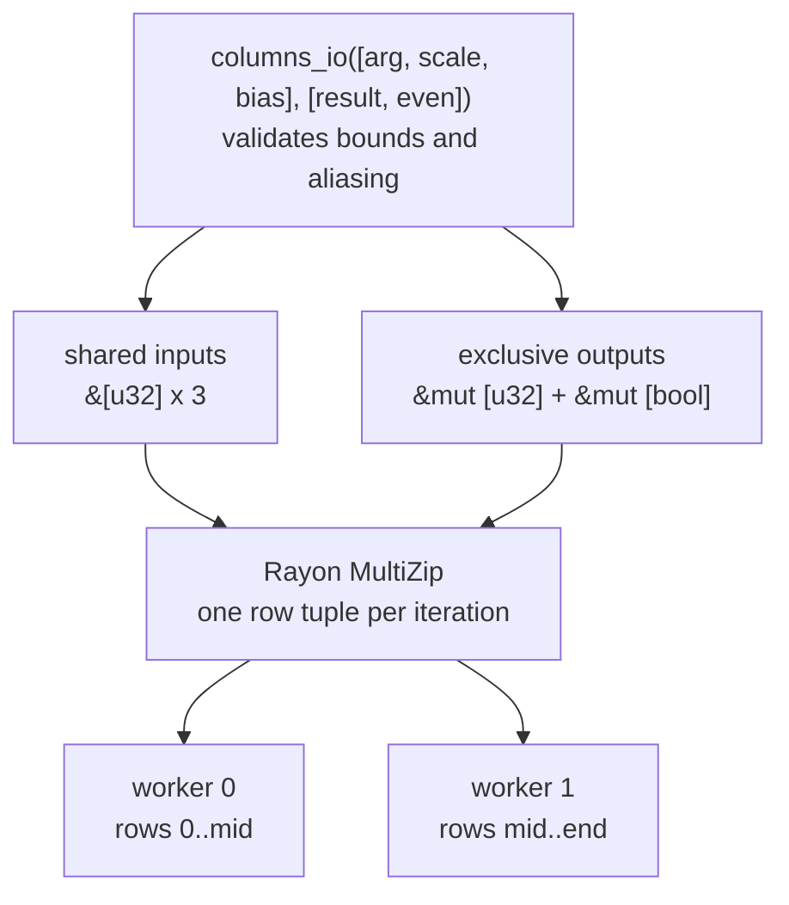
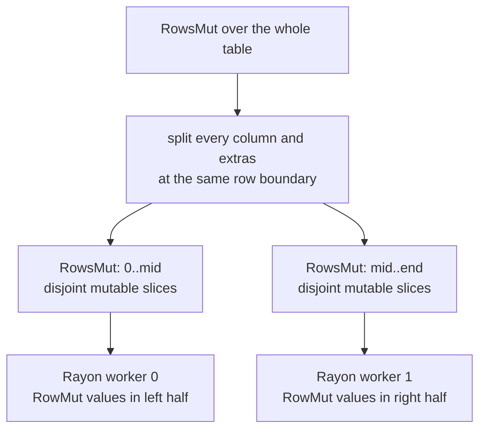

# Tables

`Table` combines a shared immutable `Arc<Schema>` with one typed vector per column.
`Row` and `Column` are borrowing views; ordinary cell access returns `ValueRef`, while
required fixed-width columns can also expose a checked typed slice. Independent
tables with the same layout can share all schema metadata without sharing row data.



This is different from the C++ `table_column_buffer`, whose fixed payload buffer is
row-major despite “columnar” wording in its documentation.

## Schema and rows

Primary names and aliases are unique across different columns. Schema lookup uses
`ahash` and is expected O(name length). A row must have exactly the schema width.
Values must match the declared `DataType`; conversion is not implicit.

`Table::new` and `Table::with_capacity` accept either an owned `Schema` or a shared
`Arc<Schema>`. Cloning a table or its `schema_arc` handle increments standard atomic
ownership; schema metadata is released only after the last handle is dropped.

`push_row([Value; N])` consumes a fixed-width array without a staging allocation.
`push_row_vec(Vec<Value>)` handles runtime-width rows and consumes the existing vector.
Both validate the entire row before changing any column.

Nullable columns accept `Value::Null`; non-nullable columns reject it. Unlike C++
`row_add()`, an omitted value never becomes a non-null cell with uninitialized bytes.

### Concurrent construction

`ConcurrentTableBuilder` separates parallel row production from the final `Table`.
Producers share `&ConcurrentTableBuilder`; every row is validated and assembled before
it is published as one concurrent-vector element. This avoids a partially appended
row if validation fails or another producer observes the collection concurrently.



The temporary layout is deliberately row-oriented: one reservation publishes the
whole logical row rather than independently extending several columns and risking
different lengths. Most rows of up to eight values keep their staging values inline.
`into_table` consumes the builder and performs one row-to-column transpose into the
ordinary dense SoA representation. Pending rows are moved rather than cloned.

This is a construction boundary, not a concurrently mutable `Table`. Concurrent row
order follows scheduling, live cell mutation is not exposed, and no producer may
remain borrowed when `into_table` takes ownership. Once converted, typed column
slices and `RowsMut::split_at` provide the existing safe parallel-processing paths.

```rust
use std::thread;

use gd::{ColumnSpec, ConcurrentTableBuilder, DataType, Schema, Value};

let schema = Schema::new([
    ColumnSpec::new("id", DataType::U64),
    ColumnSpec::new("square", DataType::U64),
])
.unwrap();
let builder = ConcurrentTableBuilder::new(schema);

thread::scope(|scope| {
    for shard in 0_u64..4 {
        let builder = &builder;
        scope.spawn(move || {
            let rows = (0_u64..100).map(|offset| {
                let id = shard * 100 + offset;
                [Value::U64(id), Value::U64(id * id)]
            });
            builder.extend_rows(rows).unwrap();
        });
    }
});

let table = builder.into_table();
assert_eq!(table.row_count(), 400);
```

### Shared-schema and row memory

Sharing the schema separates the one-time metadata cost from each table's row storage:



The following 64-bit M3 release-layout comparison uses five required columns in this
order: `u8`, `u64`, `bool`, `u8`, and `i32`. It excludes allocator bookkeeping, null
metadata, open-schema extras, and unused capacity. C++ GD rounds every cell slot to a
four-byte boundary:

```text
C++ packed row (24 bytes)

offset  0  u8    [value][3 bytes padding]
offset  4  u64   [8-byte value]
offset 12  bool  [value][3 bytes padding]
offset 16  u8    [value][3 bytes padding]
offset 20  i32   [4-byte value]
```

The Rust table stores five independent, correctly aligned vectors:

```text
Rust SoA storage (15 bytes per populated row)

Vec<u8>    1 byte  x capacity
Vec<u64>   8 bytes x capacity
Vec<bool>  1 byte  x capacity
Vec<u8>    1 byte  x capacity
Vec<i32>   4 bytes x capacity
```

Rust's standard `Vec<bool>` stores ordinary one-byte `bool` elements; unlike C++
`std::vector<bool>`, it is not bit-packed. It therefore exposes normal `&[bool]` and
`&mut [bool]` slices that Rayon can partition directly.

Measured fixed layouts are 104 bytes for a C++ internal table and 64 bytes for the
Arc-backed Rust `Table`. Rust additionally keeps five 40-byte `ColumnStorage` values
in the table's column-descriptor allocation. For capacity `C`, excluding the shared
schema and allocator bookkeeping:

| Implementation | Fixed per table | Row capacity | Total per table |
|---|---:|---:|---:|
| C++ internal table | 104 bytes | 24C bytes | `104 + 24C` |
| Rust `Table` | 64 + 200 bytes | 15C bytes | `264 + 15C` |

The C++ representation is smaller for very small equal-capacity tables; the Rust
representation crosses below it at about 18 rows because it avoids per-cell padding.
The shared schema was approximately 800 requested bytes for C++ and 1,016 requested
bytes for Rust in this fixture. Rust's larger one-time schema includes the `AHashMap`
used for expected constant-time name and alias lookup. Real tiny-table totals also
depend on allocation rounding and growth policy: Rust has one descriptor allocation
plus one allocation per typed column, while C++ has one packed row allocation.

## Open schemas

`UnknownFields::Reject` is the default. Applying
`with_unknown_fields(UnknownFields::Store)` keeps the fixed schema immutable but lets
individual rows own additional named `Value`s. `push_row_with_extras` declares fixed
and dynamic values atomically, while `set_named` updates either storage class through
one name-based API. Fixed names and aliases always take precedence.

Closed schemas store no sidecar. Open schemas add a vector parallel to the fixed
columns; each element is either a null pointer or points to one row's extras object:



The diagram also shows that the same extra name can have a different `Value` type in
another row. It has no shared column storage or schema-level type contract.

Extras storage is schema-aware. A closed schema allocates no pointer vector. In an open
schema every row has one nullable pointer slot; rows without extras allocate no
`RowExtras` object, and the first two extras remain inline in the allocated row object.
Rows stay in the compact representation through four fields, then promote to an
`AHashMap` on the fifth unique name. They are deliberately excluded from column scans,
indexes, ordering, and fixed-schema formatting because they do not form homogeneous
columns.

## Null storage

Required columns use dense `Vec<T>` storage because the schema and atomic row
validation guarantee that every committed row contains a value. Nullable columns use
`Vec<Option<T>>`; for example, `Option<i64>` occupies 16 bytes on the current target.
A separate validity bitmap could reduce nullable-column memory, but would add another
allocation and more indexing logic. The public API exposes dense required values as a
slice, not the internal storage enum, so nullable representation can still change.

## Typed bulk column operations

`Column::as_slice::<T>` checks the runtime schema type and nullability once, then
returns the required column as `&[T]`. It supports Boolean, fixed-width integer,
floating-point, and UUID columns. A wrong type returns `ColumnSliceError::TypeMismatch`;
a nullable column returns `ColumnSliceError::Nullable`.

The slice uses standard iterator operations rather than table-specific versions of
`map`, `filter`, and `fold`:

```rust
let values = table.column_named("requests").unwrap().as_slice::<u64>()?;

let doubled: Vec<u64> = values.iter().map(|value| value * 2).collect();
let large: Vec<u64> = values.iter().copied().filter(|value| *value >= 1_000).collect();
let selected_rows: Vec<usize> = values
    .iter()
    .enumerate()
    .filter_map(|(row, value)| (*value >= 1_000).then_some(row))
    .collect();
let total = values.iter().copied().fold(0_u64, u64::saturating_add);
```

For an element-wise transform, `Table::columns_io` borrows any number of immutable
inputs and mutable outputs together. Each view can then be converted to a typed slice
with one type/nullability check:

```rust
let ([left, right], [sum, product]) = table.columns_io([0, 1], [2, 3])?;
let left = left.as_slice::<u32>()?;
let right = right.as_slice::<u32>()?;
let sum = sum.as_mut_slice::<u32>()?;
let product = product.as_mut_slice::<u32>()?;

for (((left, right), sum), product) in left.iter().zip(right).zip(sum).zip(product) {
    *sum = left.saturating_add(*right);
    *product = left.saturating_mul(*right);
}
```

Input positions may repeat because they are shared borrows. Output positions must be
unique and cannot also occur as inputs; `columns_io` validates those rules and bounds
before returning any view. The common one-input, one-output case has a specialized
zero-allocation path:

```rust
let (args, results) = table.column_pair_mut(0, 1).unwrap();
let args = args.as_slice::<u32>()?;
let results = results.as_mut_slice::<u32>()?;

for (&arg, result) in args.iter().zip(results) {
    *result = arg.saturating_mul(arg);
}
```

`column_pair_mut` validates the two positions and applies `split_at_mut` directly;
`columns_io` pays its small generalized setup cost only when a kernel needs more
columns. Since both return ordinary `&[T]` and `&mut [T]`, applications may use Rayon
for parallel transforms. The optional `rayon` feature additionally provides a safely
partitioned row-wise adapter for heterogeneous transforms.

This moves dynamic dispatch out of the hot loop. The compiler sees a monomorphic,
contiguous slice, which is the form most suitable for bounds-check elimination and
auto-vectorization. Filtering preserves table correspondence by collecting row
positions; callers that only need values can use ordinary `filter` directly.

For code that does not know the column type until runtime, `Column::for_each_value`
matches storage type and nullability once, then calls a `ValueRef` closure for every
cell. This avoids the repeated storage dispatch and bounds check in `Column::iter`
without fragmenting the dynamic value API. It is a terminal operation; use `iter` for
composable or short-circuiting traversal, and `as_slice::<T>` for an explicitly typed
loop.

## Parallel processing with Rayon

Rayon operates on the same borrowing interfaces as sequential code. It does not need
access to `Table` internals and does not make a table globally mutable from several
threads.

### Column-wise transform

For homogeneous work, borrow all participating required columns once and pass their
ordinary slices to Rayon's tuple `MultiZip` implementation:

```rust
use gd::{ColumnSpec, DataType, Schema, Table, Value};
use rayon::prelude::*;

let schema = Schema::new([
    ColumnSpec::new("arg", DataType::U32),
    ColumnSpec::new("scale", DataType::U32),
    ColumnSpec::new("bias", DataType::U32),
    ColumnSpec::new("result", DataType::U32),
    ColumnSpec::new("even", DataType::Bool),
])
.unwrap();
let mut table = Table::with_capacity(schema, 10_000);
for arg in 0_u32..10_000 {
    table
        .push_row([
            Value::U32(arg),
            Value::U32(3),
            Value::U32(1),
            Value::U32(0),
            Value::Bool(false),
        ])
        .unwrap();
}

let ([args, scales, biases], [results, even]) =
    table.columns_io([0, 1, 2], [3, 4]).unwrap();
let args = args.as_slice::<u32>().unwrap();
let scales = scales.as_slice::<u32>().unwrap();
let biases = biases.as_slice::<u32>().unwrap();
let results = results.as_mut_slice::<u32>().unwrap();
let even = even.as_mut_slice::<bool>().unwrap();

(args, scales, biases, results, even)
    .into_par_iter()
    .for_each(|(&arg, &scale, &bias, result, even)| {
        *result = arg.saturating_mul(scale).saturating_add(bias);
        *even = *result % 2 == 0;
    });
```



Rayon supports tuple zips through twelve participants. More inputs can be indexed by
row while parallel iteration is driven by the output slices, or several zips can be
nested. This is an iterator-level arity convenience, not a table restriction:
`columns_io` uses const-generic arrays and does not impose a fixed input/output count.

Rayon shares every immutable input and divides every mutable output into matching,
non-overlapping ranges, so two workers cannot receive mutable access to the same cell.
The outstanding borrows also prevent structural table operations until the parallel
transform finishes.

### Row-wise transform

Enable the crate's `rayon` feature when one operation needs heterogeneous cells from
the same row:

```rust
use gd::{ColumnSpec, DataType, Schema, Table, Value, ValueRef};

let schema = Schema::new([
    ColumnSpec::new("arg", DataType::U32),
    ColumnSpec::new("result", DataType::U32),
])
.unwrap();
let mut table = Table::with_capacity(schema, 10_000);
for arg in 0_u32..10_000 {
    table.push_row([Value::U32(arg), Value::U32(0)]).unwrap();
}

table.par_for_each_row_mut(256, |mut row| {
    let ValueRef::U32(arg) = row.get_named("arg").unwrap() else {
        unreachable!()
    };
    row.set_named("result", arg.saturating_mul(arg)).unwrap();
});
```



`RowsMut` applies `split_at_mut` to every column at the same logical row and splits the
optional extras sidecar there too. Each recursive half therefore owns a disjoint set
of rows across all storage allocations. The grain size (`256` above) controls the
smallest independently scheduled range. Row-wise access performs dynamic cell work;
typed column slices remain preferable when the operation is homogeneous.

## Views and indexes

A dynamic column scan yields `ValueRef`; a required fixed-width scan can instead walk
its typed slice directly. Row iteration assembles a borrowing view across columns.
`RowMut` similarly assembles disjoint mutable cell references for one row. `RowsMut`
can split all column slices and the open-schema sidecar at one common row boundary;
its halves can therefore be sent to scoped threads without a table lock or unsafe
aliasing. With the optional `rayon` feature, `par_for_each_row_mut` performs this
partitioning recursively using a caller-selected minimum grain size. Typed column
slices remain the lower-overhead interface for homogeneous bulk operations.
`ColumnIndex` borrows the table, uses a typed `AHashMap`, preserves
duplicate row positions, and tracks null rows separately. Boolean, integer, string,
byte, and UUID columns are indexable. Floating-point indexes are rejected until NaN
and signed-zero equality have an explicit policy.

## Ordered rows

`row_order` and `row_order_named` return `RowOrder`, a stable permutation of original
row positions. The table is neither copied nor mutated. `SortDirection` controls
non-null values, while `NullOrder` independently places nulls first or last. Equal
keys retain insertion order.

Integer, Boolean, string, byte, and UUID columns use their ordinary total order.
Floating-point columns use `total_cmp`, which gives deterministic positions to NaNs
and distinguishes negative and positive zero. A `RowOrder` immutably borrows its
source, preventing row positions from becoming stale during iteration.

This replaces destructive selection and bubble sorts with standard stable sorting of
row indexes. Constructing an order takes **O(r log r)** time and **O(r)** space; it
does not move payloads from unrelated columns. The C++ algorithms take **O(r²)**
comparisons and may move complete rows after comparisons.

## Complexity

| Operation | Expected time | Extra space |
|---|---:|---:|
| positional cell read/write | O(1) | none |
| schema name/alias lookup | O(name length) | none per lookup |
| unknown row-field lookup | O(name length + extras) through four fields; expected O(name length) after promotion | none per lookup |
| append complete row | O(columns) | payload ownership only |
| append row with extras | expected O(columns + extras) | owned extra names and values |
| pop last row | O(columns) | none |
| column scan | O(rows) | none |
| build column index | O(rows) | O(rows) |
| indexed equality lookup | O(key length) | none per lookup |
| build stable row order | O(rows log rows) | O(rows) |
| iterate ordered rows | O(rows) | none after construction |
