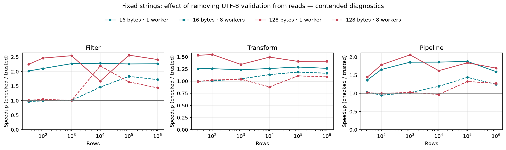

# Fixed strings: validate at the write boundary

Fixed-buffer reads now trust the UTF-8 validity established by string-typed writes. The public API still checks bounds, capacity, and nullability. Raw bytes and descriptors remain private; safe `str` mutation preserves UTF-8. Three small internal unchecked conversions replace repeated validity scans.

The checked-read executable was preserved from the original implementation before rebuilding. Its workload source is identical to the new executable's; transform scratch copies and per-cell gathering are unchanged. This experiment measures the read change.

## Findings

Sources: [Rust workload](../../benches/text_workflow/driver.rs), [paired runner](../../benches/text_workflow/compare_validation.py), [fixed-string storage](../../src/table/fixed_string.rs). C++ is not remeasured; its [workloads](../../benches/cpp-reference/text_workflow.cpp) and results remain in the [original comparison](text-workflow-results.md).

Removing repeated validation makes a substantial difference. At 1,000,000 rows
with one worker, filtering improves by 2.27× for 16-byte messages and 2.41× for
128-byte messages. Transform improves by 1.26× and 1.41×, respectively; pipeline
improves by 1.60× and 1.69×. A separate four-round recheck reproduced the gains,
with filtering at 2.28× and 2.32× and pipeline at 1.64× and 1.75×.

These are paired diagnostics under competing host activity. The single-worker
million-row results are consistent across rounds and rechecks; small differences
in parallel timings should not be treated as precise isolated costs.

## Paired measurements

Sources: [unchanged Rust workload](../../benches/text_workflow/driver.rs), [paired runner](../../benches/text_workflow/compare_validation.py), [fixed-string storage](../../src/table/fixed_string.rs), [original checked-read storage](https://github.com/kjn-void/gd-rs/blob/d0000f7856cdcb6bc9920dd59e04820477341609/src/table/fixed_string.rs). This isolates two Rust implementations; C++ is not remeasured here. The [C++ workloads](../../benches/cpp-reference/text_workflow.cpp) belong to the [original four-case comparison](text-workflow-results.md).

Measured 2026-10-07 on Apple M3 Max, `macOS-27.0.1-arm64-arm-64bit-Mach-O`, with `rustc 1.98.1 (48a229cea 2026-09-01)`. Flags: `release -O3; codegen-units=1; lto=thin; target-cpu=native; no-default-features; features=rayon; --locked`. Scheduling: OS scheduling, no affinity; persistent pools, exactly one static row task per worker; one process at a time.

**Contended diagnostics: competing host activity was allowed. Alternating order reduces ordering bias but does not remove contention; close differences and worker scaling need quiet-host confirmation.**

Each configuration has 4 rounds, alternating executable order. Each process records 7 calibrated batches, with a 50 ms minimum target. Values are medians of process medians. Fixtures, pool creation, and complete output checks are outside timing; filter and pipeline include allocation and destruction. Transform measures warmed output capacity; pipeline returns ordered worker shards.

All 144 before/after output checks matched the independent oracle from the original matrix, as did all 576 timed processes. CPU activity was sampled before and after each round. 0 rounds were discarded. Boundary samples do not continuously profile competing activity.

Recorded CPU snapshots range from 29.1% to 1476.6%, where 100% represents one
CPU core and only processes above 5% are counted. Some 10,000-row parallel
configurations have very wide process ranges, up to 17.6× within one version.
The plot and tables retain this first full run; the rechecks below document the
effect of that variability instead of silently replacing individual points.

[Raw paired measurements](measurements/text-validation-m3max.json) include individual samples, process ranges, load checks, compiler context, source hashes, binary hashes, and commands. No source or executable changed during measurement.



## At 1,000,000 rows

Sources: [unchanged Rust workload](../../benches/text_workflow/driver.rs), [paired runner](../../benches/text_workflow/compare_validation.py), [fixed-string storage](../../src/table/fixed_string.rs), [original checked-read storage](https://github.com/kjn-void/gd-rs/blob/d0000f7856cdcb6bc9920dd59e04820477341609/src/table/fixed_string.rs). This isolates two Rust implementations; C++ is not remeasured here. The [C++ workloads](../../benches/cpp-reference/text_workflow.cpp) belong to the [original four-case comparison](text-workflow-results.md).

Milliseconds per operation; lower is faster. Speedup is checked-read time divided by trusted-read time.

| Text bytes | Workers | Operation | Checked reads | Trusted reads | Speedup |
|---:|---:|---|---:|---:|---:|
| 16 | 1 | filter | 6.895 | 3.039 | 2.27× |
| 16 | 1 | transform | 10.414 | 8.237 | 1.26× |
| 16 | 1 | pipeline | 13.469 | 8.427 | 1.60× |
| 16 | 8 | filter | 1.011 | 0.586 | 1.72× |
| 16 | 8 | transform | 1.818 | 1.564 | 1.16× |
| 16 | 8 | pipeline | 2.148 | 1.722 | 1.25× |
| 128 | 1 | filter | 8.969 | 3.715 | 2.41× |
| 128 | 1 | transform | 11.768 | 8.350 | 1.41× |
| 128 | 1 | pipeline | 21.207 | 12.513 | 1.69× |
| 128 | 8 | filter | 1.238 | 0.860 | 1.44× |
| 128 | 8 | transform | 3.345 | 3.075 | 1.09× |
| 128 | 8 | pipeline | 3.297 | 2.581 | 1.28× |

## Filter: few to many rows

Sources: [unchanged Rust workload](../../benches/text_workflow/driver.rs), [paired runner](../../benches/text_workflow/compare_validation.py), [fixed-string storage](../../src/table/fixed_string.rs), [original checked-read storage](https://github.com/kjn-void/gd-rs/blob/d0000f7856cdcb6bc9920dd59e04820477341609/src/table/fixed_string.rs). This isolates two Rust implementations; C++ is not remeasured here. The [C++ workloads](../../benches/cpp-reference/text_workflow.cpp) belong to the [original four-case comparison](text-workflow-results.md).

Microseconds per operation; lower is faster.

| Rows | Text bytes | Workers | Checked reads | Trusted reads | Speedup |
|---:|---:|---:|---:|---:|---:|
| 32 | 16 | 1 | 0.198 | 0.098 | 2.02× |
| 32 | 16 | 8 | 20.9 | 21.6 | 0.97× |
| 32 | 128 | 1 | 0.205 | 0.0912 | 2.25× |
| 32 | 128 | 8 | 21.8 | 21.5 | 1.01× |
| 100 | 16 | 1 | 0.732 | 0.347 | 2.11× |
| 100 | 16 | 8 | 20.6 | 20.7 | 0.99× |
| 100 | 128 | 1 | 0.79 | 0.32 | 2.46× |
| 100 | 128 | 8 | 19.4 | 18.5 | 1.04× |
| 1,000 | 16 | 1 | 6.85 | 3.01 | 2.27× |
| 1,000 | 16 | 8 | 20.6 | 20.3 | 1.01× |
| 1,000 | 128 | 1 | 7.56 | 2.97 | 2.55× |
| 1,000 | 128 | 8 | 20.5 | 20.3 | 1.01× |
| 10,000 | 16 | 1 | 68.6 | 30 | 2.29× |
| 10,000 | 16 | 8 | 40.5 | 27.6 | 1.47× |
| 10,000 | 128 | 1 | 94.6 | 56.6 | 1.67× |
| 10,000 | 128 | 8 | 456 | 207 | 2.20× |
| 100,000 | 16 | 1 | 708 | 313 | 2.26× |
| 100,000 | 16 | 8 | 238 | 130 | 1.83× |
| 100,000 | 128 | 1 | 790 | 308 | 2.56× |
| 100,000 | 128 | 8 | 185 | 113 | 1.64× |
| 1,000,000 | 16 | 1 | 6.9e+03 | 3.04e+03 | 2.27× |
| 1,000,000 | 16 | 8 | 1.01e+03 | 586 | 1.72× |
| 1,000,000 | 128 | 1 | 8.97e+03 | 3.72e+03 | 2.41× |
| 1,000,000 | 128 | 8 | 1.24e+03 | 860 | 1.44× |

## Transform: few to many rows

Sources: [unchanged Rust workload](../../benches/text_workflow/driver.rs), [paired runner](../../benches/text_workflow/compare_validation.py), [fixed-string storage](../../src/table/fixed_string.rs), [original checked-read storage](https://github.com/kjn-void/gd-rs/blob/d0000f7856cdcb6bc9920dd59e04820477341609/src/table/fixed_string.rs). This isolates two Rust implementations; C++ is not remeasured here. The [C++ workloads](../../benches/cpp-reference/text_workflow.cpp) belong to the [original four-case comparison](text-workflow-results.md).

Microseconds per operation; lower is faster.

| Rows | Text bytes | Workers | Checked reads | Trusted reads | Speedup |
|---:|---:|---:|---:|---:|---:|
| 32 | 16 | 1 | 0.358 | 0.285 | 1.26× |
| 32 | 16 | 8 | 21.1 | 21.1 | 1.00× |
| 32 | 128 | 1 | 0.395 | 0.258 | 1.53× |
| 32 | 128 | 8 | 21 | 21.1 | 0.99× |
| 100 | 16 | 1 | 1.06 | 0.845 | 1.26× |
| 100 | 16 | 8 | 18.3 | 18.2 | 1.01× |
| 100 | 128 | 1 | 1.18 | 0.762 | 1.55× |
| 100 | 128 | 8 | 18.7 | 18.3 | 1.02× |
| 1,000 | 16 | 1 | 10.3 | 8.35 | 1.23× |
| 1,000 | 16 | 8 | 20.9 | 20 | 1.05× |
| 1,000 | 128 | 1 | 11.6 | 8.64 | 1.34× |
| 1,000 | 128 | 8 | 21.2 | 20.4 | 1.04× |
| 10,000 | 16 | 1 | 103 | 81.9 | 1.26× |
| 10,000 | 16 | 8 | 49.3 | 43.5 | 1.13× |
| 10,000 | 128 | 1 | 197 | 132 | 1.50× |
| 10,000 | 128 | 8 | 340 | 386 | 0.88× |
| 100,000 | 16 | 1 | 1.08e+03 | 833 | 1.29× |
| 100,000 | 16 | 8 | 318 | 268 | 1.19× |
| 100,000 | 128 | 1 | 1.2e+03 | 854 | 1.41× |
| 100,000 | 128 | 8 | 391 | 352 | 1.11× |
| 1,000,000 | 16 | 1 | 1.04e+04 | 8.24e+03 | 1.26× |
| 1,000,000 | 16 | 8 | 1.82e+03 | 1.56e+03 | 1.16× |
| 1,000,000 | 128 | 1 | 1.18e+04 | 8.35e+03 | 1.41× |
| 1,000,000 | 128 | 8 | 3.34e+03 | 3.08e+03 | 1.09× |

## Pipeline: few to many rows

Sources: [unchanged Rust workload](../../benches/text_workflow/driver.rs), [paired runner](../../benches/text_workflow/compare_validation.py), [fixed-string storage](../../src/table/fixed_string.rs), [original checked-read storage](https://github.com/kjn-void/gd-rs/blob/d0000f7856cdcb6bc9920dd59e04820477341609/src/table/fixed_string.rs). This isolates two Rust implementations; C++ is not remeasured here. The [C++ workloads](../../benches/cpp-reference/text_workflow.cpp) belong to the [original four-case comparison](text-workflow-results.md).

Microseconds per operation; lower is faster.

| Rows | Text bytes | Workers | Checked reads | Trusted reads | Speedup |
|---:|---:|---:|---:|---:|---:|
| 32 | 16 | 1 | 0.396 | 0.29 | 1.37× |
| 32 | 16 | 8 | 26.6 | 25.8 | 1.03× |
| 32 | 128 | 1 | 0.418 | 0.289 | 1.45× |
| 32 | 128 | 8 | 26.9 | 26.4 | 1.02× |
| 100 | 16 | 1 | 1.28 | 0.775 | 1.66× |
| 100 | 16 | 8 | 27.5 | 28.9 | 0.95× |
| 100 | 128 | 1 | 1.34 | 0.752 | 1.79× |
| 100 | 128 | 8 | 27.3 | 27.3 | 1.00× |
| 1,000 | 16 | 1 | 10.3 | 5.53 | 1.86× |
| 1,000 | 16 | 8 | 32.8 | 32.1 | 1.02× |
| 1,000 | 128 | 1 | 11 | 5.35 | 2.06× |
| 1,000 | 128 | 8 | 32.9 | 32.1 | 1.03× |
| 10,000 | 16 | 1 | 99.4 | 53.4 | 1.86× |
| 10,000 | 16 | 8 | 73.1 | 61.3 | 1.19× |
| 10,000 | 128 | 1 | 174 | 107 | 1.62× |
| 10,000 | 128 | 8 | 390 | 402 | 0.97× |
| 100,000 | 16 | 1 | 1.13e+03 | 602 | 1.88× |
| 100,000 | 16 | 8 | 373 | 259 | 1.44× |
| 100,000 | 128 | 1 | 1.43e+03 | 777 | 1.84× |
| 100,000 | 128 | 8 | 350 | 264 | 1.33× |
| 1,000,000 | 16 | 1 | 1.35e+04 | 8.43e+03 | 1.60× |
| 1,000,000 | 16 | 8 | 2.15e+03 | 1.72e+03 | 1.25× |
| 1,000,000 | 128 | 1 | 2.12e+04 | 1.25e+04 | 1.69× |
| 1,000,000 | 128 | 8 | 3.3e+03 | 2.58e+03 | 1.28× |

## Rechecks

Sources: [Rust workload](../../benches/text_workflow/driver.rs), [paired runner](../../benches/text_workflow/compare_validation.py), [fixed-string storage](../../src/table/fixed_string.rs). There is no new C++ measurement; see the [original C++ workloads](../../benches/cpp-reference/text_workflow.cpp).

The 10,000-row configurations with large ranges and every 1,000,000-row
configuration were repeated for four more alternating rounds. All 48 separate
output checks and 192 timed processes matched the oracle. The
[recheck samples](measurements/text-validation-rechecks.json) include all
process ranges and load snapshots and use the same executable hashes.

The large 10,000-row ranges narrowed substantially in the repeat, with the
maximum process-median ratio at 1.13×. The long-message single-worker filter at
that size improved by 2.70× in the repeat versus 1.67× in the first run, showing
why a single contended matrix should not determine exact ratios. At one million
rows, the following repeat results support the main finding:

| Text bytes | Workers | Operation | Checked reads (ms) | Trusted reads (ms) | Speedup |
|---:|---:|---|---:|---:|---:|
| 16 | 1 | filter | 6.745 | 2.957 | 2.28× |
| 128 | 1 | filter | 7.734 | 3.330 | 2.32× |
| 16 | 1 | pipeline | 12.969 | 7.927 | 1.64× |
| 128 | 1 | pipeline | 18.996 | 10.826 | 1.75× |
| 16 | 8 | filter | 1.017 | 0.602 | 1.69× |
| 128 | 8 | filter | 1.212 | 0.842 | 1.44× |
| 16 | 8 | pipeline | 2.151 | 1.723 | 1.25× |
| 128 | 8 | pipeline | 3.154 | 2.514 | 1.25× |

## Safety and remaining costs

Writes accept valid `&str` or owned strings; incoming byte decoding establishes UTF-8 before producing these types. Stored lengths select only valid cell prefixes. Unused slot suffixes can contain stale bytes after shorter replacements and are never borrowed as text. Copies, append, compaction, and safe mutable string views preserve this invariant. Each unchecked conversion documents it and retains safe slicing for bounds checks.

Short text still requires a separate descriptor and slot rather than inline string storage. Transforms still copy through scratch, and gathering still copies strings cell by cell. Those costs are independent of UTF-8 validity scans.

Full repository CI passed formatting, strict Clippy, all-targets/all-features
tests, minimal-feature tests, rustdoc, and the Rust 1.86 check. Doctests passed.
All seven fixed-string tests also passed under Miri, including 16 randomized
property cases, Unicode replacements with stale slot suffixes, null/empty
transitions, failed-write atomicity, copies, append, compaction, and disjoint
mutable views.

Miri used `x86_64-apple-darwin` with SSE4.1 disabled to avoid a `zmij` SIMD
configuration error under Miri; native ARM compilation hit the same dependency
issue. Filesystem isolation was disabled for proptest's failure-persistence
lookup. This exercises the actual table integration tests; ordinary timing
executables are optimized native ARM builds without instrumentation.

```sh
env PROPTEST_CASES=16 PROPTEST_RNG_SEED=20261007 \
  RUSTFLAGS='-C target-feature=-sse4.1' MIRIFLAGS='-Zmiri-disable-isolation' \
  cargo +nightly miri test --target x86_64-apple-darwin \
  --no-default-features --test table_fixed_strings
```

Reproduce:

```sh
python3 benches/text_workflow/compare_validation.py \
  --checked target/text-validation/checked-read --allow-contended
```

See the [benchmark README](../../benches/text_workflow/README.md#utf-8-read-validation-comparison) for building both executables with matching flags.
