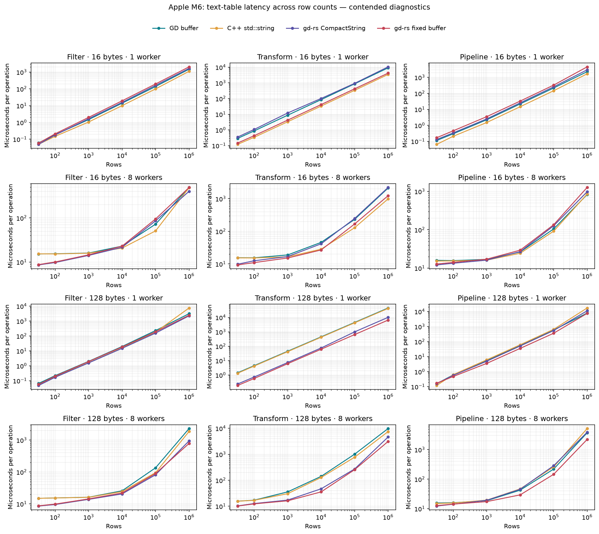

# Text filtering and transforms on Apple M6: GD and gd-rs

This is a fresh run of the same four string representations on remote host `192.168.0.172` (`M6.local`). The checkout is available at `/Users/kjn/repos/gd-rs` and resolves to `/Volumes/wd_black/repos/gd-rs`. The earlier [M3 Max measurement](text-workflow-results.md) is retained separately. Fixed-buffer reads trust valid string writes without rescanning UTF-8; bounds, capacity, and nullability checks remain.

This comparison exercises text directly in ordinary application tables: filtering, rewriting a string column, and filtering plus materializing and transforming rows. It compares four representations of the same five-column data.

| Case | Storage and access |
|---|---|
| GD buffer | Unmodified `gd::table::table_column_buffer`, row-major (AoS), preallocated bounded inline text slots |
| C++ std::string | `std::vector<StringRow>`, AoS rows with three ordinary `std::string` fields; a STL baseline rather than a GD table |
| gd-rs CompactString | Existing `gd::Table` SoA string storage, checked typed descriptor slices |
| gd-rs fixed buffer | `gd::Table` SoA, one fixed-slot byte buffer per string column; every row has an offset and length |

The new gd-rs storage is a supported table layout, with UTF-8 byte limits, nullability, conversions, atomic failed writes, independent copies, append between layouts, compaction, indexes, and disjoint parallel mutable views. See the [API](../api/tables.md#fixed-capacity-string-buffers) and [storage implementation](../../src/table/fixed_string.rs).

## Findings

Sources: [Rust workloads](../../benches/text_workflow/driver.rs), [GD buffer and C++ std::string workloads](../../benches/cpp-reference/text_workflow.cpp), [runner and independent oracle](../../benches/text_workflow/compare.py).

The fastest representation depends on the operation, message length, and worker count. At 1,000,000 rows, the lowest primary medians are:

| Text bytes | Workers | Filtering | Rewriting | Pipeline |
|---:|---:|---|---|---|
| 16 | 1 | C++ std::string | C++ std::string | C++ std::string |
| 16 | 8 | gd-rs CompactString | C++ std::string | GD buffer |
| 128 | 1 | gd-rs CompactString | gd-rs fixed buffer | gd-rs fixed buffer |
| 128 | 8 | gd-rs fixed buffer | gd-rs fixed buffer | gd-rs fixed buffer |

Small timing differences can exchange order between runs. The full tables retain the numerical differences and process-round ranges; fresh rechecks are listed when available.

Rechecks at one million rows retained 11 of the 12 primary workload winners. Filtering 128-byte messages with one worker exchanged first place between CompactString and fixed buffers, so that ranking should be treated as close under contention. The CompactString 16-byte, one-worker rewrite median changed from 10.590 ms to 12.650 ms; its maximum/minimum process-round median ratio was 1.41 in the primary run and 1.06 in the recheck. C++ std::string remained the fastest variant in that workload. Primary medians are retained throughout the main tables and geometric means; rechecks appear separately.

## Geometric-mean comparison

Sources: [Rust workloads](../../benches/text_workflow/driver.rs), [GD buffer and C++ std::string workloads](../../benches/cpp-reference/text_workflow.cpp), [runner and independent oracle](../../benches/text_workflow/compare.py).

Each matched case has equal weight. Speedup is the geometric mean of GD-buffer time divided by the other variant's time, using the primary process-round medians. A value above 1 means faster than GD buffer. Rechecks are excluded from the aggregate.

| Group | Cases | GD buffer | C++ std::string | gd-rs CompactString | gd-rs fixed buffer |
|---|---:|---:|---:|---:|---:|
| All cases | 72 | 1.000× | 1.199× | 1.305× | 1.458× |
| 1 worker, 16-byte messages | 18 | 1.000× | 1.721× | 0.877× | 1.010× |
| 1 worker, 128-byte messages | 18 | 1.000× | 0.982× | 1.949× | 2.212× |
| 8 workers, 16-byte messages | 18 | 1.000× | 1.166× | 1.126× | 1.169× |
| 8 workers, 128-byte messages | 18 | 1.000× | 1.050× | 1.506× | 1.732× |

| Operation | Cases | GD buffer | C++ std::string | gd-rs CompactString | gd-rs fixed buffer |
|---|---:|---:|---:|---:|---:|
| Filter | 24 | 1.000× | 1.130× | 1.264× | 1.131× |
| Transform | 24 | 1.000× | 1.447× | 1.828× | 2.741× |
| Pipeline | 24 | 1.000× | 1.055× | 0.962× | 1.001× |

## Conditions and interpretation

Measured 2026-10-08 on Apple M6, 12 logical CPUs, macOS-27.0.1-arm64-arm-64bit. Rust: `rustc 1.99.0 (b940084d7 2026-09-28)`. C++: `Apple clang version 21.0.0 (clang-2100.3.34.2)`. GD is pinned to `cb11cff90d05260a88d59a30c9da421cd4e19c34`. The gd-rs worktree was based on `fd75869ae38a6e27e4b887284746f813cbab2e8c`; exact source hashes are in the raw results. All measured source hashes match [commit `fd75869`](https://github.com/kjn-void/gd-rs/tree/fd75869ae38a6e27e4b887284746f813cbab2e8c); use that snapshot to reproduce this cohort byte for byte.

Rust flags: `release -O3; codegen-units=1; lto=thin; target-cpu=native; no-default-features; features=rayon; --locked`. C++ flags: `Release -O3 -DNDEBUG -march=native; interprocedural optimization ON; sanitizers OFF`. Scheduling: OS scheduling, no affinity; persistent pools, exactly one static row task per worker; one process at a time.

**These are contended diagnostics measured with background jobs active. They are not an unloaded performance baseline; worker scaling and close rankings cannot be attributed solely to the table implementations.**

Unrelated CPU snapshots ranged from 112.4% to 122.7% (100% is one CPU core; only processes above 5% are counted). These are boundary snapshots, not continuous profiling. The final run checked 288 implementation/size/worker/workload combinations against the independent oracle and recorded 1152 timed processes. Each process recorded 7 calibrated batches; the minimum batch target was 50 ms. Tables report the median of 4 process-round medians. Round ranges and all samples are retained in the raw JSON.

Diagnostic mode accepted every primary round; no load-based rejection was applied. A preceding quiet-mode attempt repeatedly rejected or delayed rounds and was abandoned. Its partial samples are excluded from this matrix; the additional host context records that attempt.

[Raw measurements](measurements/text-workflow-m6.json) contain commands, source fingerprints, compiler versions, topology, thermal state, background load, and process RSS. The GD source fingerprint was unchanged.

The host has 32 GiB RAM and 12 physical/logical CPU cores: 2 Super, 4 Performance, and 6 Efficiency cores. All eight-worker runs use OS scheduling without affinity. The build used Apple Clang 21.0.0 and Rust 1.99.0. The previous M3 Max run used Rust 1.98.1 and was labelled as contended diagnostics, so a comparison between hosts also includes toolchain and load differences. [Additional host context](measurements/text-workflow-m6-host.json) records the full three-level CPU topology, checkout path, CMake version, and Python version.

## Workload and timing boundaries

Rows: 32, 100, 1,000, 10,000, 100,000, 1,000,000. Message lengths: 16, 128 ASCII bytes. Workers: 1, 8. The schema is `id: u64`, `region: text`, `message: text`, `output: text`, and `score: u64`. IDs and message prefixes vary by row. `north` occurs every fourth row, `error` every third row, and score is `row % 100`.

- Filter: collect ordered row positions where region is `north`, score is at least 20, and message contains `error`. Approximately 6.67% of large tables match.
- Transform: rewrite every output cell as ASCII uppercase message plus `|ok`. The output becomes three bytes longer. The source column is unchanged.
- Pipeline: filter, copy all five columns into independently owned output tables, then transform their output strings. Each worker returns its own ordered shard; no final merge is timed.

Pool construction, fixture generation, and full output digest checks are outside timing. One-worker operations execute directly; eight-worker operations dispatch exactly eight disjoint row tasks. Transform measures repeated writes after output capacity has warmed. Filter and pipeline include result allocation and destruction. These timing boundaries are the same for all cases.

GD gathers whole rows through its public row-buffer API. The benchmark schema contains inline strings and no null metadata or indexed references, so byte copying owns the complete payload. The STL case copies `StringRow` values, including string ownership. gd-rs uses native column-wise `copy_rows`. GD and fixed-buffer transforms use one scratch string per worker; the ordinary C++/Rust strings rewrite their own output buffers. Search functions, case-conversion loops, runtime scheduling, bounds checks, and UTF-8 validation also differ; this experiment does not isolate layout or language alone.

Sources: [Rust workloads](../../benches/text_workflow/driver.rs), [GD buffer and C++ std::string workloads](../../benches/cpp-reference/text_workflow.cpp), [runner and independent oracle](../../benches/text_workflow/compare.py).



## Filtering text

Sources: [Rust workloads](../../benches/text_workflow/driver.rs), [GD buffer and C++ std::string workloads](../../benches/cpp-reference/text_workflow.cpp), [runner and independent oracle](../../benches/text_workflow/compare.py).

Times are microseconds per complete operation; lower is faster.

### 16-byte messages

| Rows | Workers | GD buffer | C++ std::string | gd-rs CompactString | gd-rs fixed buffer |
|---:|---:|---:|---:|---:|---:|
| 32 | 1 | 0.0601 | 0.0498 | 0.0493 | 0.0575 |
| 32 | 8 | 15.2 | 15.3 | 8.59 | 8.74 |
| 100 | 1 | 0.186 | 0.148 | 0.179 | 0.21 |
| 100 | 8 | 15.4 | 15.3 | 9.74 | 10 |
| 1,000 | 1 | 1.48 | 1.06 | 1.66 | 2 |
| 1,000 | 8 | 16 | 15.8 | 14.1 | 14.6 |
| 10,000 | 1 | 14 | 10 | 15.7 | 19.4 |
| 10,000 | 8 | 23 | 20.7 | 21.6 | 23 |
| 100,000 | 1 | 138 | 99.6 | 162 | 196 |
| 100,000 | 8 | 72.5 | 50.9 | 86.2 | 95.2 |
| 1,000,000 | 1 | 1.49e+03 | 1.11e+03 | 1.66e+03 | 2.05e+03 |
| 1,000,000 | 8 | 494 | 487 | 403 | 492 |

### 128-byte messages

| Rows | Workers | GD buffer | C++ std::string | gd-rs CompactString | gd-rs fixed buffer |
|---:|---:|---:|---:|---:|---:|
| 32 | 1 | 0.0657 | 0.0556 | 0.048 | 0.0568 |
| 32 | 8 | 15 | 15 | 8.57 | 8.71 |
| 100 | 1 | 0.219 | 0.192 | 0.171 | 0.203 |
| 100 | 8 | 15.4 | 15.3 | 9.56 | 9.87 |
| 1,000 | 1 | 2 | 1.61 | 1.57 | 1.93 |
| 1,000 | 8 | 16.2 | 16.1 | 13.9 | 14.3 |
| 10,000 | 1 | 19.8 | 15.7 | 14.9 | 18.4 |
| 10,000 | 8 | 25.8 | 24.3 | 20.6 | 22 |
| 100,000 | 1 | 232 | 183 | 157 | 192 |
| 100,000 | 8 | 136 | 95.5 | 82.1 | 89.9 |
| 1,000,000 | 1 | 3.15e+03 | 7.58e+03 | 2.25e+03 | 2.48e+03 |
| 1,000,000 | 8 | 2.31e+03 | 1.87e+03 | 946 | 786 |

## Rewriting text

Sources: [Rust workloads](../../benches/text_workflow/driver.rs), [GD buffer and C++ std::string workloads](../../benches/cpp-reference/text_workflow.cpp), [runner and independent oracle](../../benches/text_workflow/compare.py).

Times are microseconds per complete operation; lower is faster.

### 16-byte messages

| Rows | Workers | GD buffer | C++ std::string | gd-rs CompactString | gd-rs fixed buffer |
|---:|---:|---:|---:|---:|---:|
| 32 | 1 | 0.288 | 0.12 | 0.351 | 0.146 |
| 32 | 8 | 15.5 | 15.4 | 9.82 | 9.34 |
| 100 | 1 | 0.866 | 0.34 | 1.07 | 0.428 |
| 100 | 8 | 15.5 | 15.3 | 12.5 | 11 |
| 1,000 | 1 | 8.7 | 3.31 | 12.1 | 4.22 |
| 1,000 | 8 | 18.9 | 16.6 | 16.9 | 15.2 |
| 10,000 | 1 | 85.8 | 33.3 | 102 | 41.6 |
| 10,000 | 8 | 45.9 | 28.4 | 41.5 | 26.9 |
| 100,000 | 1 | 873 | 338 | 939 | 420 |
| 100,000 | 8 | 233 | 129 | 248 | 168 |
| 1,000,000 | 1 | 9.19e+03 | 3.47e+03 | 1.06e+04 | 4.21e+03 |
| 1,000,000 | 8 | 2.13e+03 | 990 | 2.22e+03 | 1.24e+03 |

### 128-byte messages

| Rows | Workers | GD buffer | C++ std::string | gd-rs CompactString | gd-rs fixed buffer |
|---:|---:|---:|---:|---:|---:|
| 32 | 1 | 1.44 | 1.33 | 0.238 | 0.188 |
| 32 | 8 | 15.7 | 15.6 | 10.3 | 10.2 |
| 100 | 1 | 4.49 | 4.2 | 0.728 | 0.577 |
| 100 | 8 | 17.1 | 16.9 | 12.7 | 12.3 |
| 1,000 | 1 | 45 | 42.2 | 7.37 | 6.15 |
| 1,000 | 8 | 35.7 | 30.5 | 17.2 | 16.2 |
| 10,000 | 1 | 451 | 424 | 75.9 | 62.2 |
| 10,000 | 8 | 142 | 128 | 47 | 35.8 |
| 100,000 | 1 | 4.52e+03 | 4.25e+03 | 998 | 648 |
| 100,000 | 8 | 1.01e+03 | 773 | 273 | 256 |
| 1,000,000 | 1 | 4.56e+04 | 4.25e+04 | 1.02e+04 | 6.57e+03 |
| 1,000,000 | 8 | 9.84e+03 | 7.51e+03 | 4.65e+03 | 3.13e+03 |

## Filter, copy, and transform

Sources: [Rust workloads](../../benches/text_workflow/driver.rs), [GD buffer and C++ std::string workloads](../../benches/cpp-reference/text_workflow.cpp), [runner and independent oracle](../../benches/text_workflow/compare.py).

Times are microseconds per complete operation; lower is faster.

### 16-byte messages

| Rows | Workers | GD buffer | C++ std::string | gd-rs CompactString | gd-rs fixed buffer |
|---:|---:|---:|---:|---:|---:|
| 32 | 1 | 0.112 | 0.0644 | 0.129 | 0.168 |
| 32 | 8 | 16 | 15.3 | 12.1 | 12.8 |
| 100 | 1 | 0.297 | 0.206 | 0.336 | 0.454 |
| 100 | 8 | 15.7 | 15.4 | 13.4 | 14.1 |
| 1,000 | 1 | 2.23 | 1.5 | 2.53 | 3.49 |
| 1,000 | 8 | 16.9 | 16.1 | 16.2 | 17.1 |
| 10,000 | 1 | 21.9 | 14.6 | 25.5 | 33 |
| 10,000 | 8 | 26.4 | 24.4 | 26.9 | 29.4 |
| 100,000 | 1 | 218 | 147 | 257 | 330 |
| 100,000 | 8 | 105 | 92 | 127 | 135 |
| 1,000,000 | 1 | 2.28e+03 | 1.68e+03 | 2.98e+03 | 4.58e+03 |
| 1,000,000 | 8 | 829 | 853 | 981 | 1.27e+03 |

### 128-byte messages

| Rows | Workers | GD buffer | C++ std::string | gd-rs CompactString | gd-rs fixed buffer |
|---:|---:|---:|---:|---:|---:|
| 32 | 1 | 0.158 | 0.12 | 0.159 | 0.172 |
| 32 | 8 | 15.6 | 15 | 12.3 | 12.7 |
| 100 | 1 | 0.614 | 0.631 | 0.57 | 0.477 |
| 100 | 8 | 15.9 | 15.6 | 14.2 | 14.3 |
| 1,000 | 1 | 5.49 | 6.13 | 4.97 | 3.56 |
| 1,000 | 8 | 18.7 | 19.4 | 19.3 | 17.4 |
| 10,000 | 1 | 56 | 61.6 | 51.3 | 35.5 |
| 10,000 | 8 | 42.5 | 47 | 45.7 | 29.4 |
| 100,000 | 1 | 595 | 660 | 549 | 362 |
| 100,000 | 8 | 220 | 261 | 286 | 146 |
| 1,000,000 | 1 | 7.98e+03 | 1.74e+04 | 1.13e+04 | 7.59e+03 |
| 1,000,000 | 8 | 3.73e+03 | 5.19e+03 | 3.9e+03 | 2.22e+03 |

## Scaling at the largest size

Sources: [Rust workloads](../../benches/text_workflow/driver.rs), [GD buffer and C++ std::string workloads](../../benches/cpp-reference/text_workflow.cpp), [runner and independent oracle](../../benches/text_workflow/compare.py).

1,000,000 rows. Speedup is one-worker time divided by eight-worker time. A value below 1 means the parallel run is slower.

| Text bytes | Operation | GD buffer | C++ std::string | gd-rs CompactString | gd-rs fixed buffer |
|---:|---|---:|---:|---:|---:|
| 16 | filter | 3.02× | 2.29× | 4.13× | 4.16× |
| 16 | transform | 4.32× | 3.51× | 4.77× | 3.40× |
| 16 | pipeline | 2.75× | 1.97× | 3.04× | 3.60× |
| 128 | filter | 1.36× | 4.06× | 2.38× | 3.15× |
| 128 | transform | 4.63× | 5.65× | 2.19× | 2.10× |
| 128 | pipeline | 2.14× | 3.35× | 2.89× | 3.42× |

## Process memory

Sources: [Rust workloads](../../benches/text_workflow/driver.rs), [GD buffer and C++ std::string workloads](../../benches/cpp-reference/text_workflow.cpp), [runner and independent oracle](../../benches/text_workflow/compare.py).

Peak RSS at 1,000,000 rows during transform, in MiB. This includes the source fixture, verification, worker runtime, and allocator overhead, so it is not an isolated table footprint.

| Text bytes | Workers | GD buffer | C++ std::string | gd-rs CompactString | gd-rs fixed buffer |
|---:|---:|---:|---:|---:|---:|
| 16 | 1 | 81.8 | 85.6 | 86.2 | 104.5 |
| 16 | 8 | 82.0 | 85.8 | 86.5 | 104.8 |
| 128 | 1 | 295.4 | 393.3 | 516.0 | 318.1 |
| 128 | 8 | 295.7 | 393.6 | 516.3 | 318.4 |

On this 64-bit host, ordinary Rust/C++ string descriptors are 24 bytes and use inline storage for these short values. The new fixed-buffer descriptors use two `usize` fields (16 bytes) plus each reserved slot. Region capacity is 8 bytes, message capacity is its byte length, and output capacity is message length plus 3. Slots are reserved even for nulls; this benchmark has no nulls. Larger-than-needed capacities increase the footprint.

## Rechecks and variability

Sources: [Rust workloads](../../benches/text_workflow/driver.rs), [GD buffer and C++ std::string workloads](../../benches/cpp-reference/text_workflow.cpp), [runner and independent oracle](../../benches/text_workflow/compare.py).

After the full matrix, 48 configurations were repeated in 4 fresh rotated process rounds. All 48 separate output checks and 192 timed processes matched the oracle. The recheck uses the same source and executable hashes. Primary medians are retained; recheck ranges are process-median ranges, not confidence intervals. [Raw rechecks](measurements/text-workflow-m6-confirmations.json) retain every sample and load check.

| Rows | Text bytes | Workers | Operation | Implementation | Primary (ms) | Recheck (ms) | Recheck range (ms) |
|---:|---:|---:|---|---|---:|---:|---:|
| 1,000,000 | 16 | 1 | filter | gd-rs CompactString | 1.663 | 1.577 | 1.539–1.613 |
| 1,000,000 | 16 | 1 | filter | gd-rs fixed buffer | 2.049 | 1.992 | 1.929–2.033 |
| 1,000,000 | 16 | 1 | filter | GD buffer | 1.494 | 1.421 | 1.364–1.480 |
| 1,000,000 | 16 | 1 | filter | C++ std::string | 1.115 | 1.090 | 1.074–1.112 |
| 1,000,000 | 16 | 1 | pipeline | gd-rs CompactString | 2.978 | 2.978 | 2.928–2.988 |
| 1,000,000 | 16 | 1 | pipeline | gd-rs fixed buffer | 4.577 | 4.557 | 4.554–4.609 |
| 1,000,000 | 16 | 1 | pipeline | GD buffer | 2.282 | 2.232 | 2.201–2.274 |
| 1,000,000 | 16 | 1 | pipeline | C++ std::string | 1.677 | 1.673 | 1.665–1.678 |
| 1,000,000 | 16 | 1 | transform | gd-rs CompactString | 10.590 | 12.650 | 12.135–12.846 |
| 1,000,000 | 16 | 1 | transform | gd-rs fixed buffer | 4.207 | 4.158 | 4.155–4.201 |
| 1,000,000 | 16 | 1 | transform | GD buffer | 9.186 | 8.835 | 8.543–9.373 |
| 1,000,000 | 16 | 1 | transform | C++ std::string | 3.470 | 3.429 | 3.371–3.474 |
| 1,000,000 | 16 | 8 | filter | gd-rs CompactString | 0.403 | 0.420 | 0.394–0.458 |
| 1,000,000 | 16 | 8 | filter | gd-rs fixed buffer | 0.492 | 0.492 | 0.484–0.496 |
| 1,000,000 | 16 | 8 | filter | GD buffer | 0.494 | 0.491 | 0.487–0.493 |
| 1,000,000 | 16 | 8 | filter | C++ std::string | 0.487 | 0.487 | 0.484–0.494 |
| 1,000,000 | 16 | 8 | pipeline | gd-rs CompactString | 0.981 | 0.981 | 0.969–0.986 |
| 1,000,000 | 16 | 8 | pipeline | gd-rs fixed buffer | 1.271 | 1.265 | 1.260–1.277 |
| 1,000,000 | 16 | 8 | pipeline | GD buffer | 0.829 | 0.823 | 0.812–0.829 |
| 1,000,000 | 16 | 8 | pipeline | C++ std::string | 0.853 | 0.840 | 0.832–0.852 |
| 1,000,000 | 16 | 8 | transform | gd-rs CompactString | 2.222 | 2.149 | 2.140–2.217 |
| 1,000,000 | 16 | 8 | transform | gd-rs fixed buffer | 1.237 | 1.226 | 1.191–1.257 |
| 1,000,000 | 16 | 8 | transform | GD buffer | 2.128 | 2.085 | 1.974–2.152 |
| 1,000,000 | 16 | 8 | transform | C++ std::string | 0.990 | 0.984 | 0.970–0.991 |
| 1,000,000 | 128 | 1 | filter | gd-rs CompactString | 2.248 | 2.573 | 2.206–2.919 |
| 1,000,000 | 128 | 1 | filter | gd-rs fixed buffer | 2.478 | 2.481 | 2.478–2.488 |
| 1,000,000 | 128 | 1 | filter | GD buffer | 3.147 | 3.150 | 3.138–3.160 |
| 1,000,000 | 128 | 1 | filter | C++ std::string | 7.576 | 7.633 | 7.525–7.819 |
| 1,000,000 | 128 | 1 | pipeline | gd-rs CompactString | 11.273 | 11.299 | 10.229–11.317 |
| 1,000,000 | 128 | 1 | pipeline | gd-rs fixed buffer | 7.594 | 7.588 | 7.584–7.597 |
| 1,000,000 | 128 | 1 | pipeline | GD buffer | 7.984 | 8.013 | 7.987–8.022 |
| 1,000,000 | 128 | 1 | pipeline | C++ std::string | 17.380 | 17.345 | 17.242–17.353 |
| 1,000,000 | 128 | 1 | transform | gd-rs CompactString | 10.194 | 9.188 | 8.145–10.220 |
| 1,000,000 | 128 | 1 | transform | gd-rs fixed buffer | 6.567 | 6.580 | 6.498–6.603 |
| 1,000,000 | 128 | 1 | transform | GD buffer | 45.582 | 45.630 | 45.622–45.652 |
| 1,000,000 | 128 | 1 | transform | C++ std::string | 42.450 | 42.508 | 42.494–42.610 |
| 1,000,000 | 128 | 8 | filter | gd-rs CompactString | 0.946 | 0.928 | 0.815–1.029 |
| 1,000,000 | 128 | 8 | filter | gd-rs fixed buffer | 0.786 | 0.788 | 0.785–0.792 |
| 1,000,000 | 128 | 8 | filter | GD buffer | 2.307 | 2.298 | 2.294–2.303 |
| 1,000,000 | 128 | 8 | filter | C++ std::string | 1.867 | 1.856 | 1.853–1.863 |
| 1,000,000 | 128 | 8 | pipeline | gd-rs CompactString | 3.896 | 4.022 | 3.873–4.165 |
| 1,000,000 | 128 | 8 | pipeline | gd-rs fixed buffer | 2.223 | 2.227 | 2.214–2.233 |
| 1,000,000 | 128 | 8 | pipeline | GD buffer | 3.732 | 3.740 | 3.731–3.745 |
| 1,000,000 | 128 | 8 | pipeline | C++ std::string | 5.188 | 5.163 | 5.153–5.187 |
| 1,000,000 | 128 | 8 | transform | gd-rs CompactString | 4.648 | 4.588 | 4.542–4.930 |
| 1,000,000 | 128 | 8 | transform | gd-rs fixed buffer | 3.128 | 3.125 | 3.120–3.135 |
| 1,000,000 | 128 | 8 | transform | GD buffer | 9.842 | 9.844 | 9.803–9.862 |
| 1,000,000 | 128 | 8 | transform | C++ std::string | 7.511 | 7.505 | 7.500–7.507 |

## What the experiment establishes

Sources: [Rust workloads](../../benches/text_workflow/driver.rs), [GD buffer and C++ std::string workloads](../../benches/cpp-reference/text_workflow.cpp), [runner and independent oracle](../../benches/text_workflow/compare.py).

Text is supported in the gd-rs column layout, including filtering, longer output strings, owned materialization, and parallel writes. The fixed buffer removes per-cell string allocations but adds offsets and reserved capacity. UTF-8 validity is established by string-typed writes; reads do not validate stored text again. It is an alternative storage contract rather than a guaranteed speed improvement. The measurements above determine which implementation is faster for each tested operation and size.

The comparison covers fixed-length ASCII messages and one selectivity. Unicode boundary behavior is tested for correctness, but Unicode case folding, variable-length distributions, joins, random edits, database import, nullable scans, and oversized-write performance are outside this timing matrix. It does not establish a universal AoS/SoA ranking or any OLAP preprocessing cost.

Validation on this host: all 288 separate configuration checks and 1152 accepted timed processes matched the independent Python oracle. Source and executable fingerprints remained unchanged throughout the run. Rechecks are listed above when present. The benchmark uses optimized executables without sanitizers. No library or benchmark source was changed for this rerun.

Reproduce the final matrix:

```sh
./benches/run_text_workflow.sh --samples 7 --rounds 4 --sample-ms 50 --allow-contended
```

The [benchmark README](../../benches/text_workflow/README.md) describes smaller runs and the diagnostic mode. The [report generator](../../benches/text_workflow/summarize.py) recreates the workload tables and optional charts from the raw JSON. The geometric-mean tables use the formula and equal case weighting stated with those results.
