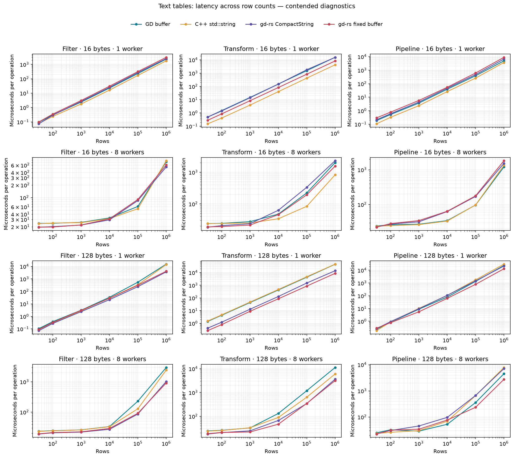

# Text filtering and transforms: GD and gd-rs

All graphs and tables below use a fresh four-way measurement of the current implementation. Fixed-buffer reads trust valid string writes without rescanning UTF-8; bounds, capacity, and nullability checks remain. The [paired before/after experiment](text-validation-results.md) and [archived checked-read matrix](measurements/archive/text-workflow-checked-read.json) retain the earlier implementation for comparison.

This comparison exercises text directly in ordinary application tables: filtering, rewriting a string column, and filtering plus materializing and transforming rows. It compares four representations of the same five-column data.

| Case | Storage and access |
|---|---|
| GD buffer | Unmodified `gd::table::table_column_buffer`, row-major (AoS), preallocated bounded inline text slots |
| C++ std::string | `std::vector<StringRow>`, AoS rows with three ordinary `std::string` fields; a STL baseline rather than a GD table |
| gd-rs CompactString | Existing `gd::Table` SoA string storage, checked typed descriptor slices |
| gd-rs fixed buffer | `gd::Table` SoA, one fixed-slot byte buffer per string column; every row has an offset and length |

The new gd-rs storage is a supported table layout, with UTF-8 byte limits, nullability, conversions, atomic failed writes, independent copies, append between layouts, compaction, indexes, and disjoint parallel mutable views. See the [API](../api/tables.md#fixed-capacity-string-buffers) and [storage implementation](../../src/table/fixed_string.rs).

## Findings

Sources: [Rust workloads](../../benches/text_workflow/driver.rs), [GD buffer and C++ std::string workloads](../../benches/cpp-reference/text_workflow.cpp), [runner and independent oracle](../../benches/text_workflow/compare.py).

The fastest representation depends on the operation, message length, and worker count. At 1,000,000 rows, the lowest primary medians are:

| Text bytes | Workers | Filtering | Rewriting | Pipeline |
|---:|---:|---|---|---|
| 16 | 1 | C++ std::string | C++ std::string | C++ std::string |
| 16 | 8 | gd-rs CompactString | C++ std::string | GD buffer |
| 128 | 1 | gd-rs CompactString | gd-rs fixed buffer | gd-rs fixed buffer |
| 128 | 8 | gd-rs fixed buffer | gd-rs fixed buffer | gd-rs fixed buffer |

Close medians under contention can exchange order between runs. The full tables and fresh rechecks below retain the numerical differences and ranges.

## Conditions and interpretation

Measured 2026-10-07 on Apple M3 Max, 16 logical CPUs, macOS-27.0.1-arm64-arm-64bit-Mach-O. Rust: `rustc 1.98.1 (48a229cea 2026-09-01)`. C++: `Apple clang version 21.0.0 (clang-2100.3.34.2)`. GD is pinned to `cb11cff90d05260a88d59a30c9da421cd4e19c34`. The gd-rs worktree was based on `8414a715205a377408a15ef937b08d447bc1e3d8`; exact source hashes are in the raw results.

Rust flags: `release -O3; codegen-units=1; lto=thin; target-cpu=native; no-default-features; features=rayon; --locked`. C++ flags: `Release -O3 -DNDEBUG -march=native; interprocedural optimization ON; sanitizers OFF`. Scheduling: OS scheduling, no affinity; persistent pools, exactly one static row task per worker; one process at a time.

**These are contended diagnostics measured with background jobs active. They are not an unloaded performance baseline; worker scaling and close rankings cannot be attributed solely to the table implementations.**

Unrelated CPU snapshots ranged from 129.8% to 288.2% (100% is one CPU core; only processes above 5% are counted). These are boundary snapshots, not continuous profiling. The final run checked 288 implementation/size/worker/workload combinations against the independent oracle and recorded 1152 timed processes. Each process recorded 7 calibrated batches; the minimum batch target was 50 ms. Tables report the median of 4 process-round medians. Round ranges and all samples are retained in the raw JSON.

0 rounds were discarded because substantial background work returned. Discarded samples and waiting-period load snapshots are kept in the raw JSON and excluded from the result tables.

[Raw measurements](measurements/text-workflow-m3max.json) contain commands, source fingerprints, compiler versions, topology, thermal state, background load, and process RSS. The GD source fingerprint was unchanged.

## Workload and timing boundaries

Rows: 32, 100, 1,000, 10,000, 100,000, 1,000,000. Message lengths: 16, 128 ASCII bytes. Workers: 1, 8. The schema is `id: u64`, `region: text`, `message: text`, `output: text`, and `score: u64`. IDs and message prefixes vary by row. `north` occurs every fourth row, `error` every third row, and score is `row % 100`.

- Filter: collect ordered row positions where region is `north`, score is at least 20, and message contains `error`. Approximately 6.67% of large tables match.
- Transform: rewrite every output cell as ASCII uppercase message plus `|ok`. The output becomes three bytes longer. The source column is unchanged.
- Pipeline: filter, copy all five columns into independently owned output tables, then transform their output strings. Each worker returns its own ordered shard; no final merge is timed.

Pool construction, fixture generation, and full output digest checks are outside timing. One-worker operations execute directly; eight-worker operations dispatch exactly eight disjoint row tasks. Transform measures repeated writes after output capacity has warmed. Filter and pipeline include result allocation and destruction. These timing boundaries are the same for all cases.

GD gathers whole rows through its public row-buffer API. The benchmark schema contains inline strings and no null metadata or indexed references, so byte copying owns the complete payload. The STL case copies `StringRow` values, including string ownership. gd-rs uses native column-wise `copy_rows`. GD and fixed-buffer transforms use one scratch string per worker; the ordinary C++/Rust strings rewrite their own output buffers. Search functions, case-conversion loops, runtime scheduling, bounds checks, and UTF-8 validation also differ; this experiment does not isolate layout or language alone.

Sources: [Rust workloads](../../benches/text_workflow/driver.rs), [GD buffer and C++ std::string workloads](../../benches/cpp-reference/text_workflow.cpp), [runner and independent oracle](../../benches/text_workflow/compare.py).



## Filtering text

Sources: [Rust workloads](../../benches/text_workflow/driver.rs), [GD buffer and C++ std::string workloads](../../benches/cpp-reference/text_workflow.cpp), [runner and independent oracle](../../benches/text_workflow/compare.py).

Times are microseconds per complete operation; lower is faster.

### 16-byte messages

| Rows | Workers | GD buffer | C++ std::string | gd-rs CompactString | gd-rs fixed buffer |
|---:|---:|---:|---:|---:|---:|
| 32 | 1 | 0.0957 | 0.079 | 0.0737 | 0.099 |
| 32 | 8 | 24.1 | 23.7 | 19.5 | 19.6 |
| 100 | 1 | 0.308 | 0.243 | 0.296 | 0.351 |
| 100 | 8 | 24.2 | 24.6 | 20.1 | 19.7 |
| 1,000 | 1 | 2.41 | 1.78 | 2.68 | 3.1 |
| 1,000 | 8 | 25.5 | 25.1 | 21.9 | 22.1 |
| 10,000 | 1 | 22.8 | 16.4 | 25.6 | 30.6 |
| 10,000 | 8 | 32.5 | 31.4 | 29.3 | 30.9 |
| 100,000 | 1 | 232 | 172 | 272 | 316 |
| 100,000 | 8 | 61.5 | 54.1 | 85.3 | 90.3 |
| 1,000,000 | 1 | 2.34e+03 | 1.78e+03 | 2.54e+03 | 3.11e+03 |
| 1,000,000 | 8 | 726 | 767 | 544 | 606 |

### 128-byte messages

| Rows | Workers | GD buffer | C++ std::string | gd-rs CompactString | gd-rs fixed buffer |
|---:|---:|---:|---:|---:|---:|
| 32 | 1 | 0.106 | 0.0879 | 0.0726 | 0.0911 |
| 32 | 8 | 23.4 | 23.2 | 18.9 | 19.2 |
| 100 | 1 | 0.382 | 0.317 | 0.275 | 0.334 |
| 100 | 8 | 24.4 | 24.2 | 20.8 | 21.2 |
| 1,000 | 1 | 3.14 | 2.81 | 2.4 | 3.07 |
| 1,000 | 8 | 26 | 25.8 | 21.9 | 22.3 |
| 10,000 | 1 | 34.1 | 29.4 | 22 | 28.2 |
| 10,000 | 8 | 33.4 | 33 | 27 | 28.9 |
| 100,000 | 1 | 550 | 338 | 240 | 313 |
| 100,000 | 8 | 229 | 129 | 86.4 | 91.5 |
| 1,000,000 | 1 | 1.52e+04 | 1.42e+04 | 3.65e+03 | 4.11e+03 |
| 1,000,000 | 8 | 2.94e+03 | 2.42e+03 | 1.02e+03 | 913 |

## Rewriting text

Sources: [Rust workloads](../../benches/text_workflow/driver.rs), [GD buffer and C++ std::string workloads](../../benches/cpp-reference/text_workflow.cpp), [runner and independent oracle](../../benches/text_workflow/compare.py).

Times are microseconds per complete operation; lower is faster.

### 16-byte messages

| Rows | Workers | GD buffer | C++ std::string | gd-rs CompactString | gd-rs fixed buffer |
|---:|---:|---:|---:|---:|---:|
| 32 | 1 | 0.493 | 0.152 | 0.491 | 0.281 |
| 32 | 8 | 24.1 | 24 | 18.4 | 18.8 |
| 100 | 1 | 1.51 | 0.417 | 1.42 | 0.854 |
| 100 | 8 | 24.4 | 24.2 | 20.7 | 19.2 |
| 1,000 | 1 | 14.8 | 3.92 | 14.1 | 8.38 |
| 1,000 | 8 | 27.5 | 25.1 | 23.7 | 21.5 |
| 10,000 | 1 | 151 | 40.5 | 150 | 82.9 |
| 10,000 | 8 | 47.6 | 34 | 63.1 | 45.9 |
| 100,000 | 1 | 1.54e+03 | 421 | 1.8e+03 | 830 |
| 100,000 | 8 | 223 | 83.9 | 335 | 194 |
| 1,000,000 | 1 | 1.55e+04 | 4.25e+03 | 1.55e+04 | 8.27e+03 |
| 1,000,000 | 8 | 2.02e+03 | 828 | 2.31e+03 | 1.56e+03 |

### 128-byte messages

| Rows | Workers | GD buffer | C++ std::string | gd-rs CompactString | gd-rs fixed buffer |
|---:|---:|---:|---:|---:|---:|
| 32 | 1 | 1.4 | 1.51 | 0.415 | 0.264 |
| 32 | 8 | 24.3 | 23.8 | 17.9 | 18.6 |
| 100 | 1 | 4.34 | 4.65 | 1.22 | 0.788 |
| 100 | 8 | 25.8 | 25.3 | 20.7 | 21 |
| 1,000 | 1 | 43.5 | 47.5 | 12.9 | 8.87 |
| 1,000 | 8 | 32.5 | 32.9 | 24.4 | 21.9 |
| 10,000 | 1 | 428 | 466 | 130 | 85.7 |
| 10,000 | 8 | 132 | 89.6 | 66.7 | 46.5 |
| 100,000 | 1 | 4.34e+03 | 4.69e+03 | 1.5e+03 | 860 |
| 100,000 | 8 | 1.19e+03 | 636 | 343 | 347 |
| 1,000,000 | 1 | 4.55e+04 | 4.64e+04 | 1.4e+04 | 8.68e+03 |
| 1,000,000 | 8 | 1.12e+04 | 6.01e+03 | 3.62e+03 | 3.16e+03 |

## Filter, copy, and transform

Sources: [Rust workloads](../../benches/text_workflow/driver.rs), [GD buffer and C++ std::string workloads](../../benches/cpp-reference/text_workflow.cpp), [runner and independent oracle](../../benches/text_workflow/compare.py).

Times are microseconds per complete operation; lower is faster.

### 16-byte messages

| Rows | Workers | GD buffer | C++ std::string | gd-rs CompactString | gd-rs fixed buffer |
|---:|---:|---:|---:|---:|---:|
| 32 | 1 | 0.186 | 0.107 | 0.215 | 0.296 |
| 32 | 8 | 24.2 | 23.8 | 22.6 | 22.3 |
| 100 | 1 | 0.523 | 0.326 | 0.598 | 0.786 |
| 100 | 8 | 26.2 | 24.8 | 27.4 | 28.3 |
| 1,000 | 1 | 3.68 | 2.38 | 4.39 | 5.76 |
| 1,000 | 8 | 27.2 | 26.5 | 31.9 | 34.5 |
| 10,000 | 1 | 39.2 | 26.2 | 46.9 | 54.6 |
| 10,000 | 8 | 34.4 | 33.5 | 62.8 | 64 |
| 100,000 | 1 | 389 | 261 | 473 | 620 |
| 100,000 | 8 | 97 | 97.3 | 171 | 178 |
| 1,000,000 | 1 | 4.92e+03 | 3.71e+03 | 6.76e+03 | 8.99e+03 |
| 1,000,000 | 8 | 1.2e+03 | 1.35e+03 | 1.52e+03 | 1.81e+03 |

### 128-byte messages

| Rows | Workers | GD buffer | C++ std::string | gd-rs CompactString | gd-rs fixed buffer |
|---:|---:|---:|---:|---:|---:|
| 32 | 1 | 0.237 | 0.185 | 0.265 | 0.288 |
| 32 | 8 | 24.8 | 23.4 | 22.3 | 22.4 |
| 100 | 1 | 0.835 | 0.885 | 0.939 | 0.78 |
| 100 | 8 | 32.4 | 26 | 30.3 | 31.1 |
| 1,000 | 1 | 8.88 | 10.3 | 9.59 | 5.56 |
| 1,000 | 8 | 28.8 | 30.1 | 45.3 | 34.2 |
| 10,000 | 1 | 80.3 | 106 | 109 | 62.8 |
| 10,000 | 8 | 52.5 | 69.2 | 96.5 | 76.3 |
| 100,000 | 1 | 1.35e+03 | 1.77e+03 | 1.46e+03 | 788 |
| 100,000 | 8 | 356 | 655 | 666 | 234 |
| 1,000,000 | 1 | 2.38e+04 | 3.02e+04 | 2.14e+04 | 1.3e+04 |
| 1,000,000 | 8 | 4.52e+03 | 7.79e+03 | 7.09e+03 | 2.75e+03 |

## Scaling at the largest size

Sources: [Rust workloads](../../benches/text_workflow/driver.rs), [GD buffer and C++ std::string workloads](../../benches/cpp-reference/text_workflow.cpp), [runner and independent oracle](../../benches/text_workflow/compare.py).

1,000,000 rows. Speedup is one-worker time divided by eight-worker time. A value below 1 means the parallel run is slower.

| Text bytes | Operation | GD buffer | C++ std::string | gd-rs CompactString | gd-rs fixed buffer |
|---:|---|---:|---:|---:|---:|
| 16 | filter | 3.23× | 2.33× | 4.67× | 5.13× |
| 16 | transform | 7.71× | 5.13× | 6.69× | 5.30× |
| 16 | pipeline | 4.09× | 2.76× | 4.44× | 4.96× |
| 128 | filter | 5.17× | 5.87× | 3.58× | 4.50× |
| 128 | transform | 4.05× | 7.72× | 3.86× | 2.75× |
| 128 | pipeline | 5.26× | 3.88× | 3.02× | 4.75× |

## Process memory

Sources: [Rust workloads](../../benches/text_workflow/driver.rs), [GD buffer and C++ std::string workloads](../../benches/cpp-reference/text_workflow.cpp), [runner and independent oracle](../../benches/text_workflow/compare.py).

Peak RSS at 1,000,000 rows during transform, in MiB. This includes the source fixture, verification, worker runtime, and allocator overhead, so it is not an isolated table footprint.

| Text bytes | Workers | GD buffer | C++ std::string | gd-rs CompactString | gd-rs fixed buffer |
|---:|---:|---:|---:|---:|---:|
| 16 | 1 | 81.7 | 85.6 | 86.2 | 104.4 |
| 16 | 8 | 82.0 | 85.8 | 86.4 | 104.6 |
| 128 | 1 | 295.4 | 393.2 | 515.8 | 318.1 |
| 128 | 8 | 295.6 | 393.4 | 516.1 | 318.3 |

On this 64-bit host, ordinary Rust/C++ string descriptors are 24 bytes and use inline storage for these short values. The new fixed-buffer descriptors use two `usize` fields (16 bytes) plus each reserved slot. Region capacity is 8 bytes, message capacity is its byte length, and output capacity is message length plus 3. Slots are reserved even for nulls; this benchmark has no nulls. Larger-than-needed capacities increase the footprint.

## Rechecks and variability

Sources: [Rust workloads](../../benches/text_workflow/driver.rs), [GD buffer and C++ std::string workloads](../../benches/cpp-reference/text_workflow.cpp), [runner and independent oracle](../../benches/text_workflow/compare.py).

After the full matrix, 120 configurations were repeated in 4 fresh rotated process rounds. All 120 separate output checks and 480 timed processes matched the oracle. The recheck uses the same source and executable hashes. Primary medians are retained; recheck ranges are process-median ranges, not confidence intervals. [Raw rechecks](measurements/text-workflow-confirmations.json) retain every sample and load check.

| Rows | Text bytes | Workers | Operation | Implementation | Primary (ms) | Recheck (ms) | Recheck range (ms) |
|---:|---:|---:|---|---|---:|---:|---:|
| 10,000 | 16 | 1 | filter | gd-rs CompactString | 0.026 | 0.026 | 0.025–0.026 |
| 10,000 | 16 | 1 | filter | gd-rs fixed buffer | 0.031 | 0.031 | 0.031–0.031 |
| 10,000 | 16 | 1 | filter | GD buffer | 0.023 | 0.023 | 0.022–0.023 |
| 10,000 | 16 | 1 | filter | C++ std::string | 0.016 | 0.016 | 0.016–0.017 |
| 10,000 | 16 | 1 | pipeline | gd-rs CompactString | 0.047 | 0.049 | 0.047–0.049 |
| 10,000 | 16 | 1 | pipeline | gd-rs fixed buffer | 0.055 | 0.055 | 0.055–0.056 |
| 10,000 | 16 | 1 | pipeline | GD buffer | 0.039 | 0.040 | 0.039–0.041 |
| 10,000 | 16 | 1 | pipeline | C++ std::string | 0.026 | 0.027 | 0.026–0.027 |
| 10,000 | 16 | 1 | transform | gd-rs CompactString | 0.150 | 0.147 | 0.144–0.151 |
| 10,000 | 16 | 1 | transform | gd-rs fixed buffer | 0.083 | 0.083 | 0.082–0.085 |
| 10,000 | 16 | 1 | transform | GD buffer | 0.151 | 0.152 | 0.151–0.153 |
| 10,000 | 16 | 1 | transform | C++ std::string | 0.041 | 0.041 | 0.040–0.041 |
| 10,000 | 16 | 8 | filter | gd-rs CompactString | 0.029 | 0.029 | 0.028–0.030 |
| 10,000 | 16 | 8 | filter | gd-rs fixed buffer | 0.031 | 0.031 | 0.030–0.032 |
| 10,000 | 16 | 8 | filter | GD buffer | 0.033 | 0.033 | 0.032–0.034 |
| 10,000 | 16 | 8 | filter | C++ std::string | 0.031 | 0.033 | 0.032–0.034 |
| 10,000 | 16 | 8 | pipeline | gd-rs CompactString | 0.063 | 0.065 | 0.062–0.066 |
| 10,000 | 16 | 8 | pipeline | gd-rs fixed buffer | 0.064 | 0.065 | 0.064–0.067 |
| 10,000 | 16 | 8 | pipeline | GD buffer | 0.034 | 0.035 | 0.035–0.035 |
| 10,000 | 16 | 8 | pipeline | C++ std::string | 0.033 | 0.035 | 0.034–0.036 |
| 10,000 | 16 | 8 | transform | gd-rs CompactString | 0.063 | 0.065 | 0.062–0.067 |
| 10,000 | 16 | 8 | transform | gd-rs fixed buffer | 0.046 | 0.046 | 0.045–0.047 |
| 10,000 | 16 | 8 | transform | GD buffer | 0.048 | 0.048 | 0.048–0.049 |
| 10,000 | 16 | 8 | transform | C++ std::string | 0.034 | 0.034 | 0.033–0.035 |
| 10,000 | 128 | 1 | filter | gd-rs CompactString | 0.022 | 0.022 | 0.022–0.022 |
| 10,000 | 128 | 1 | filter | gd-rs fixed buffer | 0.028 | 0.029 | 0.029–0.030 |
| 10,000 | 128 | 1 | filter | GD buffer | 0.034 | 0.034 | 0.034–0.035 |
| 10,000 | 128 | 1 | filter | C++ std::string | 0.029 | 0.030 | 0.029–0.030 |
| 10,000 | 128 | 1 | pipeline | gd-rs CompactString | 0.109 | 0.112 | 0.108–0.115 |
| 10,000 | 128 | 1 | pipeline | gd-rs fixed buffer | 0.063 | 0.064 | 0.063–0.064 |
| 10,000 | 128 | 1 | pipeline | GD buffer | 0.080 | 0.081 | 0.081–0.082 |
| 10,000 | 128 | 1 | pipeline | C++ std::string | 0.106 | 0.111 | 0.110–0.112 |
| 10,000 | 128 | 1 | transform | gd-rs CompactString | 0.130 | 0.131 | 0.130–0.132 |
| 10,000 | 128 | 1 | transform | gd-rs fixed buffer | 0.086 | 0.086 | 0.086–0.086 |
| 10,000 | 128 | 1 | transform | GD buffer | 0.428 | 0.432 | 0.427–0.433 |
| 10,000 | 128 | 1 | transform | C++ std::string | 0.466 | 0.471 | 0.467–0.474 |
| 10,000 | 128 | 8 | filter | gd-rs CompactString | 0.027 | 0.026 | 0.025–0.026 |
| 10,000 | 128 | 8 | filter | gd-rs fixed buffer | 0.029 | 0.030 | 0.029–0.030 |
| 10,000 | 128 | 8 | filter | GD buffer | 0.033 | 0.034 | 0.034–0.034 |
| 10,000 | 128 | 8 | filter | C++ std::string | 0.033 | 0.034 | 0.033–0.034 |
| 10,000 | 128 | 8 | pipeline | gd-rs CompactString | 0.096 | 0.098 | 0.094–0.101 |
| 10,000 | 128 | 8 | pipeline | gd-rs fixed buffer | 0.076 | 0.078 | 0.075–0.080 |
| 10,000 | 128 | 8 | pipeline | GD buffer | 0.053 | 0.054 | 0.053–0.054 |
| 10,000 | 128 | 8 | pipeline | C++ std::string | 0.069 | 0.069 | 0.069–0.071 |
| 10,000 | 128 | 8 | transform | gd-rs CompactString | 0.067 | 0.066 | 0.064–0.073 |
| 10,000 | 128 | 8 | transform | gd-rs fixed buffer | 0.047 | 0.047 | 0.045–0.050 |
| 10,000 | 128 | 8 | transform | GD buffer | 0.132 | 0.116 | 0.116–0.118 |
| 10,000 | 128 | 8 | transform | C++ std::string | 0.090 | 0.091 | 0.090–0.091 |
| 100,000 | 128 | 1 | filter | gd-rs CompactString | 0.240 | 0.246 | 0.238–0.289 |
| 100,000 | 128 | 1 | filter | gd-rs fixed buffer | 0.313 | 0.314 | 0.310–0.317 |
| 100,000 | 128 | 1 | filter | GD buffer | 0.550 | 0.569 | 0.519–0.584 |
| 100,000 | 128 | 1 | filter | C++ std::string | 0.338 | 0.361 | 0.339–0.375 |
| 100,000 | 128 | 1 | pipeline | gd-rs CompactString | 1.461 | 1.406 | 1.294–1.592 |
| 100,000 | 128 | 1 | pipeline | gd-rs fixed buffer | 0.788 | 0.794 | 0.728–0.803 |
| 100,000 | 128 | 1 | pipeline | GD buffer | 1.348 | 1.306 | 1.203–1.350 |
| 100,000 | 128 | 1 | pipeline | C++ std::string | 1.770 | 1.667 | 1.564–1.763 |
| 100,000 | 128 | 1 | transform | gd-rs CompactString | 1.499 | 1.496 | 1.480–1.570 |
| 100,000 | 128 | 1 | transform | gd-rs fixed buffer | 0.860 | 0.862 | 0.857–0.865 |
| 100,000 | 128 | 1 | transform | GD buffer | 4.337 | 4.338 | 4.245–4.357 |
| 100,000 | 128 | 1 | transform | C++ std::string | 4.688 | 4.674 | 4.642–4.685 |
| 100,000 | 128 | 8 | filter | gd-rs CompactString | 0.086 | 0.085 | 0.084–0.092 |
| 100,000 | 128 | 8 | filter | gd-rs fixed buffer | 0.091 | 0.090 | 0.088–0.092 |
| 100,000 | 128 | 8 | filter | GD buffer | 0.229 | 0.232 | 0.231–0.239 |
| 100,000 | 128 | 8 | filter | C++ std::string | 0.129 | 0.135 | 0.128–0.139 |
| 100,000 | 128 | 8 | pipeline | gd-rs CompactString | 0.666 | 0.670 | 0.661–0.677 |
| 100,000 | 128 | 8 | pipeline | gd-rs fixed buffer | 0.234 | 0.240 | 0.238–0.262 |
| 100,000 | 128 | 8 | pipeline | GD buffer | 0.356 | 0.368 | 0.355–0.371 |
| 100,000 | 128 | 8 | pipeline | C++ std::string | 0.655 | 0.647 | 0.628–0.681 |
| 100,000 | 128 | 8 | transform | gd-rs CompactString | 0.343 | 0.350 | 0.344–0.383 |
| 100,000 | 128 | 8 | transform | gd-rs fixed buffer | 0.347 | 0.347 | 0.346–0.350 |
| 100,000 | 128 | 8 | transform | GD buffer | 1.194 | 1.190 | 1.182–1.196 |
| 100,000 | 128 | 8 | transform | C++ std::string | 0.636 | 0.631 | 0.628–0.666 |
| 1,000,000 | 16 | 1 | filter | gd-rs CompactString | 2.537 | 2.545 | 2.521–2.569 |
| 1,000,000 | 16 | 1 | filter | gd-rs fixed buffer | 3.108 | 3.116 | 3.090–3.152 |
| 1,000,000 | 16 | 1 | filter | GD buffer | 2.342 | 2.374 | 2.320–2.410 |
| 1,000,000 | 16 | 1 | filter | C++ std::string | 1.784 | 1.771 | 1.768–1.798 |
| 1,000,000 | 16 | 1 | pipeline | gd-rs CompactString | 6.762 | 6.837 | 6.523–7.082 |
| 1,000,000 | 16 | 1 | pipeline | gd-rs fixed buffer | 8.994 | 9.024 | 8.969–9.252 |
| 1,000,000 | 16 | 1 | pipeline | GD buffer | 4.916 | 5.005 | 4.883–5.046 |
| 1,000,000 | 16 | 1 | pipeline | C++ std::string | 3.712 | 3.884 | 3.483–4.262 |
| 1,000,000 | 16 | 1 | transform | gd-rs CompactString | 15.456 | 15.527 | 15.340–15.635 |
| 1,000,000 | 16 | 1 | transform | gd-rs fixed buffer | 8.266 | 8.317 | 8.303–8.335 |
| 1,000,000 | 16 | 1 | transform | GD buffer | 15.549 | 15.557 | 15.467–15.561 |
| 1,000,000 | 16 | 1 | transform | C++ std::string | 4.248 | 4.255 | 4.233–4.301 |
| 1,000,000 | 16 | 8 | filter | gd-rs CompactString | 0.544 | 0.542 | 0.539–0.546 |
| 1,000,000 | 16 | 8 | filter | gd-rs fixed buffer | 0.606 | 0.610 | 0.607–0.619 |
| 1,000,000 | 16 | 8 | filter | GD buffer | 0.726 | 0.735 | 0.723–0.751 |
| 1,000,000 | 16 | 8 | filter | C++ std::string | 0.767 | 0.775 | 0.761–0.789 |
| 1,000,000 | 16 | 8 | pipeline | gd-rs CompactString | 1.522 | 1.531 | 1.522–1.553 |
| 1,000,000 | 16 | 8 | pipeline | gd-rs fixed buffer | 1.813 | 1.850 | 1.828–1.872 |
| 1,000,000 | 16 | 8 | pipeline | GD buffer | 1.202 | 1.207 | 1.200–1.221 |
| 1,000,000 | 16 | 8 | pipeline | C++ std::string | 1.346 | 1.352 | 1.350–1.390 |
| 1,000,000 | 16 | 8 | transform | gd-rs CompactString | 2.310 | 2.284 | 2.275–2.372 |
| 1,000,000 | 16 | 8 | transform | gd-rs fixed buffer | 1.560 | 1.565 | 1.562–1.585 |
| 1,000,000 | 16 | 8 | transform | GD buffer | 2.017 | 2.018 | 1.990–2.053 |
| 1,000,000 | 16 | 8 | transform | C++ std::string | 0.828 | 0.830 | 0.827–0.834 |
| 1,000,000 | 128 | 1 | filter | gd-rs CompactString | 3.652 | 3.527 | 3.441–4.881 |
| 1,000,000 | 128 | 1 | filter | gd-rs fixed buffer | 4.108 | 4.068 | 4.031–4.159 |
| 1,000,000 | 128 | 1 | filter | GD buffer | 15.225 | 15.294 | 15.217–15.626 |
| 1,000,000 | 128 | 1 | filter | C++ std::string | 14.218 | 14.441 | 14.388–14.460 |
| 1,000,000 | 128 | 1 | pipeline | gd-rs CompactString | 21.440 | 20.872 | 20.098–21.133 |
| 1,000,000 | 128 | 1 | pipeline | gd-rs fixed buffer | 13.040 | 13.255 | 13.159–13.724 |
| 1,000,000 | 128 | 1 | pipeline | GD buffer | 23.769 | 23.799 | 23.535–24.090 |
| 1,000,000 | 128 | 1 | pipeline | C++ std::string | 30.207 | 29.989 | 29.847–30.321 |
| 1,000,000 | 128 | 1 | transform | gd-rs CompactString | 14.001 | 14.917 | 13.680–16.128 |
| 1,000,000 | 128 | 1 | transform | gd-rs fixed buffer | 8.680 | 8.794 | 8.700–8.835 |
| 1,000,000 | 128 | 1 | transform | GD buffer | 45.473 | 45.199 | 45.073–45.669 |
| 1,000,000 | 128 | 1 | transform | C++ std::string | 46.371 | 46.372 | 46.208–47.361 |
| 1,000,000 | 128 | 8 | filter | gd-rs CompactString | 1.021 | 0.959 | 0.877–1.072 |
| 1,000,000 | 128 | 8 | filter | gd-rs fixed buffer | 0.913 | 0.904 | 0.889–0.925 |
| 1,000,000 | 128 | 8 | filter | GD buffer | 2.943 | 2.927 | 2.906–3.015 |
| 1,000,000 | 128 | 8 | filter | C++ std::string | 2.420 | 2.426 | 2.386–2.452 |
| 1,000,000 | 128 | 8 | pipeline | gd-rs CompactString | 7.094 | 7.237 | 7.061–7.308 |
| 1,000,000 | 128 | 8 | pipeline | gd-rs fixed buffer | 2.747 | 2.762 | 2.729–2.791 |
| 1,000,000 | 128 | 8 | pipeline | GD buffer | 4.521 | 4.549 | 4.525–4.607 |
| 1,000,000 | 128 | 8 | pipeline | C++ std::string | 7.791 | 7.969 | 7.870–8.368 |
| 1,000,000 | 128 | 8 | transform | gd-rs CompactString | 3.624 | 3.770 | 3.622–3.885 |
| 1,000,000 | 128 | 8 | transform | gd-rs fixed buffer | 3.156 | 3.180 | 3.145–3.213 |
| 1,000,000 | 128 | 8 | transform | GD buffer | 11.234 | 11.221 | 11.046–11.271 |
| 1,000,000 | 128 | 8 | transform | C++ std::string | 6.006 | 6.078 | 6.019–6.097 |

## What the experiment establishes

Sources: [Rust workloads](../../benches/text_workflow/driver.rs), [GD buffer and C++ std::string workloads](../../benches/cpp-reference/text_workflow.cpp), [runner and independent oracle](../../benches/text_workflow/compare.py).

Text is supported in the gd-rs column layout, including filtering, longer output strings, owned materialization, and parallel writes. The fixed buffer removes per-cell string allocations but adds offsets and reserved capacity. UTF-8 validity is established by string-typed writes; reads do not validate stored text again. It is an alternative storage contract rather than a guaranteed speed improvement. The measurements above determine which implementation is faster for each tested operation and size.

The comparison covers fixed-length ASCII messages and one selectivity. Unicode boundary behavior is tested for correctness, but Unicode case folding, variable-length distributions, joins, random edits, database import, nullable scans, and oversized-write performance are outside this timing matrix. It does not establish a universal AoS/SoA ranking or any OLAP preprocessing cost.

Validation: the repository CI script passed formatting, strict Clippy, all-features tests, minimal-feature tests, rustdoc, and the Rust 1.86 library check. Fixed-string tests include randomized equivalence with ordinary tables, UTF-8 byte limits, null/empty values, failed-write atomicity, copies, append between layouts, compaction, index/sort/format integration, and scoped parallel mutation. Separate C++ AddressSanitizer runs passed the oracle on 1, 32, and 1,001 rows with one and eight workers for both C++ representations and all three operations; [all 36 checks are recorded](measurements/text-workflow-asan.json). Sanitized executables were not used for performance measurements.

Reproduce the final matrix:

```sh
./benches/run_text_workflow.sh --samples 7 --rounds 4 --sample-ms 50 --allow-contended
```

The [benchmark README](../../benches/text_workflow/README.md) describes smaller runs and the diagnostic mode. The [report generator](../../benches/text_workflow/summarize.py) recreates these tables and optional charts from the raw JSON.
