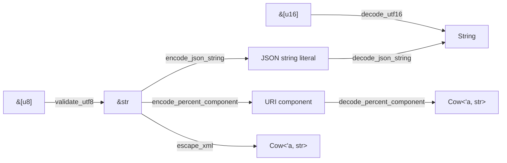

# Text boundaries

The `text` module covers conversions where raw bytes or another text syntax enters
the library. Ordinary in-memory text remains `str`/`String`; code-point iteration,
splitting, and trimming use the standard string API whenever it already expresses the
operation.

## Encoding flow

`validate_utf8` is a named boundary around `std::str::from_utf8` and borrows the
original bytes. `decode_utf16` delegates to `String::from_utf16` and rejects unpaired
surrogates.

## JSON strings

`encode_json_string` produces a complete JSON string literal, including quotes.
`decode_json_string` accepts that same complete form. Both delegate to `serde_json`,
so every forbidden control character is escaped and astral characters round trip.
This replaces the C++ escaped-fragment overloads, which disagree with one another
for non-ASCII input.

## URI components

`encode_percent_component` uses the characterized `gd` component allow-list and
uppercase hex digits. It intentionally escapes `~`. `decode_percent_component`
treats `+` as space, rejects malformed percent triples, and rejects decoded bytes
that are not UTF-8. When the input has neither percent escapes nor plus signs, it
returns `Cow::Borrowed` without allocating.

These functions operate on one component. They do not parse a complete URL or decide
which path, query, or fragment delimiters should remain structural.

## XML and small string helpers

`escape_xml` substitutes the five predefined entities and borrows input that contains
none of them. It does not construct an XML document or validate the XML version's
permitted control characters.

`split_escaped` treats a doubled separator as one literal separator and supports any
Unicode scalar separator. It returns owned parts because collapsing escapes changes
their byte ranges. `prefix_chars` returns a borrowed prefix counted in Unicode scalar
values, not grapheme clusters. `trim_ascii_control` explicitly implements the C++
byte rule `U+0000..=U+0020`; use `str::trim` for Unicode whitespace.

All operations are linear in the bytes or scalar values they inspect. Encoders use
space proportional to their output. Borrowing results avoid allocation when no
transformation is required.
