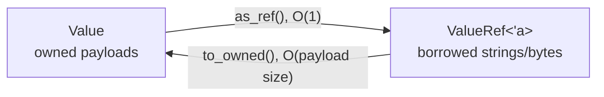

# Dynamic values

`Value` is an owned Rust sum type and `ValueRef<'a>` is its borrowed counterpart. The
variant discriminant and payload cannot disagree.

## Types

The current logical types are null, Boolean, every standard signed and unsigned
integer width, `f32`, `f64`, UTF-8 string, byte sequence, and UUID. Primitive widths are
preserved instead of widening everything into one integer or decimal representation.

Owned UTF-8 strings use `CompactString`. Short strings are stored inline; longer
strings allocate. Byte sequences use `Box<[u8]>`. UUIDs and primitive values are inline.

`DataType` describes the logical value, not ownership. For example, `Value::String`
and `ValueRef::String` both report `DataType::String`.

## Conversion

Accessors are explicit and return `ValueError` on a type mismatch. Integer-to-`i64`
conversion checks the unsigned range. Numeric-to-`f64` conversion can lose precision
for large integers, matching Rust casts; it never silently parses text.

Parsing, display formatting, and schema-directed conversions belong in separate APIs
so a read does not unexpectedly allocate or reinterpret a value.

## Complexity

| Operation | Time | Allocation |
|---|---:|---:|
| inspect type | O(1) | none |
| borrow as `ValueRef` | O(1) | none |
| clone primitive | O(1) | none |
| clone inline string | O(length) | none |
| clone heap string/bytes | O(length) | one payload allocation |
| `ValueRef::to_owned` for text/bytes | O(length) | zero or one, depending on inline text |
