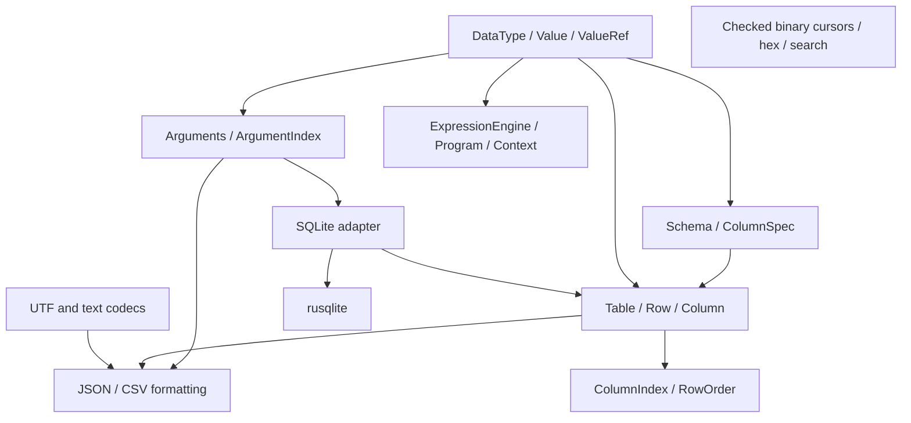

# Rust porting plan

This is the implementation plan for the portable `gd` core. Observed C++ defects,
data races, undefined behavior, and algorithmic criticism are kept separately in
[`cpp-gd-issues.md`](cpp-gd-issues.md). Intentional behavior changes are recorded in
[`compatibility.md`](compatibility.md). Reproducible source-size and complexity
measurements are recorded in [`source-stats.md`](source-stats.md).

## Scope

The Rust crate includes:

- owned and borrowed dynamic values;
- ordered named and positional arguments;
- schemas, typed columns, rows, indexes, and borrowed row ordering;
- checked binary readers and writers, hex, and byte search;
- UTF boundaries and JSON, URI-component, XML, and CSV conversion;
- argument and table interchange formatting;
- compiled expressions, scripts, variables, and typed extension functions;
- feature-gated SQLite value binding and typed-table materialization.

Generic database interfaces, ODBC, and drivers other than SQLite are excluded. The
SQLite module delegates connection and transaction behavior to `rusqlite`; it does
not reproduce the C++ cursor, record, reference-counted interface, or driver-neutral
abstractions. Pure SQL construction remains outside this crate and can become a
separate package if dialect-specific golden tests establish a concrete need.

CLI parsing, filesystem policy, rotation, console output, logging sinks, and COM-like
application routing also remain at application boundaries. Applications should use
`clap`, `std::fs`/`std::path`, and their chosen logging or routing facilities directly
instead of receiving renamed wrappers from the data-model crate.

## Design rules

1. Preserve characterized useful behavior and make failure behavior explicit.
2. Reject undefined behavior, data races, stale views, and confirmed defects.
3. Prefer a smaller safe design when measurements show only a slight cost.
4. Use Rust sum types and lifetimes instead of numeric tags, ownership flags, and
   layout-compatible pointer views.
5. Use maintained crates for general-purpose algorithms and formats.
6. Use `ahash` for trusted, non-adversarial hash-backed indexes.
7. Return typed `Result` errors for public input, bounds, conversion, parse, schema,
   and I/O failures. The library does not log expected failures.
8. Keep SQLite behind one feature and do not introduce a generic driver layer without
   a tested requirement.

### Error, bounds, and unsafe-code policy

Public APIs return typed `Result` errors for invalid input, conversion, bounds,
schema, parsing, and I/O failures. Panics are reserved for internal invariants that
safe callers cannot violate. Expected failures are returned to the caller and are not
logged by the library.

Binary and legacy-format decoders read integers from bounded byte slices with
explicit endianness; they do not cast byte pointers to typed pointers. A failed read
must be observable and leave the documented cursor state intact.

The crate currently contains no `unsafe` block. An unsafe implementation is
acceptable only when a safe public API states its invariants and before/after
measurements show a clear timing or retained-size benefit. It must have focused tests,
a local safety argument, Miri coverage where applicable, and tests for every stated
invariant. Unsafe code without the corresponding measurement or retained-size
evidence must be removed.

## Value port plan

Use closed `DataType`, `Value`, and `ValueRef<'a>` sum types rather than reproducing
the C++ numeric tag, group-bit, width-bit, and allocation-flag scheme. `Value` owns
its payload and `ValueRef<'a>` borrows string and byte payloads for no longer than
their source lives. This makes tag/payload mismatches and an owning borrowed view
unrepresentable. Raw pointers are not values; numeric legacy IDs belong only in an
explicit compatibility codec if one is ever required.

The implemented representation keeps all scalar widths as distinct variants, uses
`CompactString` for inline short strings, `Box<[u8]>` for byte payloads, and
`uuid::Uuid` inline. It intentionally relies on the compiler's enum layout rather
than a hand-written tagged union.

Before changing that representation, Criterion comparisons must cover credible
alternatives: `Arc`-shared strings/bytes, string interning, and normalization to
fewer numeric variants. Compare construction, borrowing, cloning, match/dispatch,
conversion, allocation count, and complete retained memory; `size_of` alone is not
a memory comparison.

C++ characterization and Rust tests must cover:

- signed/unsigned comparisons across widths;
- integer/float conversion and overflow;
- NaN, infinity, and signed zero;
- C++ `Unknown` versus Rust `Null`;
- ASCII, UTF-8, JSON, XML, and wide-string boundaries;
- failed conversions and unlike-type ordering;
- a non-null-terminated `std::string_view` ending at its declared length, with the
  C++ regression exercised under AddressSanitizer.

## Table and open-row sidecar plan

Keep the table's declared schema immutable and its regular cells in homogeneous,
typed column vectors. Do not reproduce the packed C++ per-row argument buffer or
turn every cell into a dynamic `Value`. Instead, model unknown named fields as an
optional sidecar running parallel to the row axis:

- tables with the same layout share immutable metadata through `Arc<Schema>`;
- `UnknownFields::Reject` remains the default schema policy;
- `UnknownFields::Store` opts a schema into row-local unknown fields;
- `Table` keeps one `Option<Box<RowExtras>>` slot per row, initially `None`;
- allocating the `RowExtras` object is deferred until that row receives its first
  extra field;
- `RowExtras` starts with `SmallVec<[(CompactString, Value); 2]>`, keeping the common
  first two entries inline in the row object; it promotes to an `AHashMap` on the fifth
  unique field so larger sidecars retain expected constant-time lookup and insertion;
- fixed names and aliases are resolved before extras and cannot be shadowed;
- `set_named` mutates either a validated fixed cell or a row-local extra, while
  `push_row_with_extras` validates the complete fixed row and all extra names before
  committing either storage class;
- append, pop, clone, and row bounds must preserve the one-sidecar-slot-per-row
  invariant.

An extra field is deliberately not a logical column: the same name may be absent or
hold different `Value` types in different rows. Extras therefore do not participate
in column scans, indexes, row ordering, fixed-schema iteration, JSON, or CSV. A field
that requires homogeneous typing, scanning, sorting, indexing, or serialization must
be promoted to a real nullable schema column. This keeps the normal columnar path
predictable while safely covering the useful behavior of the C++ argument-backed
table.

Regression coverage must include strict-schema rejection, late insertion with
`set_named`, atomic insertion with `push_row_with_extras`, replacement, fixed-column
type checking, declared-name conflicts, row removal, and the matched files, users,
and metrics custom-field workloads from the C++ characterization test.

## Target architecture

Dependencies flow away from the value core. Borrowed views and indexes carry the
lifetime of their owners, preventing structural mutation while stored positions or
borrowed keys are live. The crate has no global logger, allocator, service locator,
or mutable registry.

## Maintained crate choices

| Concern | Choice | Reason |
|---|---|---|
| Hash indexes | `ahash` | compact API and suitable policy for trusted keys |
| Short owned strings | `compact_str` | inline storage without a custom string layout |
| UUID | `uuid` | parsing, formatting, and inline value representation |
| Small duplicate positions | `smallvec` | avoids a heap allocation for common one-entry names |
| Hex | `hex-simd` | maintained checked codec with SIMD implementations |
| Byte search | `memchr` | established substring-search implementation |
| JSON | `serde_json` | complete escaping and parsing semantics |
| URI components | `percent-encoding` | explicit byte allow-list and maintained encoding |
| CSV | `csv` | complete quoting and record-boundary state machine |
| Integer/float text | `itoa` / `ryu` | stack-backed numeric formatting |
| Errors | `thiserror` | typed public errors without hand-written display plumbing |
| Expressions | `rhai` | permissive license, owned AST, control flow, typed functions, and bounded execution |
| SQLite | `rusqlite` with bundled SQLite | maintained safe wrapper and reproducible engine dependency |
| Benchmarks/tests | `criterion` / `proptest` | sampled measurements and generated invariants |

`evalexpr` was evaluated for expressions but is AGPL-3.0-only in version 13.1.0;
Rhai is MIT or Apache-2.0 and covers both expressions and scripts.

## Baseline and comparison method

The sibling C++ project has a root CMake build with pinned GoogleTest and Google
Benchmark revisions. Only its test and benchmark infrastructure is changed; product
files below `../gd/source` remain untouched. Debug and sanitizer presets characterize
what can be exercised safely. Benchmarks use narrow adapters around testable behavior
when a product defect would make the existing wrapper unsafe or unreliable. Rust uses
unit, integration, property, and negative tests plus Criterion.

Matched workloads must use the same:

- deterministic values and random seeds;
- setup boundary and input sizes;
- hit, miss, duplicate, null, and row-width distributions;
- allocation inclusion or exclusion;
- conversion and validation policy;
- measured operation count.

The current workload matrix is:

| Area | Workloads | Representative sizes |
|---|---|---|
| Values | construct, borrow, clone | scalar and strings through 32 KiB |
| Arguments | append, linear/hash lookup, positional access, format | 1 through 4,096 entries |
| Tables | append, row/column scan, named access, index, order | 10 through 100,000 rows |
| Binary | endian cursors, hex, substring search | 16 bytes through 64 KiB |
| Text | JSON, URI encode/decode, XML | 64 bytes through 64 KiB |
| Formatting | argument URI/JSON, table JSON/CSV | 100 through 10,000 rows |
| Expressions | compile and evaluate three matched formulas | short arithmetic, function, logical |
| SQLite | bind and materialize inferred/explicit tables | 100 through 10,000 rows |

Raw timings must come from optimized builds on the same host. The report compares
work performed, confidence intervals, algorithmic complexity, and allocation
boundaries rather than treating cross-machine numbers as thresholds. Memory claims
require retained capacity, payload, index overhead, and allocation counts;
`size_of::<T>()` alone is only a representation guardrail.

## Work stages

| Stage | Evidence | Status |
|---|---|---|
| Reproducible C++ baseline | CMake, GoogleTest, Google Benchmark, sanitizer preset | complete |
| Values and types | C++ characterization; Rust value/property tests; Criterion | complete |
| Arguments | duplicate/unnamed behavior, lifetime-bound `AHashMap` index, codecs | complete |
| Tables | typed columns, null policy, views, exact index, stable row order | complete |
| Binary and text | checked cursors and maintained codecs with negative/property tests | complete |
| Interchange formats | complete JSON/CSV/URI output and matched benchmarks | complete |
| Expressions | Rhai adapter, C++ regressions, Rust property tests, matched benchmarks | complete |
| SQLite | strict binding, schema inference/coercion, transaction access, in-memory tests, matched benchmark | complete |
| Public documentation | rustdoc plus architecture, subsystem, compatibility, and audit documents | complete |
| Final verification | strict Rust checks, debug/release C++, and ASan/UBSan C++ suites | complete |

## Replacement gate

A ported subsystem is ready only when:

1. its public behavior, ownership, errors, and complexity are documented;
2. relevant C++ characterization and regression tests pass;
3. equivalent Rust unit, integration, property, and negative tests pass;
4. every applicable finding in `cpp-gd-issues.md` is covered or rejected explicitly;
5. Criterion and Google Benchmark workloads are demonstrably equivalent;
6. timing, space, and algorithmic differences are recorded without unsupported claims;
7. the Rust API contains no accidental C++ layout or naming artifacts;
8. maintained crates were evaluated before custom code was accepted;
9. public APIs do not emit logs for expected errors;
10. database support remains confined to the SQLite feature and does not grow an
    untested generic abstraction.

Documentation uses Mermaid only where dependency, ownership, or state relationships
are clearer as a graph. Compatibility decisions remain explicit rather than being
inferred from whichever implementation happens to pass a test.
