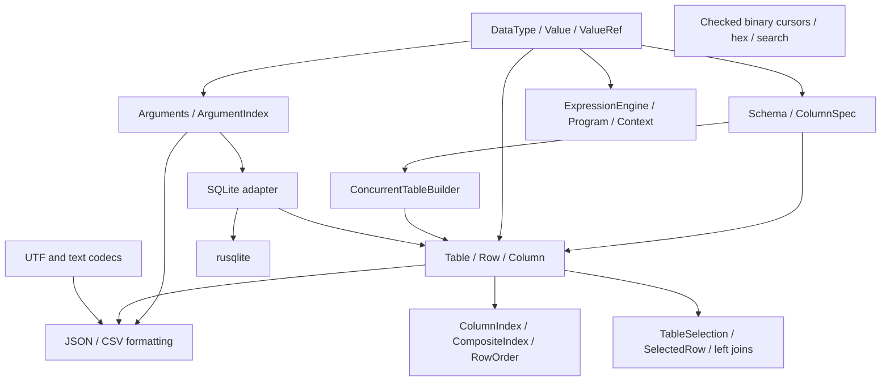

# Current Rust port scope and design

This records the implemented design and remaining scope decisions for the portable `gd`
core, reviewed on 2026-10-05 against gd-rs `f7c7b91` and GD submodule
`cb11cff90d05260a88d59a30c9da421cd4e19c34`. Observed C++ defects, data races, undefined
behavior, and algorithmic criticism are kept separately in
[`cpp-gd-issues.md`](cpp-gd-issues.md). Intentional behavior changes are recorded in
[`compatibility.md`](compatibility.md). Reproducible source-size and complexity
measurements are recorded in [`source-stats.md`](source-stats.md).

## Scope

The Rust crate includes:

- owned and borrowed dynamic values;
- ordered named and positional arguments;
- schemas, typed columns, tombstoned rows, single/composite indexes, and borrowed row ordering;
- mapped table append, owned selections, borrowed projections/filters, and duplicate-expanding left joins;
- concurrent complete-row collection and checked disjoint mutation, with optional Rayon copying/mutation;
- checked binary readers and writers, hex, and byte search;
- UTF boundaries and JSON, URI-component, XML, and CSV conversion;
- argument and table interchange formatting;
- compiled expressions, scripts, variables, and typed extension functions;
- feature-gated SQLite value binding and typed-table materialization.

Generic database interfaces, ODBC, and drivers other than SQLite are excluded. The
SQLite module delegates connection and transaction behavior to `rusqlite`; it does not
reproduce the C++ cursor, record, reference-counted interface, or driver-neutral
abstractions. Pure SQL construction remains outside this crate and belongs to an
application-selected SQL construction layer.

CLI parsing, filesystem policy, rotation, console output, logging sinks, and COM-like
application routing also remain at application boundaries. Applications should use
`clap`, `std::fs`/`std::path`, and their chosen logging or routing facilities directly
instead of receiving renamed wrappers from the data-model crate.

## Design rules

1. Preserve useful, specified behavior and make failure behavior explicit.
2. Reject undefined behavior, data races, stale views, and confirmed defects.
3. Prefer a smaller safe design when measurements show only a slight cost.
4. Use Rust sum types and lifetimes instead of numeric tags, ownership flags, and
   layout-compatible pointer views.
5. Use maintained crates for general-purpose algorithms and formats.
6. Use `ahash` for trusted, non-adversarial hash-backed indexes.
7. Return typed `Result` errors for public input, bounds, conversion, parse, schema,
   and I/O failures. The library does not log expected failures.
8. Keep SQLite behind one feature and do not introduce a generic driver layer without
   a tested requirement.

### Error, bounds, and unsafe-code policy

Checked fallible APIs return typed `Result` errors for invalid input, conversion,
bounds, schema, parsing, and I/O failures. Ordinary slice indexing can panic, and
application callbacks can panic or have side effects; safe Rust does not make those
transactional. Expected checked failures are returned to the caller and are not logged
by the library.

Binary readers decode integers from bounded byte slices with
explicit endianness; they do not cast byte pointers to typed pointers. A failed read
must be observable and leave the documented cursor state intact.

The crate currently contains no `unsafe` block. An unsafe implementation is
acceptable only when a safe public API states its invariants and before/after
measurements show a clear timing or retained-size benefit. It must have focused tests,
a local safety argument, Miri coverage where applicable, and tests for every stated
invariant. Unsafe code without the corresponding measurement or retained-size
evidence must be removed.

## Value representation

The crate uses closed `DataType`, `Value`, and `ValueRef<'a>` sum types rather than
reproducing the C++ numeric tag, group-bit, width-bit, and allocation-flag scheme.
`Value` owns its payload and `ValueRef<'a>` borrows string and byte payloads for no
longer than their source lives. This makes tag/payload mismatches and an owning borrowed
view unrepresentable. Raw pointers are not values; numeric legacy IDs belong only in an
explicit compatibility format; none is currently exported.

The implemented representation keeps all scalar widths as distinct variants, uses
`CompactString` for inline short strings, `Box<[u8]>` for byte payloads, and
`uuid::Uuid` inline. It intentionally relies on the compiler's enum layout rather
than a hand-written tagged union.

The current value contract and Rust tests cover:

- signed/unsigned comparisons across widths;
- integer/float conversion and overflow;
- NaN, infinity, and signed zero;
- C++ `Unknown` versus Rust `Null`;
- ASCII, UTF-8, JSON, XML, and wide-string boundaries;
- failed conversions and unlike-type ordering;
- length-bounded text ownership, avoiding GD's `string_view` terminator assumption.

## Tables and open-row sidecars

The table's declared schema is immutable and its regular cells are homogeneous, typed
column vectors. Unknown named fields use an optional sidecar parallel to the row axis,
rather than a packed argument buffer or a dynamic `Value` in every cell:

- tables with the same layout share immutable metadata through `Arc<Schema>`;
- `UnknownFields::Reject` remains the default schema policy;
- `UnknownFields::Store` opts a schema into row-local unknown fields;
- `Table` lazily allocates its extras sidecar; once allocated, it keeps one
  `Option<Box<RowExtras>>` slot per physical row, initially `None`;
- allocating the `RowExtras` object is deferred until that row receives its first
  extra field;
- `RowExtras` starts with `SmallVec<[(CompactString, Value); 2]>`, keeping the common
  first two entries inline in the row object; it promotes to an `AHashMap` on the fifth
  unique field so larger sidecars retain expected constant-time lookup and insertion;
- fixed names and aliases are resolved before extras and cannot be shadowed;
- `set_named` mutates either a validated fixed cell or a row-local extra, while
  `push_row_with_extras` validates the complete fixed row and all extra names before
  committing either storage class;
- append, pop, clone, compaction, and row bounds preserve that sidecar invariant.

An extra field is deliberately not a logical column: the same name may be absent or
hold different `Value` types in different rows. Extras therefore do not participate
in column scans, indexes, row ordering, fixed-schema iteration, JSON, or CSV. A field
that requires homogeneous typing, scanning, sorting, indexing, or serialization must
be promoted to a real nullable schema column. This keeps the normal columnar path
predictable while safely covering the useful behavior of the C++ argument-backed
table.

The current table tests cover strict-schema rejection, late insertion with `set_named`,
atomic insertion with `push_row_with_extras`, replacement, fixed-column type checking,
declared-name conflicts and row removal. The maintained table benchmarks include files,
users and metrics custom-field workloads on both implementations.

## Architecture

```mermaid
flowchart TD
    Value["DataType / Value / ValueRef"] --> Arguments["Arguments / ArgumentIndex"]
    Value --> Schema["Schema / ColumnSpec"]
    Schema --> Table["Table / Row / Column"]
    Value --> Table
    Table --> ColumnIndex["ColumnIndex / CompositeIndex / RowOrder"]
    Table --> Selection["TableSelection / SelectedRow / left joins"]
    Schema --> Builder["ConcurrentTableBuilder"]
    Builder --> Table
    Value --> Expression["ExpressionEngine / Program / Context"]
    Arguments --> Format["JSON / URI formatting"]
    Table --> Format["JSON / CSV formatting"]
    Binary["Checked binary cursors / hex / search"]
    Text["UTF and text codecs"] --> Format
    Arguments --> SQLite["SQLite adapter"]
    SQLite --> Table
    SQLite --> Rusqlite["rusqlite"]
```

Dependencies flow away from the value core. Borrowed views and indexes carry the
lifetime of their owners, preventing structural mutation while stored positions or
borrowed keys are live. The crate installs no custom global allocator, logger or service locator, and has
no global mutable registry; Rhai function registration is local to each engine.

## Maintained crate choices

| Concern | Choice | Reason |
|---|---|---|
| Hash indexes | `ahash` | compact API and suitable policy for trusted keys |
| Short owned strings | `compact_str` | inline storage without a custom string layout |
| UUID | `uuid` | parsing, formatting, and inline value representation |
| Small duplicate positions | `smallvec` | avoids a heap allocation for common one-entry names |
| Hex | `hex-simd` | maintained checked codec with SIMD implementations |
| Byte search | `memchr` | established substring-search implementation |
| JSON | `serde_json` | complete escaping and parsing semantics |
| URI components | `percent-encoding` | explicit byte allow-list and maintained encoding |
| CSV | `csv` | complete quoting and record-boundary state machine |
| Integer/float text | `itoa` / `ryu` | stack-backed numeric formatting |
| Errors | `thiserror` | typed public errors without hand-written display plumbing |
| Expressions | `rhai` | permissive license, owned AST, control flow, typed functions, and bounded execution |
| SQLite | `rusqlite` with bundled SQLite | maintained safe wrapper and reproducible engine dependency |
| Concurrent row collection | `orx-concurrent-vec` | complete-row publication before transpose into typed columns |
| Parallel table operations | optional `rayon` | scheduling for checked disjoint columns and rows |
| Benchmarks/tests | `criterion` / `proptest` | sampled measurements and generated invariants |

Rhai is MIT or Apache-2.0 and supplies expressions, scripts and configurable resource
limits through a single adapter; GD expression syntax and bytecode are not ported.

## Baseline and comparison method

The read-only `external/gd` submodule is built by gd-rs's maintained [CMake
recipe](../../benches/cpp-reference/cmake/GdCore.cmake) and [reference
harness](../../benches/cpp-reference/CMakeLists.txt). Google Benchmark is pinned to
v1.9.5; bundled SQLite 3.53.2 matches rusqlite 0.40.2. Forwarding headers and the
isolated SIMD placeholder correction are generated in the build directory. The pinned GD
revision has no `tests` directory or checked-in GoogleTest suite. Maintained workflow
verification, probes and sanitizer commands are described in the [order-workflow
report](../high-level/order-workflow.md). Benchmarks use narrow adapters when a product
defect would make a wrapper unsafe or unreliable. Rust uses unit, integration, property,
compile-fail tests and Criterion.

Matched workloads must use the same:

- deterministic values and random seeds;
- setup boundary and input sizes;
- hit, miss, duplicate, null, and row-width distributions;
- allocation inclusion or exclusion;
- conversion and validation policy;
- measured operation count.

The current workload matrix is:

| Area | Workloads | Representative sizes |
|---|---|---|
| Values | construct, borrow, clone | scalar and strings through 32 KiB |
| Arguments | append, linear/hash lookup, positional access, format | 1 through 4,096 entries |
| Tables | append, row/column scan, named access, index, order | 10 through 100,000 rows |
| Binary | endian cursors, hex, substring search | 16 bytes through 64 KiB |
| Text | JSON, URI encode/decode, XML | 64 bytes through 64 KiB |
| Formatting | argument URI/JSON, table JSON/CSV | 100 through 10,000 rows |
| Expressions | compile and evaluate three matched formulas | short arithmetic, function, logical |
| SQLite | bind and materialize inferred/explicit tables | 100 through 10,000 rows |
| Order workflow | database load, validation, three-table join, slices, parameterized outputs | configurable deterministic fixture; concurrent workers |

Raw timings must come from optimized builds on the same host. The report compares
work performed, confidence intervals, algorithmic complexity, and allocation
boundaries rather than treating cross-machine numbers as thresholds. Memory claims
require retained capacity, payload, index overhead, and allocation counts;
`size_of::<T>()` alone is only a representation guardrail.

## Current coverage

| Area | Evidence | Status |
|---|---|---|
| Reproducible C++ baseline | maintained CMake/Google Benchmark harness and workflow probes | available; pinned GD has no full unit-test suite |
| Values and types | pinned-source audit; Rust value/property tests; maintained benchmarks | implemented |
| Arguments | duplicate/unnamed behavior, lifetime-bound `AHashMap` index, codecs | complete |
| Tables | typed columns, null policy, tombstones/compaction, mapped append, borrowed selections, exact single/composite indexes, left joins, stable row order, concurrent builder | implemented; broader GD conveniences remain application work |
| Binary and text | checked cursors and maintained codecs with negative/property tests | complete |
| Interchange formats | complete JSON/CSV/URI output and matched benchmarks | complete |
| Expressions | bounded Rhai adapter, pinned-source audit, Rust property tests, maintained benchmarks | implemented; GD syntax is not preserved |
| SQLite | strict binding, schema inference/coercion, transaction access, in-memory tests, matched benchmark | complete |
| Public documentation | rustdoc plus architecture, subsystem, compatibility, and audit documents | complete |
| Verification | strict Rust CI; maintained release C++ workflow checks and focused sanitizer probes | reproducible for documented paths; no claim of exhaustive GD coverage |

## Validation and limits

[`scripts/ci.sh`](../../scripts/ci.sh) runs formatting, Clippy, all-target/all-feature
tests, minimal-feature tests, rustdoc and the Rust 1.86 library check. The public Rust
APIs have unit, integration, property and compile-fail coverage. This does not establish
exhaustive GD parity or prove absence of application logic errors.

The maintained C++ harness builds a selected GD core, not every toolkit facility.
Workflow correctness checks compare materialized outputs against a SQLite oracle;
focused probes and sanitizers cover the paths described in the workflow report. The
reference does not contain a complete GD unit-test suite. Performance results belong to
the dedicated reports, with source links, measurement boundaries and revisions; API
breadth is not evidence of speed or retained-memory efficiency.
